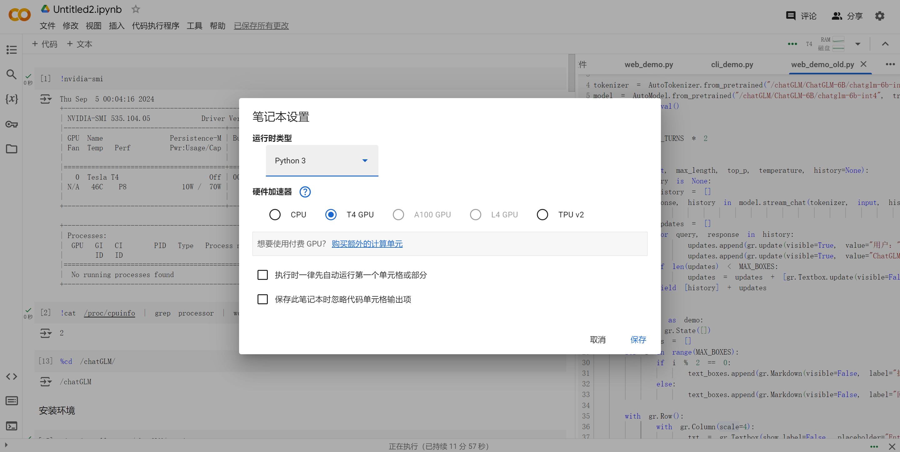

## colab部署chatGLM

### 1.登录colab，创建新笔记本

### 2.更改笔记本设置为GPU



此时使用的是免费分配的**2核cpu、12G内存、78G存储、16G显存**的**GPU**实例

### 3.克隆代码，下载项目仓库

```python
!git clone https://github.com/THUDM/ChatGLM-6B
%cd ChatGLM-6B
```


### 4.安装所需要的依赖

```python
!pip install -r requirements.txt
```

### 5.在HuggingFace中下载模型文件

| 模型名称        | 模型大小 | 模型所需GPT与内存    |
| --------------- | -------- | -------------------- |
| chatglm-6b      | 12.4g    | 最低13G显存，16G内存 |
| chatglm-6b-int8 | 7.2G     | 最低8G显存           |
| chatglm-6b-int4 | 3.6G     | 最低4.3G显存         |

根据需要下载模型文件，下面以占存较小的chatglm-6b-int4为例

```python
!git clone https://huggingface.co/THUDM/chatglm-6b-int4
```


### 6.修改web_demo.py文件

将文件中的模型文件路径改为自己的路径：

设置share=True，便于公网访问：


### 7.运行程序

#### 代码运行demo

```python
from transformers import AutoTokenizer, AutoModel
tokenizer = AutoTokenizer.from_pretrained("/content/ChatGLM-6B/chatglm-6b-int4", trust_remote_code=True)
model = AutoModel.from_pretrained("/content/ChatGLM-6B/chatglm-6b-int4", trust_remote_code=True).half().cuda()
model = model.eval()
response, history = model.chat(tokenizer, "你好", history=[])
print(response)
response, history = model.chat(tokenizer, "晚上睡不着应该怎么办", history=history)
print(response)
```


#### 运行基于Gradio的网页版demo

```python
!python web_demo.py
```


**然后访问公网地址。**

##### 过程中报错

##### 1.编码报错：


解决方法：

```python
import locale
def getpreferredencoding(do_setlocale = True):
    return "UTF-8"
locale.getpreferredencoding = getpreferredencoding
```


##### 2.未安装gradio：


解决方法：

```python
!pip uninstall gradio
!pip install gradio==3.50.0
```


##### 3.页面正常显示，但输入后无响应：


右键检查，网页报错：


解决方法：

改用旧版本的demo，和之前的一样修改代码然后执行：

```python
!python web_demo_old.py
```


###  成功部署

运行web_demo_old.py程序成功，界面如下：


## colab微调chatGLMm

**通过P-Tuning v2微调ChatGLM-6B**

### 1.配置环境与准备

地址：[ChatGLM-6B/ptuning at main · THUDM/ChatGLM-6B · GitHub](https://github.com/THUDM/ChatGLM-6B/tree/main/ptuning)
安装以下包:

```python
!pip install rouge_chinese nltk jieba datasets
```

安装时出现问题：

```python
WARNING: The following packages were previously imported in this runtime:   
    [pyarrow] 
    You must restart the runtime in order to use newly installed versions.
```

解决方法：

在下面新建一个单元格，执行以下两行代码，会重启服务器，之前安装的库都还在。

```python
import os
os.kill(os.getpid(), 9)
```

### 2.模型文件准备

模型文件在前面基于ChatGLM-6B的部署中已经准备好了，注意路径修改正确即可

### 3.数据准备

ADGEN数据集的任务为根据输入（content）生成一段广告词（summary）
{
    "content": "类型#上衣*版型#宽松*版型#显瘦*图案#线条*衣样式#衬衫*衣袖型#泡泡袖*衣款式#抽绳", 
    "summary": "这件衬衫的款式非常的宽松，利落的线条可以很好的隐藏身材上的小缺点，穿在身上有着很好的显瘦效果。领口装饰了一个可爱的抽绳，漂亮的绳结展现出了十足的个性，配合时尚的泡泡袖型，尽显女性甜美可爱的气息。"
}

从[Google Drive](https://drive.google.com/file/d/13_vf0xRTQsyneRKdD1bZIr93vBGOczrk/view?usp=sharing) 或者 [Tsinghua Cloud](https://cloud.tsinghua.edu.cn/f/b3f119a008264b1cabd1/?dl=1) 下载处理好的 ADGEN数据集，将解压后的AdvertiseGen目录放到本 ptuning 目录下

### 4.微调过程

修改train.sh文件
去掉最后的 --quantization_bit 4
注意修改模型路径，THUDM/chatglm-6b修改为/data/chatglm-6b

> nohup 是 no hung up的缩写，意思是不挂断 。
> nohup 命令，在默认情况下（非重定向时），会输出一个名叫 nohup.out 的文件到当前目录下，如果当前目录的 nohup.out 文件不可写，输出重定向到 $HOME/nohup.out 文件中。
>
> 使用 Xshell 等Linux 客户端工具，远程执行 Linux 脚本时，有时候会由于网络问题，导致客户端失去连接，终端断开，脚本运行一半就意外结束了。这种时候，就可以用nohup 指令来运行指令，即使客户端与服务端断开，服务端的脚本仍可继续运行。

如果是在云服务器上运行，建议可以加上nohup后台命令，以免断网引起训练中断的情况修改后train.sh文件如下：
```python
PRE_SEQ_LEN=8
LR=1e-2
 
CUDA_VISIBLE_DEVICES=0 nohup python -u main.py \
    --do_train \
    --train_file AdvertiseGen/train.json \
    --validation_file AdvertiseGen/dev.json \
    --prompt_column content \
    --response_column summary \
    --overwrite_cache \
    --model_name_or_path /content/chatglm-6b-int4 \
    --output_dir output/adgen-chatglm-6b-pt-$PRE_SEQ_LEN-$LR \
    --overwrite_output_dir \
    --max_source_length 64 \
    --max_target_length 64 \
    --per_device_train_batch_size 1 \
    --per_device_eval_batch_size 1 \
    --gradient_accumulation_steps 16 \
    --predict_with_generate \
    --max_steps 3000 \
    --logging_steps 10 \
    --save_steps 1000 \
    --learning_rate $LR \
    --pre_seq_len $PRE_SEQ_LEN \
    >> log.out 2>&1 &
```

执行命令，开始微调
```python
%cd /content/drive/MyDrive/ChatGLM-6B/ptuning
!bash train.sh
```


微调过程loss变化情况：


微调完成后，output/adgen-chatglm-6b-pt-8-1e-2路径下会生成对应的模型文件。

（训练过程较长，免费的colab使用时长不足以支撑完整训练）

### 5.推理过程

只需要在加载模型的位置修改成微调后的路径即可
将 evaluate.sh 中的 CHECKPOINT 更改为训练时保存的 checkpoint 名称，运行以下指令进行模型推理和评测：
改这一行即可：--model_name_or_path ./output/$CHECKPOINT/checkpoint-3000

```python
!bash evaluate.sh
```


评测指标为中文 Rouge score 和 BLEU-4，生成的结果保存在
./output/adgen-chatglm-6b-pt-8-1e-2/generated_predictions.txt

### 6.对比微调前后的效果

只需修改demo中的模型路径为：ptuning/out/adgen-chatglm-6b-pt-8-1e-2/checkpoint-3000，运行demo即可：


## 常用colab指令

```python
 
（1）查看当前路径
 
!pwd
 
（2）切换目录
 
#可以是相对、绝对路径
%cd 路径
 
（3）查看当前目录的所有文件名称
 
!ls
#ls -a 显示隐藏文件
 
（4）创建文件和文件夹
 
mkdir 文件夹名字
touch 文件名字
 
（5）删除文件
 
#  删除文件夹或文件，后面跟文件夹或文件名称
!rm -rf 文件名字
# 也可以删除多个文件
!rm -rf 文件名字1 文件名字2 文件名字3
# 删除除了drive的所有文件
ls | grep -v drive | xargs rm -rf
 
（6）查看显卡驱动信息
！ nvidia-smi
 
（7）拷贝文件
 
# 前面是要拷贝的文件名，后面是拷贝后的文件目录
!cp -i /content/drive/cat_dog_result.csv /content/
 
解压缩操作
（1）解压rar文件
 
!apt-get install rar
!apt-get install unrar
# x参数是保存原来的文件架构，e参数是把里面的文件都解压到当前路径下
# 注意压缩文件时要右键，添加到xxx.rar，不要添加到压缩文件
! unrar x 压缩文件名
 
（2）压缩rar文件
 
# !rar 压缩后的文件名 要压缩的文件名或文件夹名
!rar a 123.rar  Filename
 
（3）解压zip文件
 
!unzip FileName.zip 
 
（4）压缩zip文件
 
# !zip 压缩后的文件名 要压缩的文件名或文件夹名
!zip FileName.zip DirName 
 
阻止Colab自动掉线
步骤
按 F12 或者按快捷键ctrl+shift+i，并选择Console，复制以下的代码到控制台中，点击回车即可。
 
function ClickConnect(){
console.log("Working");
document.querySelector("colab-toolbar-button#connect").click()
}
var id=setInterval(ClickConnect,5*60000)   //5分钟点一次，改变频率把5换成其他数即可，单位分钟
//要提前停止，请输入运行以下代码：    clearInterval(id)
```

