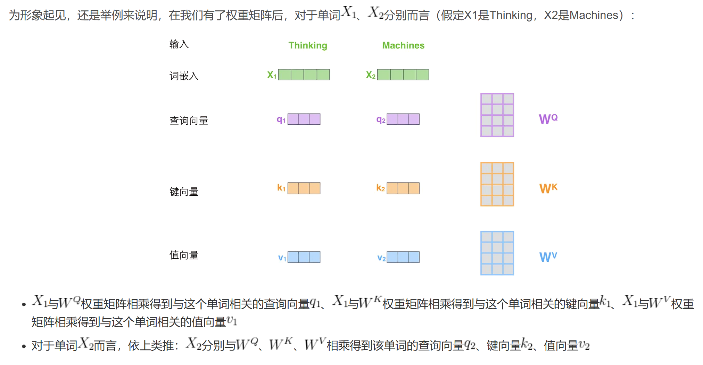

目录

[TOC]

## 从NNLM到Word2Vec

### NNLM

**神经网络语言模型(Neural Network Language Model，简称NNLM)**

NNLM的核心是一个多层感知机（Multi-Layer Perceptron，简称MLP），它将词向量序列映射到一个固定长度的向量表示，然后将这个向量输入到一个softmax层中，计算出下一个词的概率分布

第一步就是Look up Embedding，由于模型在经过另外一个训练之后可以生成一个映射单词表所有单词的矩阵，也称词嵌入矩阵，从而在进行预测的时候，我们的算法可以在这个映射矩阵(词嵌入矩阵)中查询输入的单词(即Look up embeddings)
第二步则是计算出预测值
第三步则输出结果

### Word2Vec的两种架构：从CBOW到Skipgram模型

**Word2vec训练流程：**不断缩小error(target - sigmoid_scores)

创建两个矩阵：**词嵌入Embedding矩阵**(注意：这个 Embedding矩阵其实就是网络Onehot层到Embedding层映射的网络参数矩阵，所以使用Word Embedding等价于把Onehot层到Embedding层的网络用预训练好的参数矩阵初始化了)、**上下文Context矩阵**，这两个矩阵在我们的词汇表中嵌入了每个单词，且两个矩阵都有这两个维度

第一个维度，词典大小即vocab_size，比如可能10000，代表一万个词
第二个维度，每个词其嵌入的长度即embedding_size，比如300是一个常见值（当然，我们在前文也看过50的例子，比如上文1.1节中最后关于单词“king”的词嵌入长度）

在Word2Vec模型训练的过程中，模型会不断更新Embedding矩阵和Context矩阵，使得输入词与其上下文词的嵌入更加相似。经过多次遍历整个数据集后，这些嵌入向量逐渐趋于稳定，反映出词语之间的语义关系。

在训练结束时，模型的主要目的是生成词的Embedding向量，即Embedding矩阵中的向量。Embedding矩阵包含了每个词的向量表示，这些向量已经通过训练学习到了词与词之间的语义关系。

Context矩阵的作用是在训练过程中帮助计算输入词与上下文词的相似度，但它不是最终需要使用的内容。它的作用仅限于训练过程中调整Embedding矩阵。因此，训练结束后，我们只需要保留Embedding矩阵，用于后续的任务（例如词向量查询或下游任务），而Context矩阵就不再需要了，所以可以丢弃。

## Seq2Seq and Encoder-Decoder

Seq2Seq（Sequence-to-sequence）：输入一个序列，输出另一个序列。其中输入序列和输出序列的长度是可变的。

针对Seq2Seq序列问题，比如翻译一句话，可以通过**Encoder-Decoder模型**来解决。

### Encoder-Decoder模型

#### RNN

为了建模序列问题，RNN引入了隐状态h（hidden state）的概念，隐状态h可以对序列形的数据提取特征，接着再转换为输出。

**在计算时，每一步使用的参数U、W、b都是一样的，也就是说每个步骤的参数都是共享的，这是RNN的重要特点**

- 因为RNN的权值是在同一个向量中，只是不同时刻而已
- LSTM中的权值则不共享，因为它是在两个不同的向量中。

RNN是包含循环的网络，在这个循环的结构中，每个神经网络的模块，读取某个输入，并输出一个值，然后不断循环。循环可以使得信息可以从当前步传递到下一步。

链式的特征揭示了RNN本质上是与序列和列表相关的，它们是对于这类数据的最自然的神经网络架构。

**RNN的局限：长期依赖（Long-TermDependencies）问题**

由于梯队消失，RNN会忘记它在较长序列中以前看到的内容，因此RNN只具有短时记忆。

#### LSTM

长短期（Long ShortTerm）网络是一种RNN特殊的类型，可以学习长期依赖信息。

RNN是重复单一的神经网络层，LSTM中的重复模块则包含四个交互的层，三个Sigmoid 和一个tanh层，并以一种非常特殊的方式进行交互。

- tanh层：帮助调节流经网络的值，使得数值始终限制在 -1 和 1 之间。

- sigmoid层：把值压缩到0~1 之间，有助于更新或忘记信息：

  - 因为任何数乘以 0 都得 0，这部分信息就会剔除掉；

  - 同样的，任何数乘以 1 都得到它本身，这部分信息就会完美地保存下来。

1.LSTM的关键就是**细胞状态**，水平线在图上方贯穿运行。细胞状态类似于传送带。直接在整个链上运行，只有一些少量的线性交互。信息在上面流传保持不变会很容易。

2.**“门”的结构**来去除或者增加信息到细胞状态的能力，门是一种让信息选择式通过的方法。

LSTM拥有三种类型的门结构：遗忘门/忘记门、输入门和输出门，来保护和控制细胞状态

**遗忘门**

**输入门**

**细胞状态**

**输出门**

##### LSTM变体

###### peephole连接

###### coupled

不同于之前是分开确定什么忘记和需要添加什么新的信息，这里是一同做出决定。我们仅仅会当我们将要输入在当前位置时忘记。我们仅仅输入新的值到那些我们已经忘记旧的信息的那些状态。

###### GRU

GatedRecurrentUnit(GRU)，将忘记门和输入门合成了一个单一的更新门。同样还混合了细胞状态和隐藏状态，和其他一些改动。最终的模型比标准的LSTM模型要简单，也是非常流行的变体。

> 参考博客：[如何从RNN起步，一步一步通俗理解LSTM_rnn lstm-CSDN博客](https://blog.csdn.net/v_JULY_v/article/details/89894058)

### Seq2Seq with Attention

#### **Attention模型**

**Attention模型**的关键，即由固定的中间语义表示C换成了根据当前输出单词来调整成加入注意力模型的变化的Ci

- 从输出的角度讲
  每个输出的词Y会受到每个输入x1,x2,x3,x4的整体影响，不是只受某一个词的影响，毕竟整个输入语句是整体而连贯的，但同时每个输入词对每个输出的影响又是不一样的，即每个输出Y受输入x1,x2,x3,x4的影响权重不一样，而这个权重便是由Attention计算，也就是所谓的注意力分配系数，计算每一项输入对输出权重的影响大小
- 从编码的角度讲
  在根据给到的信息进行编码时（或称特征提取），不同信息的重要程度是不一样的（可用权重表示），即有些信息是无关紧要的，比如一些语气助词之类的，所以这个时候在编码时，就可以有的放矢，根据不同的重要程度针对性汲取相关信息

#### Attention的算法流程

举例：翻译这句话：Tom chase Jerry

1.在翻译“杰瑞”的时候，带有注意力机制的模型会体现出英文单词对于翻译当前中文单词不同的影响程度，比如给出类似这样一个概率分布值：（Tom,0.3）(Chase,0.2) (Jerry,0.5)，每个英文单词的概率代表了翻译当前单词“杰瑞”时，注意力分配模型分配给不同英文单词的注意力大小

目标句子中的每个单词都应该学会其对应的源语句子中单词的注意力分配概率信息。这意味着在生成每个单词的时候，原先都是相同的中间语义表示C会被替换成根据当前生成单词而不断变化的（注：这里就是Attention模型的关键，即由固定的中间语义表示C换成了根据当前输出单词来调整成加入注意力模型的变化的）。

 2.生成目标句子单词的过程成了下面的形式：

3.而每个Ci可能对应着不同的源语句子单词的注意力分配概率分布，比如对于上面的英汉翻译来说，其对应的信息可能如下： 

其中，f2函数代表Encoder对输入英文单词的某种变换函数，比如如果Encoder是用的RNN模型的话，这个f2函数的结果往往是某个时刻输入后隐层节点的状态值；g代表Encoder根据单词的中间表示合成整个句子中间语义表示的变换函数，一般的做法中，g函数就是对构成元素加权求和，即下列公式： 

其中，Lx代表输入句子Source的长度，aij代表在Target输出第i个单词时Source输入句子中第j个单词的注意力分配系数，而hj则是Source输入句子中第j个单词的语义编码。

**生成目标句子某个单词，比如“汤姆”的时候，如何知道Attention模型所需要的输入句子单词注意力分配概率分布值呢？**
假设对非Attention模型的Encoder-Decoder框架进行细化，Encoder采用RNN模型，Decoder也采用RNN模型，这是比较常见的一种模型配置

那么用下图便可以较为便捷地说明注意力分配概率分布值的通用计算过程。

对于采用RNN的Decoder来说，用Target输出句子i-1时刻的隐层节点状态Hi-1去一一和输入句子Source中每个单词对应的RNN隐层节点状态hj进行对比，即通过函数来获得目标单词和每个输入单词对应的对齐可能性，然后函数F的输出经过Softmax进行归一化就得到了符合概率分布取值区间的注意力分配概率分布数值

**Attention的算法流程总结：通过计算相似性得出权重最后加权求和**

## **Transformer**

### 编码

- 编码组件部分由一堆编码器/Encoder构成（具体个数可以调，论文中是6个）
- 解码组件部分也是由相同数量(与编码器对应)的解码器Decoder组成

所有的编码器在结构上都是相同的，但是并不共享参数，且每个编码器都可以分解成两个子层：

从而，当我们把编码器和解码器联合起来看待的话，则整个流程就是（如下图从左至右所示）：

- 首先，从编码器输入的句子会先经过一个自注意力层（即self-attention），它会帮助编码器在对每个单词编码时关注输入句子中的的其他单词

- 接下来，自注意力层的输出会传递到前馈(feed-forward)神经网络中，每个位置的单词对应的前馈神经网络的结构都完全一样（注意：仅结构相同，但各自的参数不同）
- 最后，流入解码器中，解码器中除了也有自注意力层、前馈层外，这两个层之间还有一个编码-解码注意力层，用来关注输入句子的相关部分（和seq2seq模型的注意力作用相似）

其中Transformer的一个核心特性：

输入序列中每个位置的单词都各自单独的路径流入编码器，即各个单词同时流入编码器中，不是排队进入。
在自注意力self-attention层中，这些路径两两之间是相互依赖的，而前馈层(feed-forward）则没有这些依赖性，所以这些路径在流经**前馈层(feed-forward)时可以并行计算**

***前馈网络层在 Transformer 中的主要作用是对自注意力机制输出的特征进行非线性转换，提升模型的表达能力，帮助捕捉复杂的模式和关系，同时保持每个位置上的独立性。***

结构: 通常，前馈网络层由两个线性层（全连接层）和一个非线性激活函数（通常是 ReLU）组成：

1. 第一层线性变换将输入维度扩展到更高的维度。
2. 激活函数（如 ReLU）引入非线性，增加网络的表达能力。
3. 第二层线性变换将特征映射回原始维度。

### 自注意力机制

当模型处理每个位置的词时，self-attention允许模型看到句子中其他位置有关联或相似的单词/信息作为辅助线索，以更好地编码当前单词。

- RNN对隐藏状态的处理：将之前的隐藏状态与当前位置的输入结合起来。
- 在Transformer中，自注意力机制则将对其他单词的“理解”融入到当前处理的单词中。

#### 计算流程

##### 一、通过向量计算自注意力：先三个向量后计算得分且softmax最后加权求和

**第一步：生成查询向量、键向量和值向量**
通过向量方式计算自注意力的第一步，就是从每个编码器的输入向量(即每个单词的词向量)生成三个向量：查询向量query-vec、键向量key-vec、值向量value-vec

查询向量、键向量、值向量这三个向量的维度在论文中设置的是64，在维度上比词嵌入向量更低，因为词嵌入和编码器的输入/输出向量的维度是512，但也不是必须比编码器输入输出的维数小，这样做主要是为了让后续多头注意力的计算更稳定
（在下文你会看到，transformer通过多头注意力机制multi headed attention，对每个512维的输入向量都设置了8个头，不同的头关注每个输入向量不同的部分，而每个头的维度则是：512/8 = 64，另外也可以设置为2个头，不一定非得设置为8个头）

**最终使得输入序列的每个单词各自创建一个查询向量、一个键向量和一个值向量**

- 查询向量Query是当前单词的表示形式，用于对所有其他单词(key)进行评分，我们只需要关注当前正在处理的token的query

- 键向量Key可以看做是序列中所有单词的标签，是在我们找相关单词时候的对照物
- 值向量Value是单词的实际表示，一旦我们对每个单词的相关度打分之后，我们就要对value进行相加表示当前正在处理单词的value

**第二步：计算得分**

**得分决定编码某个固定位置的单词时，应该对其他位置上的单词各自给予多少关注度**

这个得分通过“Thinking”所对应的查询向量query和所有词的键向量key，依次乘积得出来。所以如果我们是处理位置最靠前的词的attention分值的话

第一个分数是q1和k1的点积(根据点积结果可以判断q1和k1这个向量的相似性)
第二个分数是q1和k2的点积(根据点积结果可以判断q1和k2这个向量的相似性)

**第三步和第四步**分别是：

- 将分数除以8（8是论文中使用的键向量的维数64的平方根，这会让梯度更稳定，也可以使用其它值）
- 然后通过softmax传递结果，softmax的作用是使所有单词的分数归一化，得到的分数都是正值且它们的和为1

这个softmax分数决定了在编码当下位置（“Thinking”）时，包括当下位置单词（“Thinking”）在内每个单词的所获得的关注度。显然，正在当下位置上的Thinking获得最高的softmax分数

**第五、六步：值向量乘以softmax分数后对加权值向量求和**
第五步是将softmax分值乘以每个值向量，这样操作的意义在于留下我们想要关注的单词的value，并把其他不相关的单词丢掉(例如，让它们乘以0.001这样的小数)

第六步是对加权值向量求和，产生“Thinking”的self-attention的输出结果

**接下来，针对每个单词都进行上述六个步骤的自注意力得分计算**。

##### **二、通过矩阵运算实现自注意力机制**

第一步是计算查询矩阵、键矩阵和值矩阵。为此，将输入词向量合并成输入矩阵（矩阵的每一行代表输入句子中的一个单词，所以整个矩阵就代表整个句子），将其乘以我们训练的权重矩阵：//

矩阵可以将步骤2到步骤6合并为一个公式来计算自注意力层的输出，下图是自注意力的矩阵运算形式：

#### 多头注意力机制“multi-headed” attention

- 它扩展了模型专注于不同位置的能力
- 它给出了注意力层的多个“表示子空间”

每个注意力头，只关注最终输出序列中一个子空间，互相独立，其核心思想在于，**抽取到更加丰富的特征信息**

具体步骤：

有多个查询/键/值权重矩阵集（Transformer使用8个注意力头，则对于每个编码器/解码器都有8个“    ”的矩阵集合)，每一组都是随机初始化，经过训练之后，输入向量可以被映射到不同的子表达空间中。

在“多头”注意机制下，我们为**每个头保持独立的查询/键/值权重矩阵**，从而产生不同的查询/键/值矩阵。

例子：The animal didn’t cross the street because it was too tired”，编码“it”的时候每个头的关注点：

编码it，用两个head的时候：其中一个更关注the animal（图中黄线的指向），另一个更关注tired（图中绿线的指向）。

#### 相比CNN/RNN的优势

**CNN：**

CNN提取的是局部特征，但是对于文本数据，忽略了长距离的依赖。卷积网络主要依靠深度来捕捉长距离依赖。但这个过程太间接了，因为信息在网络中实际传播了太多层。究竟哪些信息被保留，哪些被丢弃了，弄不清楚。所以从实践经验来看，卷积网络捕捉长依赖的能力非常弱。

**RNN：**

如下图所示，当计算隐向量时，用到了两个信息：一个输入，一个上一步算出来的隐向量 (前面所有节点的信息现在都寄存在了隐向量中)

- RNN中包含最多的信息是当前的输入，越往前的输入，随着距离的增加，信息衰减得越多。

  Transformer不管当前词和其他词的空间距离有多远，包含其他词的信息不取决于距离，而是取决于两者的相关性.

- 对于Transformer来说，在对当前词进行计算的时候，不仅可以用到前面的词，也可以用到后面的词，而RNN只能用到前面的词(这可以通过双向RNN来解决)

- RNN是一个顺序的结构，隐向量无法同时并行计算，导致RNN的计算效率不高

#### 位置编码

RNN的结构包含了序列的时序信息，而Transformer却完全把时序信息给丢掉了

“他欠我100万”，和“我欠他100万”，两者的意思千差万别。

**解决时序的问题：位置编码（Positional Encoding）**

即给每个位置编号，从而每个编号对应一个向量，最终通过结合位置向量和词向量，作为输入embedding，就给每个词都引入了一定的位置信息，这样Attention就可以分辨出不同位置的词了：

### 解码

#### 残差连接与层归一化

**残差连接 (Residual Connection)**

- 位置: 在 Transformer 的每一个子层（如多头自注意力机制或前馈神经网络层）后面都有一个残差连接。
- 作用
  - **稳定训练**: 残差连接通过绕过子层将输入直接加到子层的输出上，使得网络能够更容易训练深层网络。即使子层的输出很小，残差连接可以保证输入信息不丢失。
  - **信息流动**: 残差连接允许原始输入的信息在网络层中更长时间内流动，不会被层与层之间的操作削弱。

 **层归一化 (Layer Normalization)**

- 位置: 通常放在每个子层（如多头自注意力机制或前馈神经网络层）的残差连接之后。

- 作用

  - **稳定模型训练**: 层归一化通过标准化隐藏状态的输出，使得在每一层的输入保持一定的分布，减少了梯度消失和爆炸的风险，促进了更快的收敛。
  - **提高泛化能力**: 归一化有助于减少模型对特定输入分布的依赖，提高模型在不同输入条件下的表现。

  

每个**编码器和解码器**中的每个子层都有一个**残差连接**，然后做了一个：**层归一化**(layer-normalization)

其中求和与归一化层示意图：

#### 两个注意力层

解码器中的自注意力层和编码器中的不太一样，解码器中有两个注意力层，从底至上

- 一个**带masked**的Multi-Head Attention，本质是Self-Attention

  该自注意力层**只允许关注已输出位置的信息**，实现方法是在自注意力层的softmax之前进行mask，将未输出位置的权重设置为一个非常大的负数(进一步softmax之后基本变为0，相当于直接屏蔽了未输出位置的信息)

- 一个**不带masked**的Multi-Head Attention，本质是Encoder-Decoder Attention

对于第二个注意力层，即Encoder-Decoder Attention

- 与Encoder中的Q、K、V全部来自于上一层单元的输出不同，**Decoder只有Q来自于上一个Decoder单元的输出，K与V都来自于Encoder最后一层的输出**
- 也就是说，Decoder是要通过当前状态Q与Encoder的输出K算出权重后(计算query与各个key的相似度)，最后与Encoder的V加权得到下一层的状态

比如当我们要把“Hello World”翻译为“你好，世界”时

- 编码器是针对：Hello World
- 解码器是针对：你好 世界

**Decoder会计算“你好”这个query分别与“Hello”、“World”这两个key的相似度**
很明显，“你好”与“Hello”更相似，从而给“Hello”更大的权重，最终把“你好”对应到“Hello”，达到的效果就是“Hello”翻译为“你好”  

#### 最后的线性层和softmax层

线性层就是一个简单的全连接神经网络，它将解码器生成的向量映射到logits向量中。
假设我们的模型词汇表是10000个英语单词，它们是从训练数据集中学习的。那logits向量维数也是10000，每一维对应一个单词的分数。

然后，softmax层将这些分数转化为概率（全部为正值，加起来等于1.0），选择其中概率最大的位置的词汇作为当前时间步的输出

### 总体结构

当有着两个编码器和两个解码器的Transformer：

编码层与解码层二者协同工作 (可以很直观的看到，解码输出时是一个一个输出的)：

## **BERT**

**BERT：从Elmo/GPT到集大成者BERT**

**Word Embedding的缺陷：无法处理多义词问题**

考虑下面两个句子：

Sentence A：He got bit by Python.
Sentence B：Python is my favorite programming language.
在句子A中，Python是蟒蛇的意思，而句子B中是一种编程语言。
如果我们得到上面两个句子中单词Python的嵌入向量，那么像word2vec这种嵌入模型就会为这两个句子中的Python赋予相同的嵌入，因为它是上下文无关的

### ELMO

**根据上下文动态调整的ELMO：预训练(双层双向LSTM) + 特征融合**

- 在此之前的Word Embedding本质上是个静态的方式，所谓静态指的是训练好之后每个单词的表达就固定住了，以后使用的时候，不论新句子上下文单词是什么，这个单词的Word Embedding不会跟着上下文场景的变化而改变

- 而ELMO的本质思想是：根据当前上下文对Word Embedding动态调整的思路

ELMO采用了典型的两阶段过程：

- 第一个阶段是通过语言模型LSTM进行预训练

  上图左端的前向双层LSTM代表正方向编码器，输入的是从左到右顺序的上文Context-before；

  右端的逆向双层LSTM代表反方向编码器，输入的是从右到左的逆序的下文Context-after

- 同时，每个编码器的深度都是两层LSTM叠加

- 第二个阶段是在做下游任务时，从预训练网络中提取对应单词的网络各层的Word Embedding作为新特征补充到下游任务中

上图展示的是其预训练过程，它的网络结构采用了**双层双向LSTM**，双向LSTM可以**根据单词的上下文去预测单词**，比只通过上文去预测单词更准确。

LMO用双向LSTM来做encoding，但是这两个方向的**LSTM其实是分开训练的**，只是在最后在loss层做了个简单相加

- 对于每个方向上的单词来说，因为两个方向彼此独立训练，故在一个方向被encoding的时候始终是看不到它另一侧的单词的，从而避免了see itself的问题
- 而再考虑到句子中有的单词的语义会同时依赖于它左右两侧的某些词，仅仅从单方向做encoding是不能描述清楚的，所以再来一个反向encoding，故称双向

使用这个网络结构利用大量语料做语言模型任务就能预先训练好这个网络，如果**训练好这个网络后，再输入一个新句子，句子中每个单词都能得到对应的三个Embedding：**

- 第一个Embedding，是单词的Word Embedding

- 第二个Embedding，是双层双向LSTM中第一层LSTM对应单词位置的Embedding，这层编码单词的句法信息更多一些
- 第三个Embedding，是双层双向LSTM中第二层LSTM对应单词位置的Embedding，这层编码单词的语义信息更多一些

也就是说，ELMO的预训练过程不仅仅学会单词的Word Embedding，还学会了一个双层双向的LSTM网络结构，而这两者后面都有用。

预训练好网络结构后，如何给下游任务使用呢？下图展示了下游任务的使用过程，比如我们的下游任务仍然是QA问题，此时对于问句

- 可以先将句子X作为预训练好的ELMO网络的输入
- 这样句子X中每个单词在ELMO网络中都能获得对应的三个Embedding
- 之后给予这三个Embedding中的每一个Embedding一个权重a，这个权重可以学习得来
- 根据各自权重累加求和，将三个Embedding整合成一个
- 然后将整合后的这个Embedding作为X句在自己任务的那个网络结构中对应单词的输入，以此作为补充的新特征给下游任务使用
- 对于上图所示下游任务QA中的回答句子Y来说也是如此处理。因为ELMO给下游提供的是每个单词的特征形式，所以这一类预训练的方法被称为“Feature-based Pre-Training”。

**ELMO缺点**

- 在特征抽取器选择方面，ELMO使用了LSTM而不是Transformer，而**Transformer提取特征的能力是要远强于LSTM**
- ELMO采取双向拼接这种融合特征的能力可能比BERT一体化的融合特征方式弱

### 微调

**微调(Fine-tuning)：把在源数据集上训练的源模型的能力迁移到新数据新模型上**

迁移学习(Transfer learning)  ，就是把已训练好的模型（预训练模型）参数迁移到新的模型来帮助新模型训练。考虑到大部分数据或任务都是存在相关性的，所以通过迁移学习我们可以将已经学到的模型参数（也可理解为模型学到的知识），通过某种方式来分享给新模型从而加快并优化模型的学习效率，从而不用像大多数网络那样从零学习

其中，实现迁移学习有以下三种手段：

- Transfer Learning：冻结预训练模型的全部卷积层，只训练自己定制的全连接层

- Extract Feature Vector：先计算出预训练模型的卷积层对所有训练和测试数据的特征向量，然后抛开预训练模型，只训练自己定制的简配版全连接网络
- Fine-tuning：冻结预训练模型的部分卷积层（通常是靠近输入的多数卷积层，因为这些层保留了大量底层信息）甚至不冻结任何网络层，训练剩下的卷积层（通常是靠近输出的部分卷积层）和全连接层

**微调由以下4步构成**

- 在源数据集（如ImageNet数据集）上预训练一个神经网络模型，即源模型

- 创建一个新的神经网络模型，即目标模型，它复制了源模型上除了输出层外的所有模型设计及其参数

  我们假设这些模型参数包含了源数据集上学习到的知识，且这些知识同样适用于目标数据集

  我们还假设源模型的输出层与源数据集的标签紧密相关，因此在目标模型中不予采用

- 为目标模型添加一个输出大小为目标数据集类别个数的输出层，并随机初始化该层的模型参数

- 在目标数据集上训练目标模型，我们将从头训练输出层，而其余层的参数都是基于源模型的参数微调得到的

**Fine-tuning意义：**

- 站在巨人的肩膀上：前人花很大精力训练出来的模型在大概率上会比你自己从零开始搭的模型要强悍，没有必要重复造轮子

- 训练成本可以很低：如果采用导出特征向量的方法进行迁移学习，后期的训练成本非常低，用CPU都完全无压力，没有深度学习机器也可以做
- 适用于小数据集：对于数据集本身很小（几千张图片）的情况，从头开始训练具有几千万参数的大型神经网络是不现实的，因为越大的模型对数据量的要求越大，过拟合无法避免。这时候如果还想用上大型神经网络的超强特征提取能力，只能靠迁移学习

### GPT

**GPT：预训练(单向Transformer) + Fine-tuning**
GPT是“Generative Pre-Training”的简称，生成式的预训练。
GPT也采用两阶段过程，第一个阶段是利用语言模型进行预训练，第二阶段通过Fine-tuning的模式解决下游任务

下图展示了GPT的预训练过程，其实和ELMO是类似的，主要不同在于两点：

- 首先，**特征抽取器**不是用的LSTM，而是用的**Transformer**，Transformer特征抽取能力要强于LSTM

- 其次，GPT的预训练虽然仍然是以语言模型作为目标任务，但是采用的是**单向的语言模型**

**单向Transformer**

在Transformer的文章中，提到了Encoder与Decoder使用的Transformer Block是不同的：

- Encoder因为要编码整个句子，所以每个词都需要考虑上下文的关系。所以每个词在计算的过程中都是可以看到句子中所有的词的；
- 但是Decoder与Seq2Seq中的解码器类似，每个词都只能看到前面词的状态，所以是一个单向的Self-Attention结构

换言之，在解码Decoder Block中，使用了Masked Self-Attention(所谓Masked，即遮蔽的意思)，即句子中的每个词，都只能对包括自己在内的前面所有词进行Attention，这就是单向Transformer。

而**GPT使用的Transformer结构就是将Encoder中的Self-Attention替换成了Masked Self-Attention**，从而每个位置的词看不到后面的词

**GPT在第二阶段如何使用：**

- 首先，对于不同的下游任务来说，本来可以任意设计自己的网络结构，现在需要**把任务的网络结构改造成和GPT的网络结构是一样的**
- 然后，在做下游任务的时候，任务的网络结构的参数初始化为预训练好的GPT网络结构的参数
- 再次，对网络参数进行Fine-tuning，使更适合解决现有的任务

### **BERT：双向Transformer版的GPT**

#### 模型架构

**BERT模型的架构：预训练(双向Transformer) + Fine-Tuning**
GPT是使用「单向的Transformer Decoder模块」构建的，而 BERT则是通过「双向的Transformer Encoder 模块」构建的

BERT、ELMO、GPT之间的演进关系：

**BERT综合了ELMO的双向优势与GPT的Transformer特征提取优势**，即

- 第一点是特征抽取器采用Transformer
- 第二点是预训练的时候采用双向语言模型

**BERT采用和GPT完全相同的两阶段模型**

1. 首先是预训练(通过不同的预训练任务在未标记的数据上进行模型训练)，其次是使用Fine-Tuning模式解决下游任务
2. 和GPT的最主要不同在于在预训练阶段采用了类似ELMO的双向语言模型，当然另外一点是语言模型的数据规模要比GPT大

预训练之后，针对下游每个不同的任务都会有一个任务模型，只是这些任务模型一开始全都初始化为预训练好的BERT模型，然后根据下游任务的特点针对性微调

#### BERT对输入、输出部分的处理

为了适配多任务下的迁移学习，BERT设计了更通用的输入层和输出层。

具体而言，BERT的输入部分是个线性序列，两个句子之间通过**分隔符「SEP」**分割，最前面是**起始标识「CLS」**，每个单词有三个embedding：

- 单词embedding，有的单词会拆分成一组有限的公共子词单元，例如‘playing’可以被拆分成了‘play’和‘ing’；
- 句子embedding，用于区分两个句子，例如B是否是A的下文（对话场景，问答场景等）；
- 位置信息embedding，句子有前后顺序，组成句子的单词也有前后顺序，单词顺序是很重要的特征，要对位置信息进行编码

把单词对应的三个embedding叠加，就形成了BERT的输入。

BERT在预训练的输出部分：

#### BERT的两个创新点：Masked语言模型与Next Sentence Prediction

为了避免“因为双向条件会让每个词间接地 ‘看到自己/see itself’，从而模型在多层上下文中可以十分容易地预测目标词”的问题，BERT做了两个创新：一个是论文中指出的Masked 语言模型，一个是Next Sentence Prediction。

**“Masked Language Model（MLM）：**指在训练的时候随即从输入预料上mask掉一些单词，然后通过的上下文预测该单词。

也就是说

- 为了让BERT具备通过上下文做完形填空的能力，自然就得让BERT不知道中间待预测词的信息，所以就干脆不要告诉模型这个中间待预测词的信息好了

- 即在输入的句子中，挖掉一些需要预测的词，然后通过上下文来分析句子，最终使用其相应位置的输出来预测被挖掉的词

但是直接将大量的词替换为<MASK>标签可能会造成一些问题，模型可能会认为只需要预测<MASK>相应的输出就行，其他位置的输出就无所谓。同时Fine-Tuning阶段的输入数据中并没有<MASK>标签，也有数据分布不同的问题。

为了减轻这样训练带来的不利影响，BERT采用了如下的方式：输入数据中随机选择15%的词用于预测，这15%的词中

- 80%的词向量输入时被替换为<MASK>，比如my dog is hairy -> my dog is [mask]
- 10%的词的词向量在输入时被替换为其他词的词向量，比如my dog is hairy -> my dog is apple
- 另外10%保持不动，比如my dog is hairy -> my dog is hairy

> 这样一来就相当于告诉模型，我可能给你答案，也可能不给你答案，也可能给你错误的答案，有<MASK>的地方我会检查你的答案，没<MASK>的地方我也可能检查你的答案，所以<MASK>标签对你来说没有什么特殊意义，所以无论如何，你都要好好预测所有位置的输出。

**“Next Sentence Prediction”，其任务是判断句子B是否是句子A的下文**，如果是的话输出’IsNext‘，否则输出’NotNext‘，**这个关系保存在BERT输入表示图中的[CLS]符号中**

训练数据的生成方式是从平行语料中随机抽取的两句话：

- 其中50%是选择语料库中真正顺序相连的两个句子，符合IsNext关系

- 另外50%是第二个句子从语料库中随机选择出一个拼到第一个句子后面，它们的关系是NotNext

相当于我们要求模型除了做上述的Masked语言模型任务外，附带再做个句子关系预测，判断第二个句子是不是真的是第一个句子的后续句子。

之所以这么做，是考虑到很多NLP任务是句子关系判断任务，单词预测粒度的训练到不了句子关系这个层级，增加这个任务有助于下游句子关系判断任务。所以可以看到，它的预训练是个多任务过程，即有上文提到的这两个训练目标：

- 一个Token级别或称为词级别，Token级别简言之就是完形填空，一个句子中间挖个词，让模型预测那个空的是哪个词
- 一个句子级别，即给两句句子，判断这两句是不是原文中的连在一起的互为上下文（句子级别的任务对于阅读理解，推理等任务提升较大）

下图是微博公司利用微博数据和开源的BERT做预训练时随机抽出的一个中文训练实例，从中可以体会下masked语言模型和下句预测任务:

> 上文大部分内容为[Transformer通俗笔记：从Word2Vec、Seq2Seq逐步理解到GPT、BERT-CSDN博客](https://blog.csdn.net/v_JULY_v/article/details/127411638) 个人笔记整理

