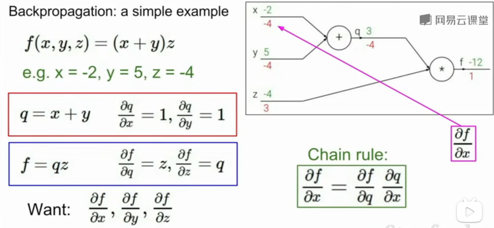
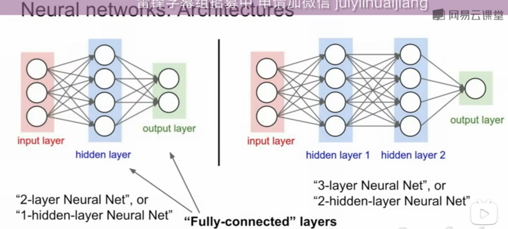
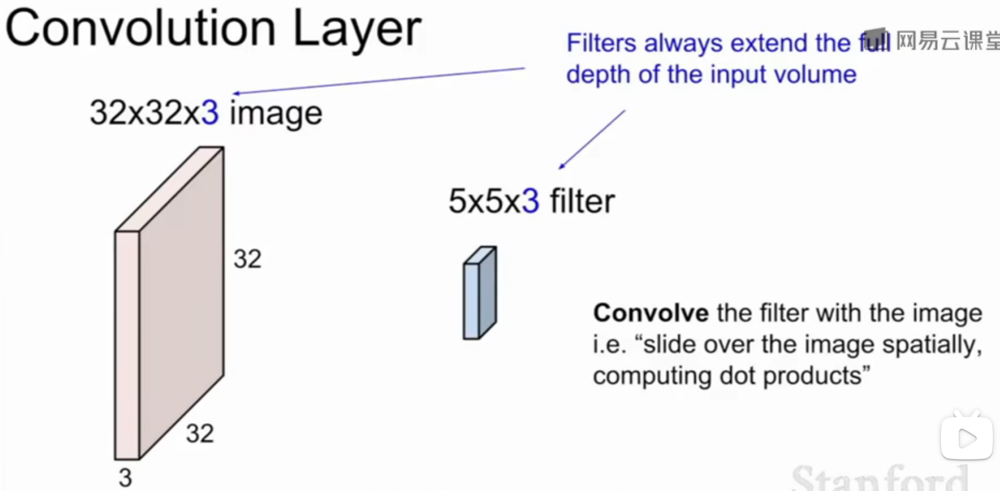
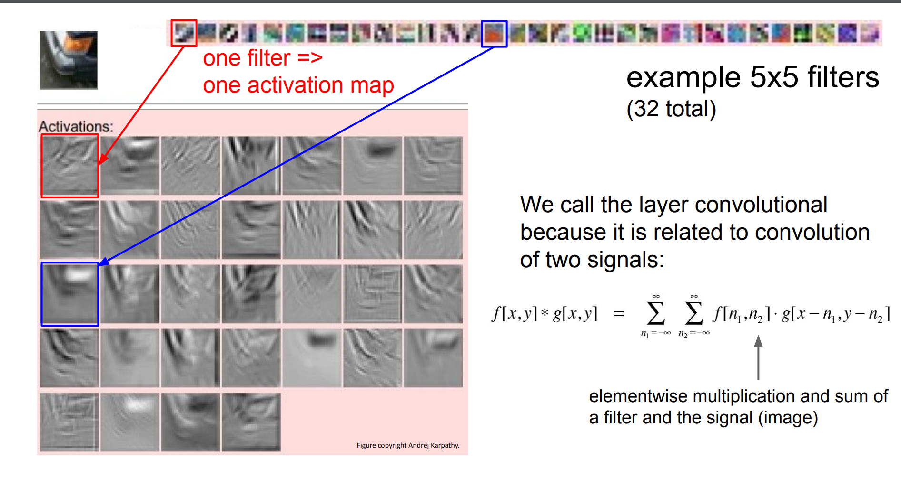
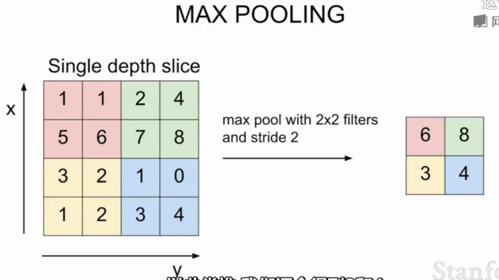
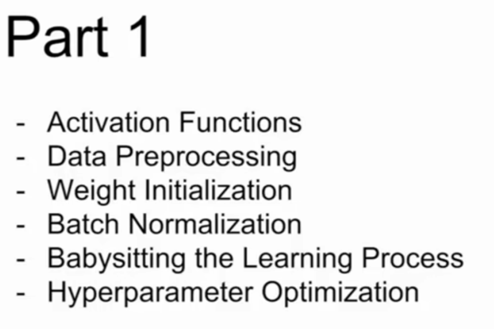
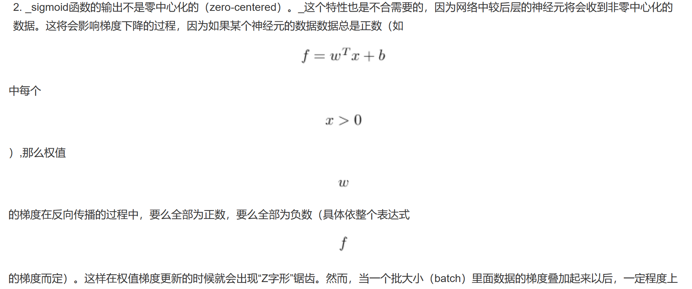
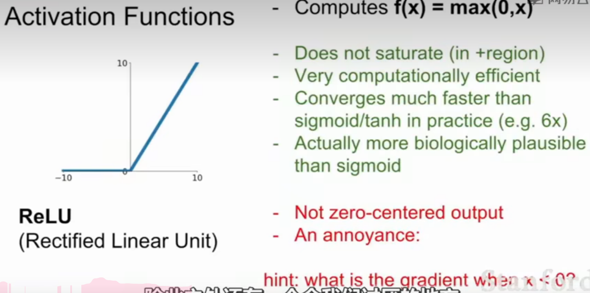
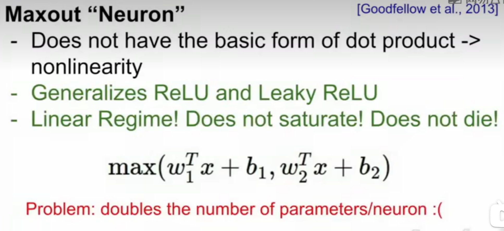
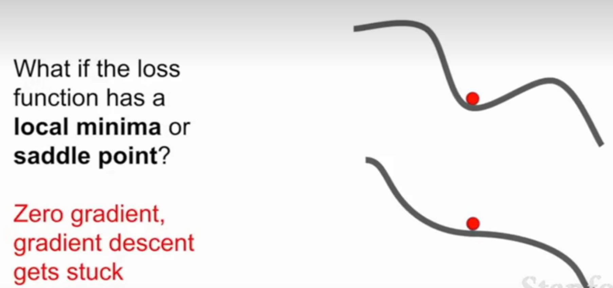

# 反向传播 计算任意复杂函数的梯度

## 反向传播技术backpropagation

递归地调用链式法则来计算计算图中每个变量的梯度

右侧计算图上面绿色的数字表示向前计算的数值，下面红色的数字表示反向计算时得到的梯度值

在每一个节点上计算我们所需的本地梯度，然后跟踪这个梯度。在反向传播过程中，我们接收从上游传回来的这个梯度值，这个值再乘以本地梯度，就得到想要传回连接点的值。在下一个节点进行反向传播时，不考虑除了直接相连的节点之外的任何东西

例子：

上游传回来的梯度值乘以本地梯度值，其中本地梯度值中的x指这个节点接收的数值

-0.53 = 1 * (-1/(1.37)²)

- 1 上游传回来的梯度值
- (-1/(x)²)本地梯度值
- 1.37 这个节点接收的x的值

尽量把计算图写成简单的形式，即每个节点最多只有两个输入

由这个图可知，可以把计算图分解成比较大的点计算，也可以把它分解成所有这些更小的计算节点

### Patterns in backward flow

- **加法门add gate:**

梯度分布器gradient distributor

通过加法门，连接了两个分支，获取上游梯度并分发和传递完全相同的梯度给相连接的两个分支

输入的梯度都等于输出的梯度，这一行为与输入值在前向传播时的值无关

加法求偏导： 

- **最大门max gate**

可以看作路由转换器

最大的那个值的梯度是上游传来的所有梯度值，另一个值的梯度为0

若该变量比另一个变量大，那么梯度是 ，反之为 。

- **乘法门mul gate**

可以看作梯度转换器，尺度缩放器

获取上游梯度，根据另一个分支的值对其缩放

输入的梯度等于输出梯度乘以另一个输入的值，或者乘以倍数 （ 的形式乘法门单元)

乘法求偏导： 

以的线性分类器为例，权重和输入进行点积  ，这说明输入数据的大小对于权重梯度的大小有影响。具体的，如在计算过程中对所有输入数据样本  乘以 100，那么权重的梯度将会增大 100 倍，这样就必须降低学习率来弥补。

> **也说明了数据预处理有很重要的作用，它即使只是有微小变化，也会产生巨大影响**。

### 向量计算

向量计算流程还是一样的，唯一区别在于梯度变成了雅可比矩阵

雅可比矩阵：**输出的每个元素对输入的每个元素求偏导组成的矩阵**，包含了每个变量里每个元素导数的矩阵，矩阵的每一行都是偏导数，矩阵的每个元素是输出向量的每个元素对输入向量每个元素分别求偏导的结果；而输出的第i个元素只与输入的第i个元素有联系，所以输出的第i个元素对其他元素求导都为0，因此雅可比矩阵是个对角矩阵，只有对角线上有数值，不为0

下面为计算图：

### 模块化操作

# 神经网络

神经网络就是由简单函数构成的一组函数在顶层由一种层次化的方式堆叠在一起，形成了一个更复杂的非线性函数

基本的多阶段分层计算

W1是像之前一样用来寻找的模板，W2是这些得分的加权，h是Max(0,W1*x)的值

一个三层的神经网络可以类比地看做  ，其中,  , 是需要进行学习的参数。

模拟真实神经元和神经网络：

常用的激活函数：

### 神经网络结构

对于普通神经网络，最普通的层级结构是**全连接层**（fully-connected layer） 。全连接层中的神经元与其前后两层的神经元是完全成对连接的，但是在同层内部的神经元之间没有连接。网络结构中没有循环（因为这样会导致前向传播的无限循环）。

左侧图：全连接层，两层神经网络，或单隐藏层神经网路

右侧图：全连接层，三层神经网络，或双隐藏层神经网络

可以把每层隐藏层神经网络看作一组向量，一组神经元的集合，利用矩阵乘法来计算神经元的值

**注意**：当我们说  层神经网络的时候，我们并不计入输入层。单层的神经网络就是没有隐层的（输入直接映射到输出）。也会使用人工神经网络（Artificial Neural Networks 缩写ANN）或者多层感知器（Multi-Layer Perceptrons 缩写MLP)来指代全连接层构建的这种神经网络。此外，输出层的神经元一般不含激活函数。

全连接层的神经网络的一种理解是：

- 它们定义了一个由一系列函数组成的函数族，网络的权重就是每个函数的参数。

拥有至少一个隐层的神经网络是一个通用的近似器，神经网络可以近似任何连续函数。

> 虽然一个2层网络在数学理论上能完美地近似所有连续函数，但在实际操作中效果相对较差。虽然在理论上深层网络（使用了多个隐层）和单层网络的表达能力是一样的，但是就实践经验而言，深度网络效果比单层网络好。

对于全连接神经网络而言，在实践中3层的神经网络会比2层的表现好，然而继续加深（做到4，5，6层）很少有太大帮助。卷积神经网络的情况却不同，在卷积神经网络中，对于一个良好的识别系统来说，深度是一个非常重要的因素（比如当今效果好的CNN都有几十上百层）。对于该现象的一种解释观点是：因为图像拥有层次化结构（比如脸是由眼睛等组成，眼睛又是由边缘组成），所以多层处理对于这种数据就有直观意义。

# 卷积神经网络

**卷积神经网络（CNN / ConvNet）** 和常规神经网络非常相似：

- 都是由神经元组成，神经元中有具有学习能力的权重和偏置项。每个神经元都得到一些输入数据，进行内积运算后再进行激活函数运算；
- 整个网络依旧是一个可导的评分函数，该函数的输入是原始的图像像素，输出是不同类别的评分；
- 在最后一层（往往是全连接层），网络依旧有一个损失函数（比如 SVM 或 Softmax），并且在神经网络中我们实现的各种技巧和要点依旧适用于卷积神经网络。

卷积神经网络的结构基于输入数据是图像，向结构中添加了一些特有的性质，使得前向传播函数实现起来更高效，并且大幅度降低了网络中参数的数量。

与常规神经网络不同，卷积神经网络的各层中的神经元都是 3 维的：**宽度、高度和深度**（这里的深度指的是激活数据体的第三个维度，而不是整个网络的深度，整个网络的深度指的是网络的层数）。

- 以第一层卷积层为例，输入数据仍然是 （宽度  高度深度）的，并不会将其延展成一个列向量，这样可以保持图像的**空间结构**（spatial structure）。
- 与输入相连的神经元权重不再是  的一个行向量（个参数），而是与输入数据有同样深度的**滤波器**（filter，也称作**卷积核**），比如是  的滤波器 。
- 这时的神经元（卷积核）不再与输入图像  是全连接的，而是**局部连接**（local connectivity），只和  中一个  的小区域进行全连接（常规神经网络中每个神经元都和整个  全连接），滤波器和这个区域计算一个点积 （计算的时候会展成两个向量进行点积），然后加一个偏置项 ，就得到一个输出数据（）。这样的一个神经元共有  个参数。
- 这个滤波器会在  上按一定的**步长**（stride） 依次滑动，比如步长为  时，最终会得到一个  的输出数据，称作**激活映射（activation map）** 或**特征映射（feature map）** ，对应  个神经元的输出。

**Convolutional Neural Networks**

卷积核遍历整个图像进行点积计算，也就是将卷积核每个位置元素和与之对应图像区域的像素值相乘然后相加 

这里的WT不完全是w的转置，这只是一个表示方法，是为了让数学运算按照点积的方式进行

通过pytorch或者numpy等，将一个5*5*3的向量扩展为一个一维的，然后进行转置，再进行向量的点积即可

这里做的是向量点积，如果w不展开的话就是做的矩阵内积了

所以这里的卷积核W实际上是向量，而不是矩阵

卷积神经网络主要由三种类型的层构成：**卷积层，池化（Pooling）层和全连接层**（全连接层和常规神经网络中的一样）。通过将这些层叠加起来，就可以构建一个完整的卷积神经网络。

一个用于 CIFAR-10 图像数据分类的卷积神经网络的结构可以是「**输入层-卷积层-ReLU层-池化层-全连接层**」，这四个层也是目前卷积神经网络比较常用的层。

- 输入层是  存有图像的原始像素，本例中图像宽高均为 32，有3个颜色通道。
- 卷积层中，神经元与输入层中的一个局部区域相连，每个神经元都计算输入层上与自己相连的区域与自己权重的内积。卷积层会计算所有神经元的输出。如果使用12个滤波器（也叫作卷积核），得到的输出数据体的维度就是  。
- ReLU层将会逐个元素地进行激活函数操作，比如使用以  为阈值的ReLU函数  作为激活函数。该层对数据尺寸没有改变，还是  。
- 池化层在空间维度（宽度和高度）上进行**降采样**（downsampling）操作，假设数据尺寸变为  。
- 全连接层将会计算分类评分，数据尺寸变为  ，其中 10 个数字对应的就是 CIFAR-10 中 10 个类别的分类评分值。全连接层与常规神经网络一样，其中每个神经元都与前一层中所有神经元相连接。

卷积神经网络一层一层地将图像从原始像素值变换成最终的分类评分值。

- 卷积层和全连接层（CONV/FC）对输入执行变换操作的时候，不仅会用到激活函数，还会用到很多参数（神经元的权值和偏置项）
- ReLU层和池化层进行一个固定的函数操作。
- 卷积层、全连接层和池化层有超参数，ReLU 层没有。卷积层和全连接层中的参数利用梯度下降训练。

不同卷积核提取不同的特征

- 前面几个卷积层的卷积核捕捉和匹配的是一些比较简单的特征，比如边缘；
- 中间几层的卷积核代表的特征变得复杂一些，比如一些边角和斑点；
- 最后几层的特征就会变得特别丰富和复杂。

向量点积与两个向量的夹角余弦值成正比，点积越大，夹角越小，向量越相似。也就是矩阵点积结果越大，特征越相似，激活函数就是添加非线性。

卷积核的通道数确实要和输入通道数一样，都是3，这里是卷积核的个数，经过一个卷积核，输出的是2维的，因为是用了多个卷积核，所以就是三维了

因为卷积核是三通道的，就是综合三通道算出来一个数字，所以压缩成单通道了

图像是7X7X3,那么卷积核必须是NXNX3的，这样一个核去做点乘的时候会得到一个数，有几个核就会得到几个数，然后所有的核再滑移

零填充的目的是保证图像尺寸再卷积后仍不变，更多地保留边缘值

3×3：填充宽度为1

5×5：填充宽度为2

7×7：填充宽度为3

如果不进行边缘填充的话：

步长较大时，获得和降采样处理图片相同的效果

### 视觉之外的卷积神经网络

池化层：

不会做深度方向上的池化处理,而只是做平面上的池化处理，所以深度是不会改变的。

池化：目的之一是进行降采样处理，减少size

最常用的方法最大池化法：（其他方法如均值池化法不如最大池化法

选激活值最大的神经元，因为他们意义最大

卷积核的大小和所要池化处理的区域大小是相同的，做法是取区域最大值

设定步长，使它们不会重叠

一般不在池化层做填零处理，因为池化层只做降采样，不会导致卷积核扫过边缘时有一部分超出了输入的范围

池化相当于是最简单的卷积方法了， 也就是卷积也可以做到池化的效果，只是卷积的参数较多，计算量较大

总结：

最后一层池化的输出，其实已经不能算作是一幅图像，更有点像是某个像素点值分布的阵列，着对应一个模式，从不同的模式中，对不同讴的检测特征进行区分识别等等

每一个池化层输出的值实际上是数据经过了整个网络处理后累积的结果

在最顶层，每一个值都表示了上一阶的某个概念

最底层寻找边缘或者一些简单的结构，经过卷积层一般是某些特定的激活表征，比如边缘在图像各个位置的体现，越往后得到的是更复杂、更高层的表示，下一个卷积层就比如表现出边角，输入不再是原始图像，而是之前的输出，在进一步计算得到更复杂的值；每一层每个值代表复合的复杂概念的受激程度

# 训练神经网络

Activation Funcations激活函数

sigmoid函数缺点：梯度消失、值恒大于零不够灵活（不满足零中心）、含有指数项计算量大

- 饱和神经元使梯度消失：当输入值特别小或大时，梯度值就无限接近于零，由链式法则反向传播，零梯度就会传递到下游的节点，即梯度就会消失

- 关于w的梯度是局部梯度(x)乘上L回传的梯度，局部梯度恒正，L回传的梯度有正有负，则w的梯度要不全为正，要不全为负，这样

​	即所有的w的梯度只能同时为正或为负

​	当进行梯度更新的时候，若L值为负，则w的梯度为负，若L值为正，即w的梯度为正；

​	这样梯度下降的方向只能是沿第一象限或第三象限，所以w更新的效率太低

- 指数计算的代价会稍微高一点（不是主要问题，卷积和点积的计算代价更大）

  

其他激活函数：

- 满足零中心（zero-centered），有梯度消失

ReLu优点：

- 右半部分没有梯度消失/梯度饱和
- 收敛速度更快

缺点：

- 不满足零中心
- 左边恒为零，梯度饱和，那么如果初始W设置得不大好，导致输出全是小于0的，这样激活函数的输出值全是0，反向求导的时候也全是0，不会进行梯度更新

对于不同的权重对应不同的分割超平面，数据经过加权后输入RELU，通过超平面将空间分割为0和非0区域，不同的RELU训练得到的分割超平面也相应不同

当数据云（即所有输入样本构成的集合）全部处于某个神经元对应直线的下方时，将导致无论输入哪个样本都无法使神经元的输出为正，因此该神经元在训练过程中将一直无法更新，所以说数据dead了

所以人们倾向于使用较小的权重来初始化ReLu，偏差值大多时候初始化为0，来增加它在初始化时被激活的可能性

改进的ReLu函数：

  

总结：

激活函数的目的是制造非线性差异，但也要兼顾计算量、导数大小及连续性、神经元死亡等问题

通常使用ReLu，可尝试使用其他函数，不会使用sigmoid

## Data Preprocessiong预处理

数据预处理：

 归一化

零均值化

原因：

在归一化  之前，分类器对数据的微小扰动特别敏感，所以网络权重矩阵的微小摄动。就会造成该层输出的巨大摄动

对训练集和测试集的数据做同样的预处理

权重预处理：

当所有权重值都为0时，相当于所有神经元都相同

初始化权重过小的时候，更新缓慢，网络崩溃

过大的时候，梯度饱和

 解决办法：使用Xavier初始化

## 批量归一化Batch Normalization

比较清晰的解释：[博文](https://blog.csdn.net/Yasin0/article/details/93379629)

 对输入数据进行标准化处理的原因？

使输入数据各个特征的分布相近：

神经网络学习的本质就是学习数据的分布，如果训练数据与测试数据的分布不同，那么网络的泛化能力也大大降低；
在使用小批量数据对神经网络进行训练时，若每批训练数据的分布各不相同，网络在每次迭代都去学习适应不同的分布，这会大大降低网络的训练速度；
为什么要使用批量归一化？

使用浅层模型时，随着模型训练的进行，当每层中参数更新时，靠近输出层的输出较难出现剧烈变化。对深层神经网络来说，随着网络训练的进行，前一层参数的调整使得后一层输入数据的分布发生变化，各层在训练的过程中就需要不断的改变以适应学习这种新的数据分布。所以即使输入数据已做标准化，训练中模型参数的更新依然很容易导致后面层输入数据分布的变化，只要网络的前面几层发生微小的改变，那么后面几层就会被累积放大下去。最终造成靠近输出层输出的剧烈变化。这种计算数值的不稳定性通常令我们难以训练出有效的深度模型。如果训练过程中，训练数据的分布一直在发生变化，那么将不仅会增大训练的复杂度，影响网络的训练速度而且增加了过拟合的风险。

在模型训练时，在应用激活函数之前，先对一个层的输出进行归一化，将所有批数据强制在统一的数据分布下，然后再将其输入到下一层，使整个神经网络在各层的中间输出的数值更稳定。从而使深层神经网络更容易收敛而且降低模型过拟合的风险。

批量归一化的优势：

不加批量归一化的网络需要慢慢的调整学习率时，网络中加入批量归一化时，可以采用初始化很大的学习率，然后学习率衰减速度也很大，因此这个算法收敛很快。
BN可以大大提高模型训练速度，提高网络泛化性能。
数据批量归一化后相当于只使用了S型激活函数的线性部分，可以缓解S型激活函数反向传播中的梯度消失的问题。
深层神经网络在做非线性变换前的激活输入值，随着网络深度加深或者在训练过程中，其分布逐渐发生偏移或者变动，整体分布逐渐往非线性函数的取值区间的上下限两端靠近，这会导致反向传播时低层神经网络的梯度消失，BN就是通过一定的规范化手段，把每层神经网络任意神经元这个输入值的分布强行拉回到均值为0方差为1的标准正态分布，使得激活输入值落在非线性函数对输入比较敏感的线性区域，其对应的导数远离导数饱和区 ，这样输入的小变化就会导致损失函数较大的变化，避免梯度消失问题产生，学习收敛速度快，能大大加快训练速度。

全连接层如何使用批量归一化？

将批量归一化层置于全连接层中的仿射变换和激活函数之间。设全连接层的输入为u，权重参数和偏差参数分别为W和b，激活函数为ϕ，批量归一化的运算符为BN。那么，使用批量归一化的全连接层输出为

## 超参数搜索hyperparameter search：

### **· 试错法（Babysitting）**

纯手工操作，设计了一个实验后，遵循学习过程的所有步骤（从数据收集到特征图映射的可视化），然后在超参数上依次迭代直到时间终止。

### **· 网格搜索（Grid Search）**

网格搜索，是一种简单尝试所有可能配置的方法。
它的工作流程是这样的：
**·** 定义一个N维的网格，其中每一个映射都代表一个超参数，例如，n＝（learning_rate, dropout_rate, batch_size）
**·** 对于每个维度，定义可能的取值范围: 例如，batch_size = [4, 8, 16, 32, 64, 128, 256]
**·** 搜索所有可能的配置，等待结果以建立最佳配置: 例如，*C1* = (0.1, 0.3, 4) ->acc = 92%, *C2* = (0.1, 0.35, 4) ->acc = 92.3%···
下图说明了一个简单的二维网格搜索的Dropout Rate和Learning Rate。

并行执行两个变量的网格搜索

这种策略没有考虑到计算背景，但这意味着可用的计算资源越多，那么同时可以尝试的猜测就会越多。它的痛点被称为维度灾难，意思是我们增加的维度越多，搜索就会变得越困难，最终导致策略失败。

### **· 随机搜索（Random Search）**

网格搜索和随机搜索之间唯一的区别在于策略周期的第一步：随机搜索在配置空间上随机选择点。

网格搜索vs随机搜索

通过在两个超参数空间上搜索最佳配置来对比这两种方法，并假定一个参数比另一个参数更重要。深度学习模型，如前面所说，实际上包含许多超参数，通常研究者知道哪些对训练影响最大。
在网格搜索中，即使我们已经训练了9个模型，但给每个变量只使用了3个值，然而，在随机搜索中，多次选择相同变量的可能性微乎其微。如果用第二种方法，那么就会给每个变量使用9个不同的值来训练9个模型。
上图中，从每个布局顶部的空间搜索可以看出，使用随机搜索更广泛地研究了超参数空间，这将帮助我们在较少的迭代中找到最佳配置。
总之，如果搜索空间包含3到4个维度，则不要使用网格搜索。相反，使用随机搜索，则会为每个搜索任务提供了一个非常好的基线。

​                                                                                              网格搜索与随机搜索的利弊

不幸的是，网格搜索和随机搜索有一个共同的缺点：“每个新的猜测都独立于之前的运行！”
相比之下，Babysitting的优势就显现出来了。Babysitting之所以有效，是因为研究者有能力利用过去的猜测，将其作为改进下一步工作的资源，来有效地推动搜索和实验。

### **· 贝叶斯优化（Bayesian Optimization）**

贝叶斯策略建立了一个代理模型，试图从超参数配置中预测我们所关注的度量指标。在每一次的迭代中，我们对代理会变得越来越有信心，新的猜测会带来新的改进，就像其它搜索策略一样，它也会等到耗尽资源的时候终止。

​                                                                                  贝叶斯优化工作流程

使用先前对损失**f**的观察结果，以确定下一个(最优)点来抽样**f**。该算法大致可以概括如下。

1. 使用先前评估的点X1*:n*，计算损失f的后验期望。
2. 在新的点X的抽样损失f，从而最大化f的期望的某些方法。该方法指定f域的哪些区域最适于抽样。

重复这些步骤，直到满足某些收敛准则。

- 交叉验证策略

- ### 粗细粒交叉搜索（coarse to fine search）

进行超参数优化时，一开始可能会处理很大的搜索范围，几次迭代后就可以缩小参数范围，圈定合适的超参数所在的范围，然后再对这个小范围重复过程

初始范围应该足够宽到网络不会超过范围的任一边

## Fancier optimization

### SGD随机梯度下降算法的问题：

- #### 方向分配不均

- #### 存在局部极小值和鞍点

高维度计算时出现鞍点，意味着某些方向上损失会增加，某些方向损失会减少，

高维度鞍点更常见，而出现局部极小值（全部方向损失都会增加）的情况反而更少遇到

### 改进算法：

#### Momentum

加入惯性/速度，使得优化不容易落入局部最优解或者停留在鞍点，可以减少常规的带有噪声的梯度下降SGD的曲折，也有利于处理高条件数的问题

例如具有惯性的小球，运动时会越过鞍点和局部最小值

#### Nesterov Momentum

在普通的SGD动量中，估算当前位置的梯度，取梯度和当前速度的混合作为实际前进的方向

在Nesterov Momentum中是速度过去后测得的梯度，然后返回来把速度加上那边的梯度再实际步进

Nesterov向量同时包含了当前速度向量和先前速度向量的误差修正

####  AdaGrad:

累加梯度平方和，使得步长有了一个很好的性质，在梯度下降很慢的维度上的训练速度会加快，在梯度下降很快的维度上的训练速度减慢

但是在复杂条件中会在局部最小值点停滞不前

#### RMSProp：

给累加的平方梯度和按照一定比率下降，和动量优化法类似

RMSProp会逐渐遗忘掉过去的梯度，在做加法运算时将新梯度的信息更多的反映出来

可以解决AdaGred在复杂条件中会在局部最小值点停滞不前的问题，但是由于给了梯度和一个衰减的比率，训练有可能  总是一直在变慢

（分母上+1e7-10为了使分母不为零

#### Adam：

  动量Momentum和平方梯度和RMSProp算法的混合

一般情况下的首选

### 学习率的选择：

#### 步长衰减，指数衰减

一开始将学习率设置为较大的数值

步长衰减：训练了多少步后对学习率进行衰减

指数衰减：在训练过程中持续衰减

步长衰减：

学习率衰减在SGD+Momentum中更常用，在Adam中不常用

设置学习率的方法应是，先尝试不用衰减，观察损失曲线，找出想衰减的地方，再使用衰减

#### 二阶优化：

##### 牛顿法

求hessian矩阵，但对深度学习来说不太实际

##### L-BGFGS二阶优化器

Adam和L-BFGS适用情况：

### 减少训练和测试之间的误差差距（减少过拟合）：

#### 模型集成/集成学习

更高级一点，保留学习过程中的模型快照，进行集成

图中使用的方法是开始时将学习率设置为一个非常小的数，然后突然变大，再突然变小......

#### Polyak平均：

在训练模型时对不同时刻的每个模型参数，求指数衰减平均值，从而得到网络训练中一个比较平滑的集成模型，之后使用这些平滑衰减平均后的模型参数，而不是截至在某一时刻的模型参数

## Regularization

### 正则化：减少过拟合

### Dropout：

- 每次在网络中正向传递时，在每一层随机将部分神经元置零
- 一般在全连接层使用
- 抑制过拟合的解释：
  - 减少了特征间的相互作用
  - 相当于集合学习，每次丢的结点都不同，相当于每次训练都是在训练新模型，测试时数据通过每个结点相当于把所有集合都给用了一遍

### Dropout的改进:

dropout和Batch Normalization都是常见的正则化方法，在训练过程中引入随机性减少过拟合，在测试时又抵消掉随机性

### 数据增强：

在不更改标签的情况下对数据进行改动

- 翻转，旋转
- 裁剪
- 色彩抖动

### 总结：

Stochastic Depth(上图)

Fractional Max Pooling：

DropConnect:

大多数情况下使用Batch Normalization就足够

## Transfer Learning迁移学习

迁移学习能够不需要大的数据集也能训练卷积神经网络

当差异不太大的时候，可以使用原有模型的参数进行微调，当差异比较大的时候就需要初始化大部分参数重新进行训练

在解决实际问题时很好用，当没有大数据集的时候，可以从网络上下载已经调试好的模型进行微调使用

# 总结

