# 图像目标检测、识别和分割

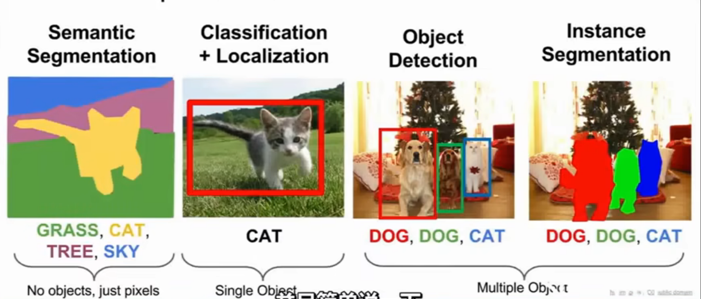

## 语义分割

为每个像素分类，语义分割并不区分同类目标

方法：

滑动窗口

全连接网络

先下采样再上采样，把特征维度降下来然后再增回去，优势就是不用那么大的过滤器

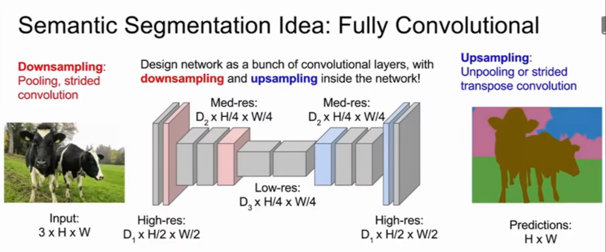

### 上采样UpSampling

最近距离去池化（展开）

将图像由小分辨率映射到大分辨率的尺寸恢复操作，使图像恢复到原尺寸

- 常见上采样方法有双线性插值、转置卷积、unpooling
- 常用的是双线性插值和转置卷积

bed of nails钉床函数

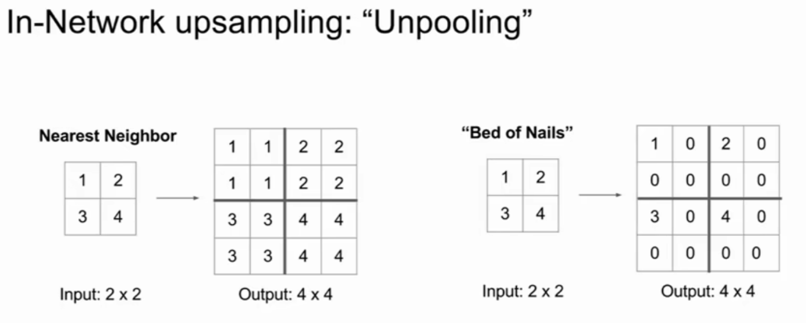

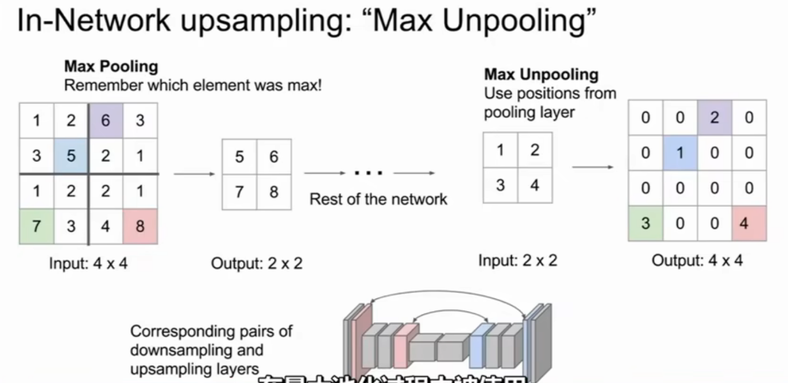

**上采样和下采样是对称的，上采样不为0的区域和前面降采样时的最大值位置一致**

**上采样即最大池化可以放大图像像素边界的不均匀性，maxpooling带有去噪效果，所以会发生特征丢失，也就是类间混淆**

不在每个像素依次向下放置卷积核，而是每隔两个像素卷积核移动一格，相当于步长为2，下采样图像或特征池

strided-convolution就是前边stride大于1的卷积层，实现下采样；

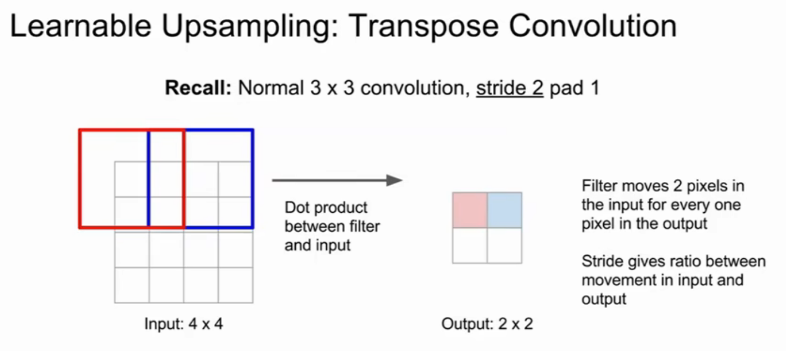

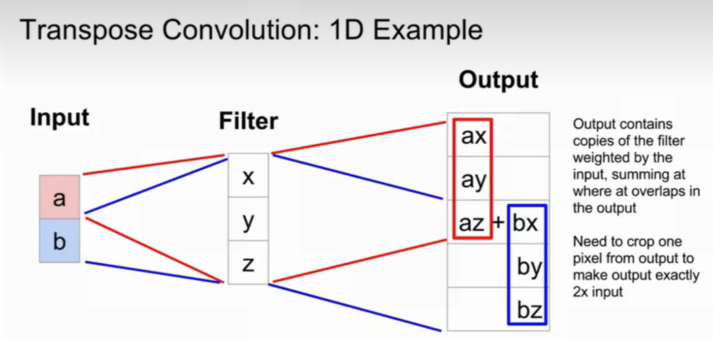

1维例子：转置卷积操作，输出是对输入做加权，依次向下移输出中的加权卷积核，步长为2，最后对输出中的感受野重叠部分进行叠加

### **转置卷积（Transposed Convolution**）

- 转置卷积不是卷积的逆运算，常规卷积操作是不可逆的，所以转置卷积并不是通过输出矩阵和卷积核计算原始输入矩阵，而是计算得到保持了相对位置关系的矩阵。
- 转置卷积也是卷积

与传统的上采样方法相比，转置卷积的上采样方式并非预设的插值方法，而是同标准卷积一样，**具有可学习的参数，可通过网络学习来获取最优的上采样方式**。

**通过在输入矩阵的值间插入零值 (以及周围填零) 上采样输入矩阵，然后进行常规卷积就会产生与转置卷积相同的效果**。

标准卷积操作实际上就是建立了一个 **多对一的映射关系**。   

对转置卷积而言，实际上是建立一个逆向操作，即 **一对多的映射关系**。

|  |  |  |
| ------------------------------------------------------------ | ------------------------------------------------------------ | ------------------------------------------------------------ |
| s=1, p=0, k=3                                                | s=2, p=0, k=3                                                | s=2, p=1, k=3                                                |

转置卷积就是一个对输入数据进行适当变换（上采样/补零）的普通卷积操作

在具体实现是对应的卷积操作如下：

- （S表示滑动步长（Sw，Sh），K表示转置卷积核大小，P表示转置卷积的padding）

- 对输入的特征图进行扩张（上采样）：相邻的数据点之间，在水平方向填充Sw-1个零，在垂直方向填充Sh-1个零
- 对输入特征图进行边界填充：四周分别填充K-P-1零行
- 将卷积核参数上下、左右翻转
- 做正常卷积运算

## 图像分类和定位

图像识别

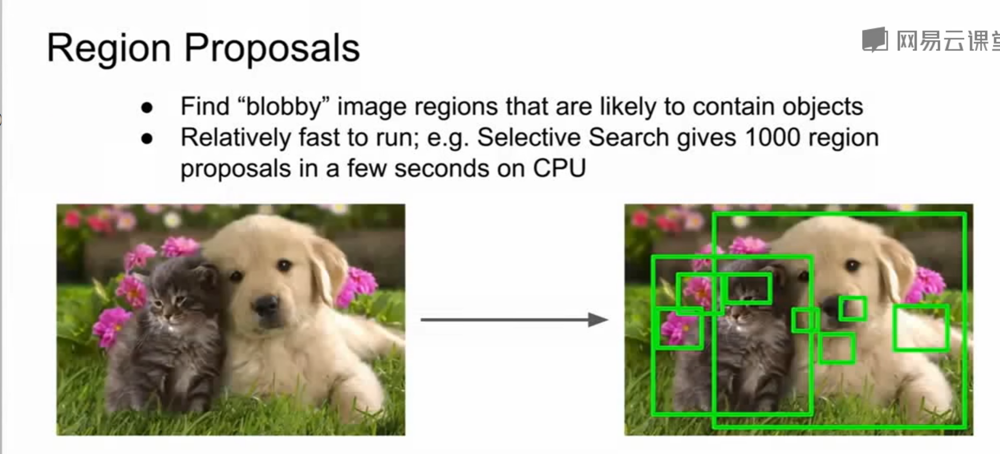

### R-CNN

R-CNN系列论文（R-CNN,fast-RCNN,faster-RCNN）是使用深度学习进行物体检测的鼻祖论文，其中fast-RCNN 以及faster-RCNN都是沿袭R-CNN的思路。

R-CNN全称region with CNN features。用CNN提取出Region Proposals中的featues，然后进行SVM分类与bbox的回归。

相当于先在原始图片中采样得到一组局部切片作为样本，再将样本送入卷积网络进行分类

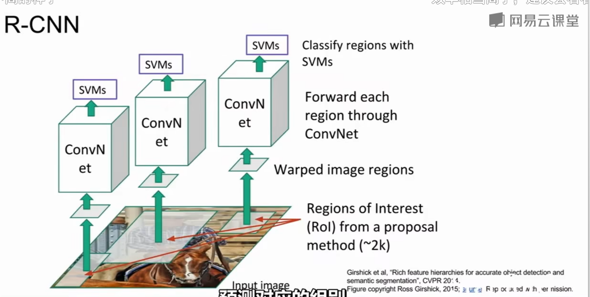

问题：

- 训练时间长：主要原因是分阶段多次训练，而且对于每个region proposal都要单独计算一次feature map，导致整体的时间变长。
- 占用空间大：每个region proposal的feature map都要写入硬盘中保存，以供后续的步骤使用。
- multi-stage：文章中提出的模型包括多个模块，每个模块都是相互独立的，训练也是分开的。这会导致精度不高，因为整体没有一个训练联动性，都是不共享分割训练的，自然最重要的CNN特征提取也不会做的太好。
- 测试时间长，由于不共享计算，所以对于test image，也要为每个proposal单独计算一次feature map，因此测试时间也很长。

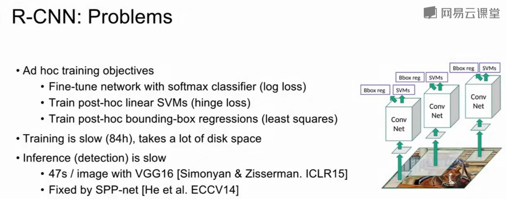

### Fast R-CNN

Fast RCNN主要有3个改进：

1、卷积不再是对每个region proposal进行，而是直接对整张图像，这样减少了很多重复计算。原来RCNN是对每个region proposal分别做卷积，因为一张图像中有2000左右的region proposal，肯定相互之间的重叠率很高，因此产生重复计算。

2、用ROI pooling进行特征的尺寸变换，因为全连接层的输入要求尺寸大小一样，因此不能直接把region proposal作为输入。

3、将regressor放进网络一起训练，每个类别对应一个regressor，同时用softmax代替原来的SVM分类器。

因此，Fast R-CNN相对于R-CNN来说，在训练速度上比RCNN快了将近9倍，比SPPnet快大概3倍；测试速度比RCNN快了213倍，比SPPnet快了10倍。在VOC2012上的mAP在66%左右。

### Faster R-CNN

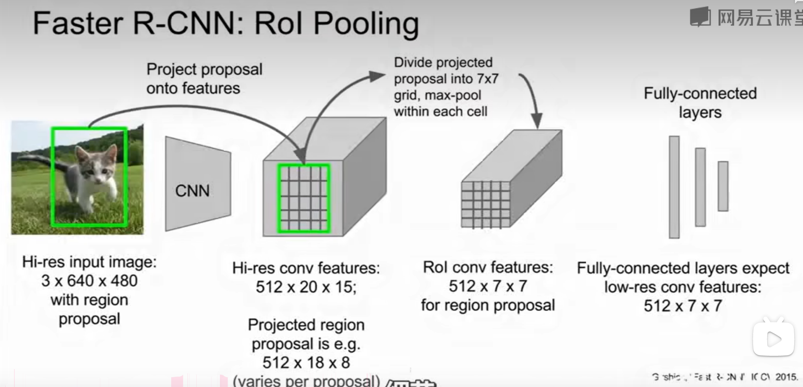

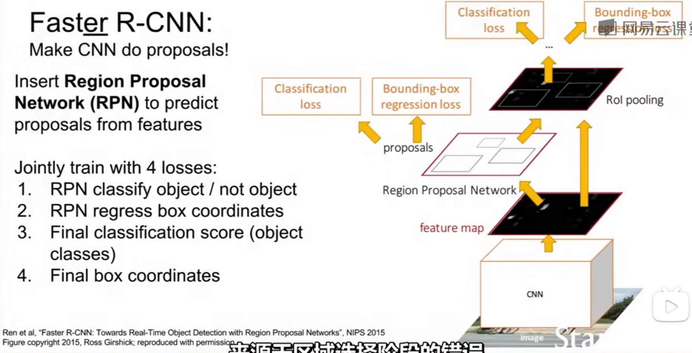

### YOLO/SSD

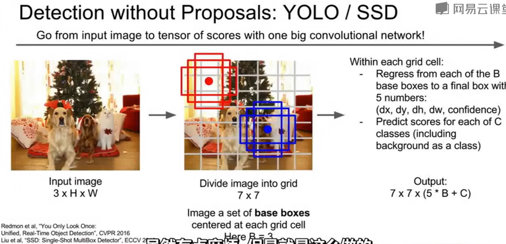

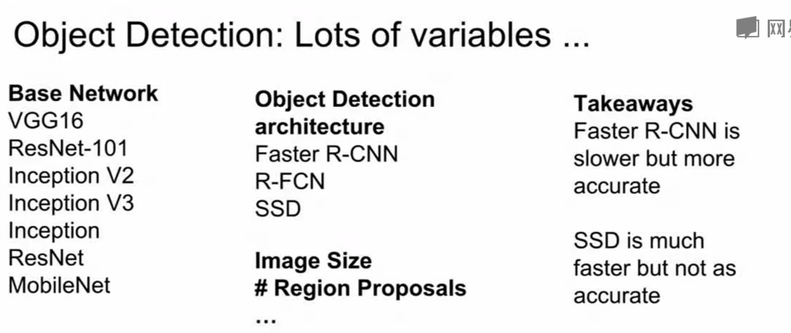

## 物体分割

### Mask R-CNN 

Mask R-CNN是在Faster R-CNN的基础上加了一个用于预测目标分割Mask的分支（即可预测目标的Bounding Boxes信息、类别信息以及分割Mask信息）,可以完成目标分类、目标检测、语义分割、实例分割、人体姿势识别等多种任务

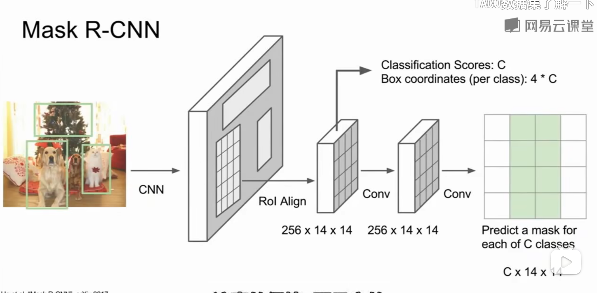

