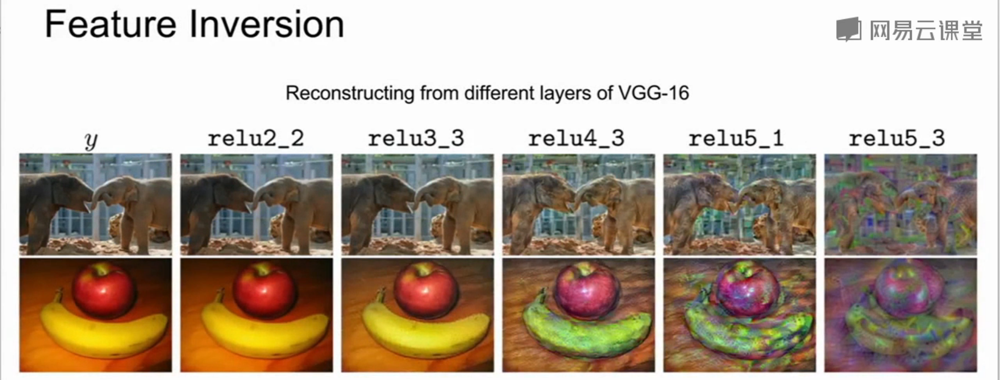

# 可视化和理解

> CNN 中有着数以千计的卷积滤波器。深度神经网络中不同的滤波器会从输入图像中提取不同特征表示。
>
> 己有的研究表明低层的卷积核提取了图像的低级语义特性（如边缘、角点），高层的卷积滤波器提取了图像的高层语义特性（如图像类别）。
>
> 但是，由于深度神经网络会以逐层复合的方式从输入数据中提取特征，我们仍然无法像Sobel算子提取的图像边缘结果图一样直观地观察到深度神经网络中的卷积滤波器从输入图像中提取到的特征表示。

## 对卷积网络各层的理解

### 第一个卷积层

几乎所有的网络第一个卷积层的卷积核的权重可视化后都是如图所示的有向边和明暗相反的颜色，和动物视觉系统开始部分组织的功能很接近。

可以把第一层的所有卷积核可视化来描述卷积层在原始图像匹配和关注什么。

可视化卷积核的背后原理是，卷积就是卷积核与图像区域做内积的结果，当图像上的区域和卷积核很相似时，卷积结果就会最大化。我们对卷积核可视化来观察卷积层在图像上匹配寻找什么。

### 中间层

对中间网络的卷积层做可视化理解可解释性比较差

例如第一个卷积层使用16 个 7 × 7 × 3的卷积核，第二层使用 20个 7 × 7 × 16的卷积核。由于第二层的数据深度变成 16维，不能直接可视化。一种处理方法是对每个卷积核画出 16 个 7 × 7 的灰度图，一共画 20 组。

即把中间网络卷积层的每个核权重展开成灰度图。

然而第二层卷积不和图片直接相连，是对第一层卷积的结果进行处理，所以卷积核可视化后并不能直接观察到有清晰物理含义的信息。

#### 1) 可视化激活图

可视化激活图在某种情况下是具备可解释性的

将中间层的特征映射图每个元素可视化灰度图，可以找到卷积神经网络要寻找的特征。

如上图，比较突出的那幅图看起来是在寻找类似人脸的东西。

- **激活量**：图像经过许多卷积网络层后的三维输出
- **激活映射图**：激活量的片段之一

每张激活图就对应了前一个卷积层的一个卷积核，相当于通过多个卷积层抽象出的特征

#### 2) Maximally Activating Patches（最大激活区块）

可视化输入图片中什么类型的小块可以最大程度的激活不同的神经元。

- 比如选择 AlexNet 的 Conv5 里的第  个激活图（共  个），然后输入很多的图片通过网络，并且记录它们在 Conv5 第  个激活图的值。
- 这个特征图上部分值会被输入图片集最大激活，由于每个神经元的感受野有限，我们可以画出这些被最大激活的神经元对应在原始输入图片的小块，通过这些小块观察不同的神经元在寻找哪些信息。

这里的神经元是指卷积激活映射图的一个缩放值

一个单层的卷积核对应一行，多个就形成了右图，意味着这层卷积核关注的是原图的什么（可能是眼睛、脸）

如下图所示，每一行都是某个神经元被最大激活对应的图片块，可以看到：

- 有的神经元在寻找类似眼睛的东西
- 有的在寻找弯曲的曲线等

如果不使用 Conv5 的激活图，而是更后面的卷积层，由于卷积核视野的扩大，寻找的特征也会更加复杂，比如人脸、相机等，对应图中的下面部分。

### 倒数第二个全连接层

#### 1) 最邻近

另一个有价值的观察对象是输入到最后一层用于分类的全连接层的图片向量，比如 AlexNet 每张图片会得到一个  维的向量。

使用一些图片来收集这些特征向量，然后在特征向量空间上使用最邻近的方法找出和测试图片最相似的图片。作为对比，是找出在原像素上最接近的图片。

可以看到，在特征向量空间中，即使原像素差距很大，但却能匹配到实际很相似的图片。

比如大象站在左侧和站在右侧在特征空间是很相似的。

#### 2) 降维

另一个观察的角度是将  维的向量压缩到二维平面的点，方法有PCA主成分分析，还有更复杂的非线性降维算法比如 **t-SNE**（t-distributed stochastic neighbors embeddings，t-分布邻域嵌入)

下图是minsts数据集使用t-SNE降维可视化后的图，minst是0到9之间的手写数字构成的数据集。把手写数字 0-9 的图片经过CNN提取特征降到2维画出后，发现都是按数字簇分布的，分成10簇。

同样可以把这个方法用到 AlexNet 的  维特征向量降维中。

输入一些图片，得到它们的  维特征向量，然后使用 t-SNE 降到二维，画出这些二维点的网格坐标，然后把这些坐标对应的原始图片放在这个网格里。

如果大家做这个实验，可以观察到相似内容的图片聚集在了一起，比如左下角都是一些花草，右上角聚集了蓝色的天空。

这两张图都是降维画出来的，左边分辨率高（输入的图少），右边分辨率低

在特征中有一些不连续的语义概念，可以通过高维特征的t-SNE降维来观察到这些不连续的语义概念

### 哪些像素对分类起作用？

#### 1) 遮挡实验（Occlusion Experiments）

在图片输入网络前，遮挡图片的部分区域，然后观察对预测概率的影响，可以想象得到，如果遮盖住核心部分内容，将会导致神经网络分值的急剧变化，即预测概率明显降低

#### 2) 显著图（Saliency Map）

除了前面介绍到的遮挡法，我们还有显著图（Saliency Map）方法，它从另一个角度来解决这个问题。

显著图（Saliency Map）方法是计算分类得分相对于图像像素的梯度，这将告诉我们在一阶近似意义上对于输入图片的每个像素如果我们进行小小的扰动，那么相应分类的分值会有多大的变化。

进行语义分割的时候也可以运用显著图的方法，可以在没有任何标签的情况下可以运用显著图进行语义分割。

#### 3) 引导式反向传播

不像显著图那样使用分类得分对图片上的像素求导，而是使用卷积网络某一层的一个特定神经元的值对像素求导，这样就可以观察图像上的像素对特定神经元的影响。

但是这里的反向传播是引导式的，即 ReLU 函数的反向传播时，只回传大于  的梯度，具体如下图所示。这样的做法有点奇怪，但是效果很好，图像很清晰。

我们把引导式反向传播计算的梯度可视化和最大激活块进行对比，发现这两者的表现很相似。

下图左边是最大激活块，每一行代表一个神经元，右侧是该神经元计算得到的对原始像素的引导式反向传播梯度。

下图的第一行可以看到，最大激活该神经元的图像块都是一些圆形的区域，这表明该神经元可能在寻找蓝色圆形状物体，下图右侧可以看到圆形区域的像素会影响的神经元的值。

#### 4) 梯度上升（Gradient Ascent）

引导式反向传播会寻找与神经元联系在一起的图像区域，另一种方法是梯度上升，合成一张使神经元最大激活或分类值最大的图片。

我们在训练神经网络时用梯度下降来使损失最小，现在我们要修正训练的卷积神经网络的权值，并且在图像的像素上执行梯度上升来合成图像，即最大化某些中间神将元和类的分值来改变像素值。

梯度上升的具体过程为：输入一张所有像素为0或者高斯分布的初始图片，训练过程中，神经网络的权重保持不变，计算神经元的值或这个类的分值相对于像素的梯度，使用梯度上升改变一些图像的像素使这个分值最大化。

同时，我们还会用正则项来阻止我们生成的图像过拟合。

正则项强制生成的图像看起来是自然的图像，比如使用 L2 正则来约束像素，针对分类得分生成的图片如下所示：

生成图像具备两个属性：

- ① 使最大程度地激活分类得分或神经元的值
- ② 使我们希望这个生成的图像看起来是自然的。

也可以使用一些其他方法来优化正则，比如：

- 对生成的图像进行高斯模糊处理
- 去除像素值特别小或梯度值特别小的值

上述方法会使生成的图像更清晰。

也可以针对某个神经元进行梯度上升，层数越高，生成的结构越复杂。

添加**多模态**（multi-faceted）可视化可以提供更好的结果（加上更仔细的正则化，中心偏差）。通过优化 FC6 的特征而不是原始像素，会得到更加自然的图像。

多模态问题，即对每一个类运行聚类算法，以使这些类分成不同的模型，然后用接近模型的类之一进行初始化

## DeepDream基于梯度的图像优化

DeepDream是一个有趣的AI应用实验，仍然利用梯度上升的原理，不再是通过最大化神经元激活来合成图片，而是直接放大某些层的神经元激活特征。

步骤如下：

- ① 首先选择一张输入的图像，通过神经网络运行到某一层
- ② 接着进行反向传播并且设置该层的梯度等于激活值，然后反向传播到图像并且不断更新图像。

对于以上步骤的解释：试图放大神经网络在这张图像中检测到的特征，无论那一层上存在什么样的特征，现在我们设置梯度等于特征值，以使神经网络放大它在图像中所检测到的特征。

不同网络、不同层检测的特征不同，梯度上升图像优化后产生的图像也不同。

在较高层激活特征比较复杂，产生的图像就比较复杂；在较低层激活特征比较简单，产生的图像就比较简单

检测不同物体、场景等等的网络不同，产生的图像也不同

初始图像：

较高层运行DeepDream

较低层运行DeepDream

长时间运行并进行多尺度处理

场景识别的网络：

## 图像神经风格迁移

### 特征反演（Feature Inversion）

查看不同层的特征向量能保留多少原始的图片信息

具体想法是：任选1张图片，前向传播到已经训练好的 CNN，选取其在 CNN 某一层产生的特征向量，保留这个向量。我们希望生成1张图片，尽量让它在该层产生一样的特征向量。

我们依旧使用梯度上升方法来完成，这个任务的目标函数定义为「最小化生成图片的特征向量与给定特征向量的L2距离」，当然我们会加一些正则化项保证生成图片的平滑，总体如下图所示：

- 在 relu2_2 层，可以根据特征向量几乎无损地恢复出原图片；
- 从 ReLU4_3 ReLU5_1 重构图像时，可以看到图像的一般空间结构被保留了下来，仍可以分辨出大象，苹果和香蕉，但是许多低层次的细节并比如纹理、颜色在神经网路的较高层更容易损失。说明网络的层次越深，细节信息越容易丢失

### 纹理生成（Texture Synthesis）

传统的方法有「近邻法」：根据已经生成的像素查看当前像素周围的邻域，并在输入图像的图像块中计算近邻，然后从输入图像中复制像素。但是这类方法在面对复杂纹理时处理得并不好。

#### 格莱姆矩阵（Gram Matrix）

格莱姆矩阵告诉我们两个点代表的不同特征的同现关系，矩阵中位置索引为  的元素值非常大，这意味着这两个输入向量的位置索引为  和  的元素值非常大。

格莱姆矩阵捕获了一些二阶统计量，即“映射特征图中的哪些特征倾向于在空间的不同位置一起激活”。

####  神经纹理生成（Neural Texture Synthesis）

**纹理生成步骤**：

- ① 首先把含有纹理的图像输入到一个预训练网络中（例如VGG），记录其每一层的激活图并计算每一层的格莱姆矩阵。
- ② 接着随机初始化一张要生成的新的图像，同样把这张初始化图像通过预训练网络并且计算每一层的 gram 矩阵。
- ③ 然后计算输入图像纹理矩阵和生成图像纹理矩阵之间的加权 L2 损失，进行反向传播，并计算相对于生成图像的像素的梯度。
- ④ 最后根据梯度上升一点点更新图像的像素，不断重复这个过程，即计算两个格莱姆矩阵的 L2 范数损失和反向传播图像梯度，最终会生成与纹理图像相匹配的纹理图像。

### 图像神经风格迁移（Style Transfer）

如果我们结合特征反演和纹理生成，可以实现非常热门的一个网络应用「图像神经风格迁移（Style Transfer）」。它能根据指定的1张内容图片和1张风格图片，合并生成具有相似内容和风格的合成图。

具体的做法是：准备两张图像，一张图像称为内容图像，需要引导我们生成图像的主题；另一张图像称为风格图像，生成图像需要重建它的纹理结构。然后共同做特征识别，最小化内容图像的特征重构损失，以及风格图像的格莱姆矩阵损失。

迭代完成后我们会得到风格迁移后的图像：它既有内容图像的空间结构，又有风格图像的纹理结构。

因为网络总损失是「特征反演」和「纹理生成」的两部分损失的加权和，我们调整损失中两者的权重可以得到不同倾向的输出；也可以改变风格图像的尺寸；甚至可以使用不同风格的格莱姆矩阵的加权和，来生成多风格图

### 快速图像风格迁移（Fast style Transfer）

风格迁移框架，每生成一张新的图像都需要迭代数次，计算量非常大

快速图像风格迁移方法，会在一开始训练好想要迁移的风格，得到一个可以输入内容图像的网络，直接前向运算，最终输出风格迁移后的结果。

训练前馈神经网络的方法是在训练期间计算相同内容图像和风格图像的损失，然后使用相同梯度来更新前馈神经网络的权重，一旦训练完成，只需在训练好的网络上进行一次前向传播。

