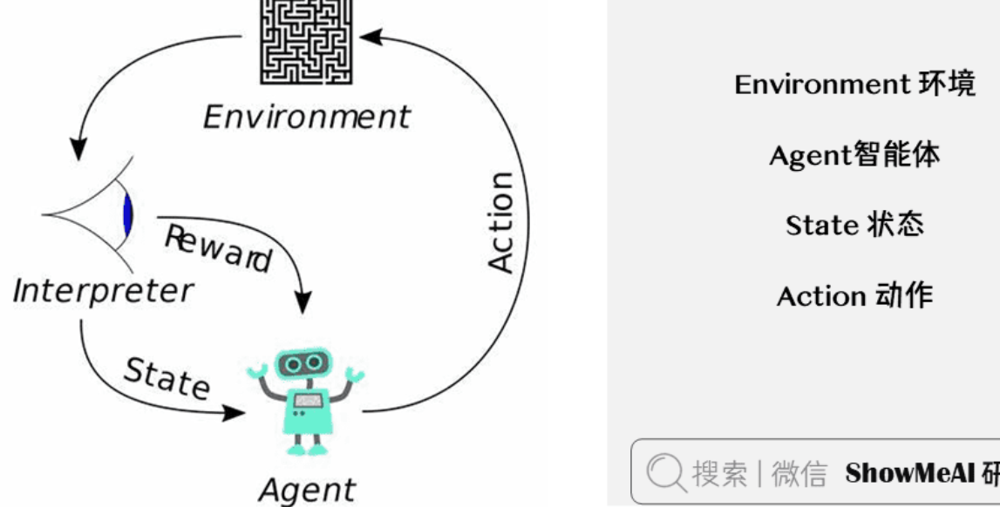

在**监督学习**（Supervised Learning）和**无监督学习**（Unsupervised Learning）之外，还有另外一类机器学习算法，叫做「**强化学习**」。

- **监督学习**：从外部监督者提供的带标注训练集中进行学习（任务驱动型）
- **无监督学习**：寻找未标注数据中隐含结构的过程（数据驱动型）。
- **强化学习**：「**试探**」与「**开发**」之间的折中权衡，智能体必须开发已有的经验来获取收益，同时也要进行试探，使得未来可以获得更好的动作选择空间（即从错误中学习）。强化学习也可以理解为有延迟标签（奖励）的学习方式。

目前强化学习在包括**游戏**，**广告和推荐**，**对话系统**，**机器人**等多个领域有着非常广泛的应用。

## 1.强化学习介绍与应用

### 1.1 强化学习介绍

强化学习是一类对目标导向的学习与决策问题进行理解和自动化处理的算法。它强调智能体通过与环境的直接互动来学习，无需像监督学习一样密集的样本级标签标注，通过奖励来学习合理的策略。

强化学习包含2个可以进行交互的对象：**智能体(Agnet)** 和 **环境(Environment)** ，它们的定义与介绍如下：

- **智能体(Agent)** ：可以感知环境的**状态(State)** ，并根据反馈的**奖励(Reward)** 学习选择一个合适的**动作(Action)** ，我们希望它能最大化长期总收益。
- **环境(Environment)** ：环境会接收智能体执行的一系列动作，对这一系列动作进行评价并转换为一种可量化的信号反馈给智能体。环境对智能体来说是一套相对固定的规则。



强化学习系统在**智能体（Agnet）** 和**环境（Environment）** 之外，还包含其他核心要素：**策略（Policy）** 、**回报函数（Reward Function）** 、**价值函数（Value Function）** 和**环境模型（Environment Model）**。

> 上述核心要素中「环境模型」是可选的。

- **策略（Policy）** ：智能体在环境中特定时间的行为方式，策略可以视作环境状态到动作的映射。
- **回报函数（Reward Function）** ：智能体在环境中的每一步，环境向其发送的1个标量数值，指代「收益」。
- **价值函数（Value Function）** ：表示了从长远的角度看什么是好的。一个状态的价值是一个智能体从这个状态开始，对将来累积的总收益的期望。
- **环境模型（Environment Model）** ：是一种对环境的反应模式的模拟，它允许对外部环境的行为进行推断。

### 1.2 强化学习应用

1) 游戏

2) 广告和推荐

3) 对话系统

4) 机器人

## 2.从游戏说起强化学习

首先，让我们简单介绍一下 Breakout 这个游戏。在这个游戏中，你需要控制屏幕底端的一根横杆左右移动，将飞向底端的球反弹回去并清除屏幕上方的砖块。每次你击中并清除了砖块，你的分数都会增加——你获得了奖励。


假设你想教神经网络模型玩这个游戏，模型的输入是游戏机屏幕像素所构成的图片，输出是三种动作：向左，向右以及开火（把球射出）。把这个问题建模为分类问题是很合理的——对于每个屏幕画面，你都需要进行决策：是左移，右移，还是开火。

分类的建模方法看起来很直接。不过，你需要大量训练数据训练你的分类模型。传统的做法是找一些专家让他们玩游戏并且记录他们的游戏过程。

但人类肯定不是这样玩游戏的，我们不需要有人站在我们背后告诉我们向左还是向右。我们只需要知道在某些情况下我们做了正确的动作并且得分了，其他的依靠我们自身的学习机制完成。这个问题就是强化学习尝试解决的问题。

强化学习处于监督学习与无监督学习的中间地带。在监督学习中，每个训练实例都有一个正确标签；在无监督学习中，训练实例并没有标签。在强化学习中，训练实例有稀疏并延时的标签——奖励。基于奖励，强化学习中的智能体可以学习如何对环境做出正确的反映。

上述的观点看起来很直观，但是实际存在很多挑战。举例来讲，在 Breakout 这个游戏中，击中砖块并且得分和前一时刻如何移动横杆没有直接关系。最相关的是前面如何将横杆移动到正确位置并反弹球。这个问题叫做信用分配问题（credit assignment problem），即：**建模获得奖励之前的哪些动作对获得奖励产生贡献以及贡献的大小**。

如果你已经获得了某种策略并且通过它得了不少奖励，你应该继续坚持这种策略还是试试其他的可能获得更高分的策略？仍举 Breakout 这个游戏为例，在游戏开始时，你把横杆停在左边并把球射出去，如果你不移动横杆，你总是能得 10 分的（当然得分的下一秒，你就死了）。你满足于这个得分吗，或者你想不想再多得几分？这种现象有一个专门的名词——**探索-利用困境（exploration-exploitation dilemma）** 。决策时应该一直延用现有的策略还是试试其他更好的策略？

强化学习是人类（或者更一般的讲，动物）学习的一种重要模式。父母的鼓励，课程的分数，工作的薪水——这些都是我们生活中的奖励。功劳分配问题以及探索-利用困境在我们日常生活工作中经常发生。这就是我们研究强化学习的原因。而对于强化学习，游戏是尝试新方法的最佳的沙盒。

## 3. 马尔科夫决策过程

下面，我们的问题是如何形式化定义强化学习问题使其支持推断。最常用的表示方式是马尔科夫决策过程。

假想你是一个智能体（agent），面对某种场景（比如说 Breakout 游戏）。你所处的环境可以定义为状态（state）（比如横杆的位置，球的位置，球的方向，当前环境中的砖块等等）。

智能体能够在环境中采取一些动作（actions）（比如向左或向右移动横杆）。这些动作会导致一些奖励（reward）（比如分数的增加）。智能体采取动作将导致新的环境，也就是新的状态。在新的状态下，智能体能够继续采取动作，循环往复。你采取行动的原则叫做策略（policy）。

通常来讲，环境是很复杂的，智能体的下一状态可能带有一定的随机性（比如当你失去一个球发射另一个球时，它的方向是随机的）。


一系列的状态、动作、以及采取动作的规则构成了一个马尔科夫决策过程（Markov decision process）。一个马尔科夫决策过程（比如一局游戏）由一串有限个数的状态、动作、反馈组成，形式化地表示为：


其中  代表状态， 代表动作， 代表进行动作后获得的奖励， 是终止状态。一个马尔科夫决策过程建立在马尔科夫假设上，即下一时刻的状态  只和当前状态  和动作  有关，和之前的状态及动作无关。

## 4. 打折的未来奖励

为了在长期决策过程中表现的更好，我们不但要考虑采取一个动作后的即时奖励，也要考虑这个动作的未来奖励。那么问题来了，我们应该如何建模这个未来奖励？

给定一个马尔科夫决策过程，它对应的奖励总和很容易用如下方式计算：


而  时刻的未来奖励可以表示为：


由于智能体所处的环境非常复杂，我们甚至无法确定在两次采取相同动作，智能体能够获得相同的奖励。智能体在未来进行的动作越多，获得的奖励越不相同。所以，我们一般采用一种「**打折的未来奖励**」作为  时刻未来奖励的代替。


其中  是  到  之间的折扣因子。这个  值使得我们更少地考虑哪些更长远未来的奖励。数学直觉好的读者可以很快地看出  可以用  来表示，从而将上式写成一种递推的形式，即：


如果  是 ，我们将会采取一种短视的策略。也就是说，我们只考虑即刻奖励。如果我们希望在即刻奖励与未来奖励之间寻求一种平衡，我们应该使用像  这样的参数。如果我们所处的环境对于动作的奖励是固定不变的，也就是说相同的动作总会导致相同的奖励，那么  应该等于 。

好的策略应该是：智能体在各种环境下采用最大（打折的）未来奖励的策略。

## 5. Q-learning算法

### 5.1 Q-Learning算法讲解

在 Q-learning 中，我们定义一个  函数，用来表示智能体在  状态下采用  动作并在之后采取最优动作条件下的打折的未来奖励。


直观讲， 是智能体「在  状态下采取  动作所能获得的最好的未来奖励」。由于这个函数反映了在  状态下采取  动作的质量（Quality），我们称之为Q-函数。

这个定义看起来特别奇怪。我们怎么可能在游戏进行的过程中，只凭一个状态和动作估计出游戏结束时的分数呢？实际上我们并不能估计出这个分数。但我们可以从理论上假设这样函数的存在，并且把重要的事情说三遍，「Q-函数存在，Q-函数存在，Q-函数存在」。Q-函数是否存在呢？

如果你还不相信，我们可以在假设Q-函数存在的情况下想一想会发生什么。假设智能体处在某个状态并且思考到底应该采用  动作还是  动作，你当然希望选取使游戏结束时分数最大的动作。如果你有那个神奇的Q-函数，你只要选取Q-函数值最大的动作。


上式中， 表示在  状态下选取动作的策略。

然后，我们应该如何获得Q-函数呢？首先让我们考虑一个转移 `<s, a, r, s’>`。我们可以采用与打折的未来奖励相同的方式定义这一状态下的Q函数。


这个公式叫贝尔曼公式。如果你再想一想，这个公式实际非常合理。对于某个状态来讲，最大化未来奖励相当于最大化即刻奖励与下一状态最大未来奖励之和。

Q-learning 的核心思想是：我们能够通过贝尔曼公式迭代地近似Q-函数。最简单的情况下，我们可以采用一种填表的方式学习Q-函数。这个表包含状态空间大小的行，以及动作个数大小的列。填表的算法伪码如下所示：

```
initialize Q[numstates,numactions] arbitrarilyobserve initial state srepeat    select and carry out an action a    observe reward r and new state s'    Q[s,a] = Q[s,a] + α(r + γmaxa' Q[s',a'] - Q[s,a])    s = s'until terminated
```

**Al gorithm 5 Q-learning 迭代算法**


其中  是在更新  时，调节旧  与新  比例的学习速率。如果，  就被消掉，而更新方式就完全与贝尔曼公式相同。

使用  作为未来奖励来更新  只是一种近似。在算法运行的初期，这个未来奖励可能是完全错误的。但是随着算法迭代，  会越来越准（它的收敛性已经被证明）。我们只要不断迭代，终有一天它会收敛到真实的Q函数的。

### 5.2 Q-Learning案例

我们来通过一个小案例理解一下 Q-Learning 算法是如何应用的。

#### 1) 环境

假设我们有5个相互连接的房间，并且对每个房间编号，整个房间的外部视作房间5。


以房间为节点，房门为边，则可以用图来描述房间之间的关系：


#### 2) 奖励机制

这里设置一个agent（在强化学习中， agent 意味着与环境交互、做出决策的智能体）， 初始可以放置在任意一个房间， agent最终的目标是走到房间5（外部）。

为此， 为每扇门设置一个 reward（奖励）， 一旦 agent 通过该门， 就能获得奖励：


其中一个特别的地方是房间5可以循环回到自身节点， 并且同样有100点奖励。

在 Q-learning 中， agent 的目标是达成最高的奖励值， 如果 agent 到达目标， 就会一直停留在原地， 这称之为 absorbing goal。

对于 agent， 这是i一个可以通过经验进行学习的 robot， agent 可以从一个房间（节点）通过门（边）通往另一个房间（节点）， 但是它不知道门会连接到哪个房间， 更不知道哪扇门能进入房间5（外部）。

#### 3) 学习过程

举个栗子，现在我们在房间2设置一个 agent，我们想让它学习如何走能走向房间5。


在 Q-leanring 中，有两个术语 state（状态）和 action（行为）。

每个房间可以称之为 state，而通过门进行移动的行为称之为 action，在图中 state 代表节点，action 代表边。

现在代理处于 **state2 (** 节点2，房间2)，从 **state2** 可以通往 **state3** ，但是无法直接通往 **state1**。

在 **state3** ，可以移动到 **state1** 或回到 **state2**。


根据现在掌握的 state，reward，可以形成一张 reward table（奖励表），称之为矩阵 ：


只有矩阵  是不够的， agent 还需要一张表， 被称之为矩阵  ， 矩阵  表示 agent 通过经验学习到的记忆（可以理解为矩阵  就是模型通过学习得到的权重）。

起初， 代理对环境一无所知， 因此矩阵  初始化为 。为了简单起见， 假设状态数已知为6。如果状态数未知， 则  仅初始化为单个元素 ， 每当发现新的状态就在矩阵中添加更多的行列。

Q-learning 的状态转移公式如下：


根据该公式， 可以对矩阵  中的特定元素赋值。

agent 在没有老师的情况下通过经验进行学习（无监督）， 从一个状态探索到另一个状态， 直到到达目标为止。每次完整的学习称之为 episode（其实也就相当于 epoch）， 每个 episode 包括从初始状态移动到目标状态的过程， 一旦到达目标状态就可以进入下一个 episode。

#### 4) 算法过程

```
设置gamme参数, 在矩阵R中设置reward初始化矩阵Q对于每一个episode:    选择随机的初始状态(随便放到一个房间里)    如果目标状态没有达成, 则        从当前所有可能的action中选择一个        执行action, 并准备进入下一个state        根据action得到reward        计算Q(state, action) = R(state, action) + Gamma * Max[Q(next-state, all actions)]        将下一个state设置为当前的state.        进入下一个state结束
```

在算法中， 训练agent在每一个episode中探索环境（矩阵  ）， 并获得reward， 直到达到目标状态。训练的目的是不断更新agent的矩阵  ：每个episode都在对矩阵  进行优化。因此， 起初随意性的探索就会被通往目标状态的最快路径取代。

参数 gamma 取  到  之间。该参数主要体现在 agent 对于 reward 的贪心程度上， 具体的说， 如果 gamma 为 ， 那么 agent 仅会考虑立即能被得到的 reward， 而 gamma 为  时， agent 会放长眼光， 考虑将来的延迟奖励。

要使用矩阵  ， agent 只需要查询矩阵  中当前 state 具有最高  值的 action：

- ① 设置当前 state 为初始 state
- ② 从当前 state 查询具有最高  值的 action
- ③ 设置当前 state 为执行 action 后的 state
- ④ 重复2，3直到当前 state 为目标 state

#### 5) Q-learning模拟

现在假设 ，初始 state 为房间 。

初始化矩阵  ：


同时有矩阵  ：


##### ① episode 1

现在 agent 处于房间1， 那么就检查矩阵  的第二行。agent 面临两个action， 一个通往房间3， 一个通往房间5。通过随机选择， 假设agent选择了房间5。


由于矩阵  被初始化为 ， 因此 ， ，  都是 ， 那么  就是 。

现在房间5变成了当前 state， 并且到达目标 state， 因此这一轮 episode 结束。

于是 agent 对矩阵  进行更新。


##### ② episode 2

现在， 从新的随机 state 开始， 假设房间3为初始 state。

同样地， 查看矩阵  的第四行， 有3种可能的 action：进入房间1、2或者4。通过随机选择， 进入房间 。计算  值：

 


现在 agent 处于房间， 查看矩阵  的第二行。此时可以进入房间3或房间5， 选择去5， 计算Q值：


由于到达目标 state， 对矩阵  进行更新，，。


##### ③ episode n

之后就是不断重复上面的过程，更新  表，直到结束为止。

#### 6) 推理

假设现在  表被更新为：


对数据标准化处理(  )，可以将  值看作概率：


描绘成图：


到这里已经很清晰了，agent 已经总结出一条从任意房间通往房间5（外部)的路径。

## 6.Deep Q Network算法

### 6.1 算法介绍

Breakout游戏的状态可以用横杆的位置，球的位置，球的方向或者每个砖块是否存在来进行定义。然而，这些表示游戏状态的直觉只能在一款游戏上发挥作用。我们要问：我们能不能设计一种通用的表示游戏状态的方法呢？最直接的方法是使用游戏机屏幕的像素作为游戏状态的表示。像素可以隐式地表示出球速以及球的方向之外的所有游戏状态的信息。而如果采用连续两个游戏机屏幕的像素，球速和球的方向也可以得到表示。

如果 DeepMind 的论文采用离散的游戏屏幕作为状态表示，让我们计算一下使用连续四步的屏幕作为状态，可能的状态空间。屏幕大小 ，每个像素点有  个灰度值，那么就有  种可能的状态。也就是说，我们的Q-表将要有  行。这个数字甚至多于宇宙中的原子个数！有人会说：有些屏幕状态永远不会出现，或者，能不能只用在学习过程中碰到过的状态作为Q-表的状态呢？即便如此，这种稀疏表示的Q-表里仍包含很多状态，并且需要很长时间收敛。理想的情况是，即便某些状态没有见过，我们的模型也能对它进行比较合理的估计。

在这种情况下，深度学习就进入了我们的视野。深度学习的一大优势是从结构数据中抽取特征（对数据进行很好的表示）。我们可以用一个神经网络对Q-函数进行建模。这个神经网络接收一个状态（连续四步的屏幕）和一个动作，然后输出对应的Q-函数的值。当然，这个网络也可以只接受一个状态作为输入，然后输出所有动作的分数（具体来讲是动作个数大小的向量）。这种做法有一个好处：我们只需要做一次前向过程就可以获得所有动作的分数。


DeepMind 在论文中使用的网络结构如下：

| Layer | Input    | Filter size | Stride | Num filters | Activation | Output   |
| ----- | -------- | ----------- | ------ | ----------- | ---------- | -------- |
| conv1 | 84x84x4  | 8×8         | 4      | 32          | ReLU       | 20x20x32 |
| conv2 | 20x20x32 | 4×4         | 2      | 64          | ReLU       | 9x9x64   |
| conv3 | 9x9x64   | 3×3         | 1      | 64          | ReLU       | 7x7x64   |
| fc4   | 7x7x64   |             |        | 512         | ReLU       | 512      |
| fc5   | 512      |             |        | 18          | Linear     | 18       |

这个网络是普通的神经网络：从输入开始，三个卷积层，接着两个全连接层。熟悉使用神经网络做物体识别的读者或许会意识到，这个网络没有池化层（pooling layer）。但是细想一下我们就知道，池化层带来位置不变性，会使我们的网络对于物体的位置不敏感，从而无法有效地识别游戏中球的位置。而我们都知道，球的位置对于决定游戏潜在的奖励来讲有非常大的意义，我们不应该丢掉这部分信息。

输入是  的灰度图片，输出的是每种可能的动作的Q-值。这个神经网络解决的问题变成了一个典型的回归问题。简单的平方误差可以用作学习目标。


给定一个转移`<s, a, r, s’>`，Q-表的更新算法只要替换成如下流程就可以学习Q-网络。

- 对于当前状态 `s`，通过前向过程获得所有动作的Q-值
- 对于下一个状态`s’`，通过前向过程计算Q-值最大的动作 
- 将  作为学习目标，对于其他动作，设定第一步获得的Q-值作为学习目标（也就是不会在反向过程中更新参数）
- 使用反向传播算法更新参数。

### **6.2 经验回放**

到现在，我们已经知道如何用 Q-learning 的算法估计未来奖励，并能够用一个卷积神经网络近似Q-函数。但使用Q 值近似非线性的Q-函数可能非常不稳定。你需要很多小技巧才能使这个函数收敛。即使如此，在单GPU上也需要一个星期的时间训练模型。

这其中，最重要的技巧是经验回放（experience replay）。在玩游戏的过程中，所有经历的`<s, a, r, s’>`都被记录起来。当我们训练神经网络时，我们从这些记录的`<s, a, r, s’>`中随机选取一些mini-batch作为训练数据训练，而不是按照时序地选取一些连续的`<s, a, r, s’>`。在后一种做法中，训练实例之间相似性较大，网络很容易收敛到局部最小值。同时，经验回放也使 Q-learning 算法更像传统监督学习。我们可以收集一些人类玩家的记录，并从这些记录中学习。

### **6.3 探索-利用困境**

Q-learning 算法尝试解决信用分配问题。通过 Q-learning ，奖励被回馈到关键的决策时刻。然而，我们还没有解决探索-利用困境。

我们第一个观察是：在游戏开始阶段，Q-表或Q-网络是随机初始化的。它给出的Q-值最高的动作是完全随机的，智能体表现出的是随机的「探索」。当Q-函数收敛时，随机「探索」的情况减少。所以， Q-learning 中包含「探索」的成分。但是这种探索是「贪心」的，它只会探索当前模型认为的最好的策略。

对于这个问题，一个简单的修正技巧是使用 - 贪心探索。在学习Q-函数时，这种技巧以  的概率选取随机的动作做为下一步动作， 的概率选取分数最高的动作。在DeepMind的系统中， 随着时间从  减少到 。这意味着开始时，系统完全随机地探索状态空间，最后以固定的概率探索。


Q-Learning 系列方法，它是基于价值（value-based）的方法， 也就是通过计算每一个状态动作的价值，然后选择价值最大的动作执行，是一种间接的强化学习建模做法，另外一类policy-based方法会直接更新策略

强化学习中还有结合policy-based 和 value-based 的 Actor-Critic 方法，以及在 Actor-Critic 基础上的 DDPG、A3C方法。