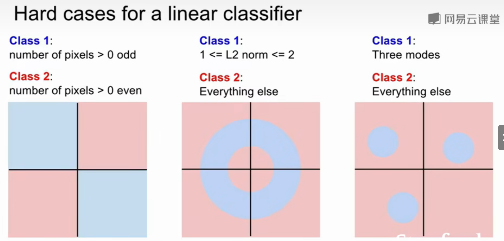

Convolutional Neural Networks 卷积神经网络（CNN, convnets)

## 图像分类：计算机视觉的核心任务

## 难题：

- 语义鸿沟（我们赋予图像的标签与计算机实际看到的像素值之间有着巨大的差距）
- 视角变换
- 光线问题
- 形变illumination
- 遮挡occlusion
- 背景干扰（Background clutter）：物体可能混入背景之中，使之难以被辨认。
- 类内差异（Intra-class variation）：一类物体的个体之间的外形差异很大，比如椅子。这一类物体有许多不同的对象，每个都有自己的外形

## 数据驱动的方式：

**硬编码**：先获取猫图像的边缘得到一些线条，然后定义规则比如**三条线交叉是耳朵之类**。然而这种方式的识别效果不好，并且不能识别新的物体。


**数据驱动算法**：不具体写出识别每个物体对应的规则，而是**针对每一类物体，找到大量样例图片，灌给计算机进行机器学习，归纳模式规律，生成一个分类器模型，总结出区分不同类物体的核心知识要素，然后用训练好的模型，识别新的图像**。

**数据驱动算法**过程如下：

- **输入**：输入是包含  个图像的集合，每个图像的标签是  种分类标签中的一种。这个集合称为训练集。
- **学习**：这一步的任务是使用训练集来学习每个类的模式规律。一般该步骤叫做分类器训练或者模型学习。
- **评价**：让分类器对它未曾见过的图像进行分类，把分类器预测的标签和图像真正的分类标签 （基本事实) 对比，并以此来评价分类器的质量。


## 分类器

### 最近邻分类器

KNN训练过程只是简单的记住图像数据和标签，预测的时候和训练数据中图片比较找出最接近的输出标签。这个分类器和卷积神经网络没有任何关系，实际中也极少使用，但通过实现它，可以对解决图像分类问题的方法有个基本认识。

最近邻算法表示图：


点代表测试点，区域代表标签

缺点：噪音干扰，在绿色区域的中间却出现了黄色区域

例子：一维的例子，120cm一下的一般是孩子(8岁以下)，150cm以上成人(18以上)如果是nn算法，给一个身高110的数据，一般是分成孩子类，但是数据集就有个噪音，有个残疾人双腿截肢了一截，身高恰好110，然后110cm想要分类的数据就会被到截肢的这个人一个类，小孩就被分成成人了


#### 距离度量计算方法

##### L1距离（曼哈顿距离）：

最简单的方法就是逐个像素比较，最后将差异值全部加起来。即将两张图片先转化为两个向量  和 ，然后计算他们的 L1 距离：


- 其中  为像素点， 表示第  个像素点的值。
- 两张图片使用 L1 距离来进行比较，即逐个像素求差值，然后将所有差值加起来得到一个数值。如果两张图片一模一样，那么 L1 距离为 ；但是如果两张图片很是不同，那 L1 值将会非常大。


```python
import numpy as np

class NearestNeighbor:
    def __init__(self):
        pass

    def train(self, X, y):
        """ X is N x D where each row is an example. Y is 1-dimension of size N"""
        # the nearest neighbor classifier simply remembers all the training date
        self.Xtr = X
        self.ytr = y

    def predict(self, X):
        """ X is N x D where each row is an example we wish to predict label for"""
        num_text = X.shape[0]
        # lets make sure that the output type matches the input type
        Ypred = np.zeros(num_text, dtype = self.ytr.dtype)

        # loop over all test rows
        for i in range(num_test):
            # find the nearest training image to the i'th test image
            # using the L1 distance (sum of absolute value differences)
            distances = np.sum(np.abs(self.Xtr - X[i,:]), axis = 1)
            min_index = np.argmin(distances) # get the index with smallest distance
            Ypred[i] = self.ytr[min_index] # predict the label of the nearest example

        return Ypred
```

`train`方法用于训练分类器。它接受两个参数：`X`是一个N x D的数组，其中每行代表一个训练样本，`y`是一个长度为N的一维数组，包含每个样本的类别标签。在方法内部，它简单地将训练数据`X`和类别标签`y`存储在类的实例变量`self.Xtr`和`self.ytr`中，以便在测试阶段使用。

`predict`方法用于对新的输入数据进行分类。它接受一个N x D的数组`X`，其中每行代表一个待预测的样本。在方法内部，首先确定输入数据的数量，并创建一个与输入数据数量相同的零数组`Ypred`，该数组将用于存储预测的类别标签。

然后，代码使用`np.argmin`找到距离数组`distances`中最小距离对应的索引，即找到了最近的训练样本。最后，将该最近训练样本的类别标签`self.ytr[min_index]`赋值给`Ypred[i]`，完成对当前测试样本的分类预测。


这种算法时间复杂度：

Train O(1) => Predict O(n)

训练时是一个恒定的时间，但测试一个图像就需要与数据集中n个训练实例进行比较

但这是一个不太好的分类器，**实际对分类器的要求是，我们希望它预测的时候要快，训练的时候可以慢**。


##### L2距离（欧式距离）


**L2 距离**，从几何学的角度，可以理解为它在计算两个向量间的欧式距离。L2 距离的公式如下：


- 依旧是在计算像素间的差值，只是先求差值的平方，然后把这些平方全部加起来，最后对这个和开方。

此时的代码只需改动计算距离差异的一行：

```python
distances = np.sqrt(np.sum(np.square(self.Xtr - X[i,:]), axis = 1))
'''np.square(self.Xtr - X[i,:]) 会对差值矩阵的每一个元素求平方'''
```

注意在这里使用了 `np.sqrt`，但是在实际中可能不用。因为对不同距离的绝对值求平方根虽然改变了数值大小，但依然保持了不同距离大小的顺序。

##### **L1、L2比较**

**坐标轴改变时，L1距离会改变，L2距离不会改变**

在 L1 距离更依赖于坐标轴的选定，坐标轴选择不同 L1 距离也会跟着变化，判定的数据归类的边界会更趋向于贴近坐标系的轴来分割所属区域，而 L2 的话相对来说与坐标系的关联度没那么大，会形成一个圆，不跟随坐标轴变化。

在面对两个向量之间的差异时，L2 比 L1 更加不能容忍这些差异。也就是说，**相对于1个巨大的差异，L2 距离更倾向于接受多个中等程度的差异（因为会把差值平方）**。

L1 和 L2 都是在 [**p-norm**](https://planetmath.org/vectorpnorm) 常用的特殊形式。

当图像中有特别在意的特征即输入特征向量的某些个值含有特殊含义的时候可以选择 L1 距离；当对图像中所有元素未知或者说是通用向量时，L2 距离会更自然一些。最好的方式是两种距离都尝试，然后找出最好的那一个。


### **K最近邻算法（K-Nearest Neighbors，KNN）**

 **k-Nearest Neighbor 分类器**。**KNN的思想是：找最相似的  个图片的标签， 中数量最多的标签作为对测试图片的预测**。

> 当  的时候，k-Nearest Neighbor 分类器就是上面所说的最邻近分类器。


从直观感受上就可以看到，更高的  值可以让分类的效果更平滑，使得分类器对于异常值更有抵抗力。

- 在  时，异常的数据点（比如：在绿色区域中的黄点)制造出一个不正确预测的孤岛。
- 在   时分类器将这些不规则都平滑了，使得它针对测试数据的泛化（generalization）能力更好。
  - 注意，5-NN 中也存在一些白色区域，这些区域是因为 5 个近邻标签中的最高数相同导致的分类模糊（即图像与两个以上的分类标签绑定），可以大胆将它归为随机周围的类。
  - 比如：2 个邻居是红色，2 个邻居是蓝色，还有 1 个是绿色，所以无法判定是红色还是蓝色。

## **超参数**（Hyperparameters)：

如K值、距离度量（distance metric）选择等等

不能直接从数据训练集中获得，需要人为提前设置的参数


#### 获得最优超参数的方法：

##### 设置验证集

将数据分为训练集、验证集、测试集（将现有数据集随机划分为训练集、验证集和测试集，即验证集和测试集也都是使用现有的有标签的数据，但算法并不知道标签），在训练集上用不同超参来训练算法，在验证集上进行评估，最后再把表现最好的一组超参在测试集上运行一次


**特别注意：不能使用测试集来进行调优**。


##### K折交叉验证（k次在不同测试集上的方差）

交叉算法：更多在小数据集上使用，因为在大数据集上训练本身就很消耗计算能力 

如果是交叉验证集，我们就不是取所有图像，而是将训练集平均分成 5 份，每份 10000 张图片，其中4份用来训练，1份用来验证。然后我们循环着取其中4份来训练，其中1份来验证，最后取所有5次验证结果的平均值作为算法验证结果。


下面是 5 份交叉验证对  值调优的例子。针对每个  值，得到 5 次验证的准确率结果，取其平均值，然后对不同  值的平均表现画线连接。


上图可以看出，本例中，当  的时算法表现最好（对应图中的准确率峰值）。如果我们将训练集分成更多份数，直线一般会更加平滑（噪音更少）。

实际情况下，深度学习不会使用交叉验证，主要是因为它会耗费较多的计算资源。一般直接把训练集按照  的比例分成训练集和验证集。但是训练集数量不多时可以使用交叉验证，一般都是分成3、5和10份。

#### KNN分类器缺点：

- **测试要花费大量时间**。因为每个测试图像需要和所有存储的训练图像进行比较，在实际应用中，关注测试效率远远高于训练效率

- **L2距离不能很好地测量图片的相似性**：尽管这四幅图片是不同的，但都拥有相同的L2距离

  使用像素差异来比较图像是不够的，图片间 L2 距离小，更多的是被背景主导而不是图片语义内容本身主导，往往背景相似图片的 L2 距离就会小。

  也就是说，在高维度数据上，基于像素的相似和基于感官上的相似非常不同。感官上不同的两张图片，可能有相同的 L2 距离。


- 维度灾难：如果要使分类器有更好的效果，需要训练数据能密集地分布在空间中（减少空白区域），需要指数倍增加的训练数据量


### 线性分类

线性分类是在不同类型的深度学习应用中最基本的构建块之一

KNN 模型中训练过程中没有使用任何参数，只是单纯的把训练数据存储起来（参数 k 是在预测中使用的，找出  个接近的图片，然后找出标签最多的，并且  是超参数，是人为设定的）。

与之相对的是**参数模型**，参数模型往往会在训练完成后得到一组参数，之后就可以完全扔掉训练数据，预测的时候只需和这组参数做某种运算，即可根据运算结果做出判断。线性分类器是参数模型里最简单的一种，但却是神经网络里很重要的基础模块。

线性分类的方法由两部分组成：

**① 评分函数（score function）**

- 它是原始图像数据到类别分值的映射。

**② 损失函数（loss function）**

- 它用来量化评分函数计算的分数与真实标签之间的一致性。该方法可转化为一个最优化问题，在最优化过程中，通过更新评分函数的参数来最小化损失函数值。


最简单的模型是线性模型：参数和输入数据相乘。即：


- 上式中参数  被称为**权重**， 被称为**偏置项**
- 在上面的公式中，假设每个图像数据都被拉长为一个长度为  的列向量，大小为 。其中大小为  的矩阵  和大小为  的列向量  为该函数的**参数（parameters）**。


偏移值b：人为设置，例如在猫多于狗的训练集中，猫的偏移值b要更大一些

- 常常混用**权重**（weights）和**参数**（parameters）这两个术语，实际上数据和参数相乘，就相当于数据占的比重，这个权重就是参数值；
- 该方法的一个优势是训练数据是用来学习参数  和  的，一旦训练完成，训练数据就可以丢弃，留下学习到的参数即可。当测试图像时可以简单地把图像数据输入给函数，函数计算出的分类分值来进行分类；
- 输入数据  是给定且不可改变的，但参数  和  是可改变的。目标就是通过改变这些参数，使得计算出来的分类分值情况和训练集中图像数据的真实类别标签相符；
- **只需一个矩阵乘法和一个矩阵加法就能对一个测试数据分类**，这比 KNN 中将测试图像和所有训练数据做比较的方法要高效很多。


#### 理解一 **W是所有分类器的组合**

**参数矩阵  相当于是三个分类器的组合， 的每一行都是一个分类器**，分别对应猫、狗、船。在线性模型中每个分类器的参数个数与输入图像的维度相当，每个像素和对应的参数相乘，就表示该像素在该分类器中应占的比重。


#### 理解二 线性分类器看做模板匹配

**把权重  的每一行看作一个分类的模板，一张图像对应不同分类的得分，是通过使用内积（也叫点积）来比较图像和模板，然后找到和哪个模板最相似**。

这种理解角度下，线性分类器在利用学习到的模板，和输入图像做模板匹配。我们设置可以把其视作一种高效的KNN，不同的是不再使用所有的训练集的图像来比较，而是每个类别只用了一张图片来表征（这张图片是我们学习到的模板，而不存在训练集中），而且我们会更换度量标准，**使用（负）内积来计算向量间的距离**，而不是使用 L1 或者 L2 距离。


上图是以 CIFAR-10 为训练集，学习结束后的权重可视化后的例子。图片的下方是线性分类器系数矩阵（权重矩阵）的可视化结果，每一个类别只有一个线性分类器，即只有一个单独的模板。可以看到：

- 马的模板看起来似乎是两个头的马，这是因为训练集中的马的图像中马头朝向各有左右造成的。线性分类器将这两种情况融合到一起了；
- 汽车的模板看起来也是将几个不同的模型融合到了一个模板中，这个模板上的车是红色的，是因为 CIFAR-10 中训练集的车大多是红色的。线性分类器对于不同颜色的车的分类能力是很弱的，但是后面可以看到神经网络是可以完成这一任务的；
- 船的模板如期望的那样有很多蓝色像素。如果图像是一艘船行驶在大海上，那么这个模板利用内积计算图像将给出很高的分数。


#### 理解三 将图像看做高维空间的点


从上面可以看到，** 的每一行都是一个分类类别的分类器**。对于这些数字的几何解释是：

- **如果改变  一行的数字取值，会看见分类器在空间中对应的直线开始向着不同方向旋转。而偏置项 ，则允许分类器对应的直线平移**。
- 需要注意的是，**如果没有偏置项，无论权重如何，在  时分类分值始终为 。这样所有分类器的线都不得不穿过原点**。

图像在象限中的划分：二维坐标系中（1,1）是一个点，三维坐标系中（1,1,1）则是一个点，以此类推，PPT上猫的图片则是在3072维坐标系上的一个点，然后找到合适的划分线即可


#### 偏置项

实际我们有权重参数  和偏置项参数  两个参数，分开处理比较冗余，常用的优化方法是把两个参数放到同一个矩阵中，同时列向量  就要增加一个维度，这个维度的数值是常量 ，这就是默认的**偏置项维度**。

如下图所示，新的公式就简化成如下形式：


经过这样的处理，最终只需学习一个权重矩阵，无需学习两个分别装着权重和偏差的矩阵。


#### 线性分类器失效

线性模型无法解决异或问题，直观上表示为无法找到一条直线分割异或点：



线性分类器的分类能力实际是有限的，例如上图中的这三种情形都无法找到合适的直线区分开。其中第 1 个 case 是奇偶分类，第 3 个 case 是有多个模型。
