# 损失函数和最优化

## 损失函数

### 损失函数概念

**损失函数**（Loss Function）（有时也叫**代价函数 Cost Function** 或**目标函数 Objective**）  来衡量对预估结果的「不满意程度」。当评分函数输出结果与真实结果之间差异越大，损失函数越大，反之越小。

- 即每个样本损失函数求和取平均。目标就是找到一个合适的  使  最小。
- **注意**：真正的损失函数  还有一项正则损失 ，下面会有说明。

两种计算损失函数的方法：SVM、Softmax

### 多类支持向量机损失 (Multiclass Support Vector Machine Loss SVM损失函数）

SVM 的损失函数想要 SVM 在正确分类上的得分始终比不正确分类上的得分高出一个边界值 。

这里的例子是 = 1

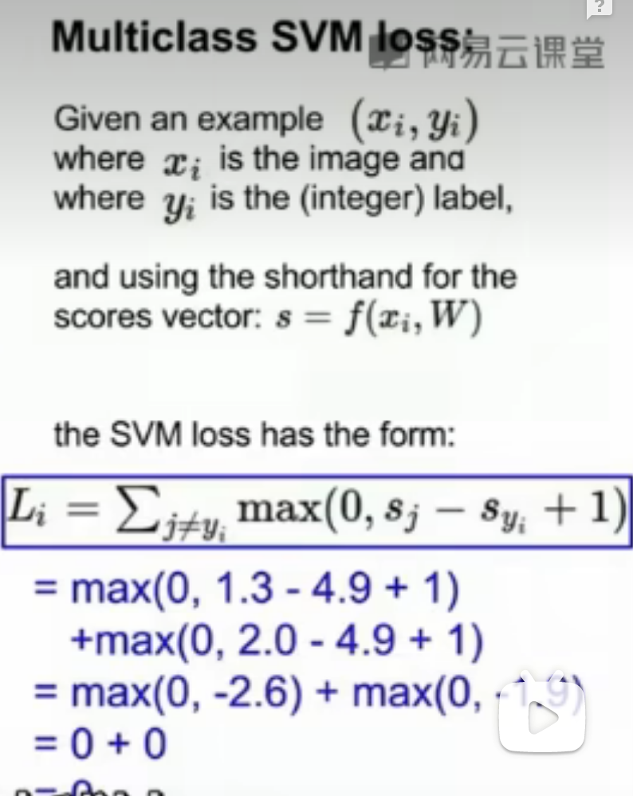

第  个数据  )中包含图像  的像素和代表正确类别的标签  ，通过公式  )来计算不同分类类别的分值

第  个类别的得分就是  的第  个元素： 

针对第  条数据样本的多类 SVM 的损失函数定义如下：

直观来看，就是如果评分函数给真实标签的分数比其他某个标签的分数高出 ，则对该其他标签的损失为 ；否则损失就是 。要对所有不正确的分类循环一遍。

例：

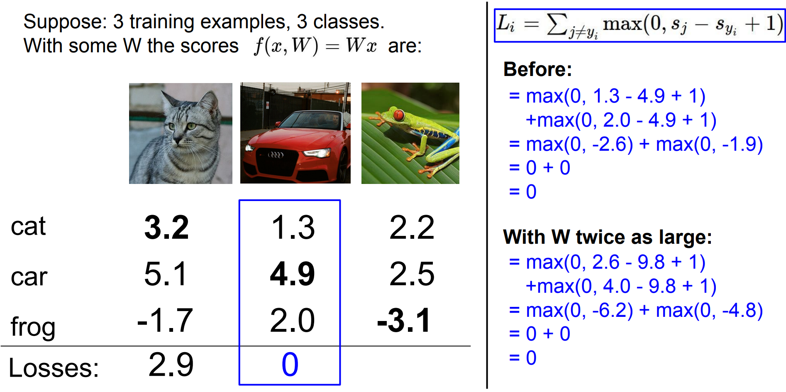

这里的评分函数 ，所以损失函数可以写为：

- 其中  是  的第  行，然后被拉成一个行列向量，与  列向量做点积。

- SVM损失函数只关注正确分类的概率比未正确分类的概率大1，只要大1，损失函数就觉得此时的损失为0。所以w扩大几倍后，L仍然为0。令L为0的Wi的值不是唯一的。
- 损失最小是 ，最大无穷；
- 如果求和的时候，不加  这一条件， 会加 ；
- 计算  时使用平均不用求和，只会缩放  不会影响好坏；而如果使用平方，就会打破平衡，会使坏的更坏， 受到影响。

在训练最开始的时候，往往会给  一个比较小的初值，结果就是  中所有值都很小接近于 ，此时的损失  应该等于分类类别数 ，这里是 。可根据这个判断代码是否有问题。

#### 合页损失（hinge loss)

 函数，常被称为**合页损失**（**hinge loss**）。比如平方合页损失 SVM （即 L2 - SVM ），它使用的是  )，将更强烈（平方地而不是线性地)地惩罚过界的边界值。不使用平方是更标准的版本，但是在某些数据集中，平方合页损失会工作得更好。可以通过交叉验证来决定到底使用哪个。

Sj（正确分类的分数）越大，Syi（错误分类的分数）越小，当Sj比Syi大的超过1后，L（损失函数值）就一直为0

- 平方损失函数：平方项可以放大错误，对正确率要求高，可以使用

### 正则化损失（regularization loss）

含义与机器学习课程里的一样，都是为了减少过拟合

##### 常用的正则化损失

- 最常用的R(W)是 L2 范式， 每个元素平方后加起来作为惩罚项，可以限制大的权重，更希望W的元素分布比较均匀：

- L1 范式，作为惩罚项更希望一个比较简单的模型，即W中有很多的 ：

- L1 和 L2 也可以组合起来：

L1正则后就是稀疏矩阵，得到w1，可让  变成接近  的数;L2倾向于让所有系数缩小，得到w2

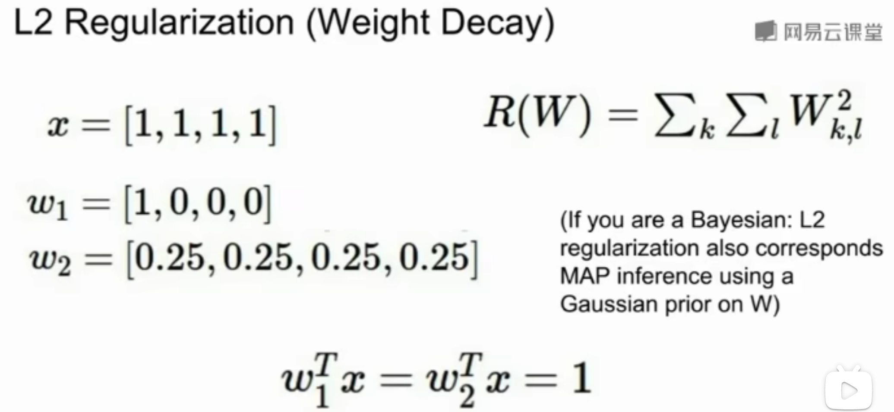

注意，和权重不同，偏置项没有这样的效果，因为它们并不控制输入维度上的影响强度。因此**通常只对权重  正则化，而不正则化偏置项 **。

-  在绝大多数情况下设为 1 都是安全的。
-  和  看起来是两个不同的超参数，但实际上他们一起控制同一个权衡：即损失函数中的数据损失和正则化损失之间的权衡。
- 理解这一点的关键是，权重  的大小对于分类分值有直接影响（对他们的差异也有直接影响）：当我们将  中值缩小，分类分值之间的差异也变小，反之亦然。
- 因此，不同分类分值之间的边界的具体值  或  从某些角度来看是没意义的，因为权重自己就可以控制差异变大和缩小。也就是说，真正的权衡是我们允许权重能够变大到何种程度（通过正则化强度  来控制）。

### Softmax Calssifier

Softmax 分类器可以理解为逻辑回归分类器面对多个分类的一般化归纳，又称为**多项式逻辑回归**（**Multinomial Logistic Regression**）。

- 整个数据集的损失：

- SVM 中使用的是合页损失（hinge loss）有时候又被称为最大边界损失（max-margin loss），Softmax分类器中使用的为**交叉熵损失**（**cross-entropy loss**），因为使用的是 Softmax 函数，求一个归一化的概率。

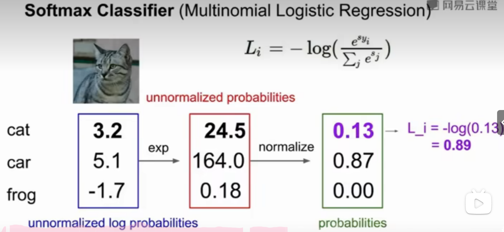

逻辑斯蒂回归 :指数化——》归一化

Li的最小值是0（归一化后正确分类的概率是1，其他分类是0，-log(1/1) = 0）

最大值是趋向正无穷（归一化后正确分类的的概率是0，-log(0/1) = +∞)

### Softmax 和 SVM 比较

##### ① 计算上有差异

SVM 和 Softmax 分类器对于数据有不同的处理方式。两个分类器都计算了同样的分值向量 （本节中是通过矩阵乘来实现）。不同之处在于对  中分值的解释：

- **SVM 分类器将它们看做是类别评分，它的损失函数鼓励正确的类别的分值比其他类别的分值高出至少一个安全边界值**。
- **Softmax 分类器将这些数值看做是每个类别没有归一化的对数概率，鼓励正确分类的归一化的对数概率变高，其余的变低**。

SVM 的最终的损失值是 ，Softmax 的最终的损失值是 ，注意这两个数值大小没有可比性。只在给定同样数据，在同样的分类器的损失值计算中，损失之间比较才有意义。

##### ② 损失的绝对数值不可以直接解释

SVM 的计算是无标定的，而且难以针对所有分类的评分值给出直观解释。Softmax 分类器则不同，它允许我们计算出对于所有分类标签的 「概率」。

但这里要注意，「不同类别概率」 分布的集中或离散程度是由正则化参数  直接决定的。随着正则化参数  不断增强，权重数值会越来越小，最后输出的概率会接近于均匀分布。

也就是说，Softmax 分类器算出来的概率可以某种程度上视作一种对于分类正确性的自信。和 SVM 一样，数字间相互比较得出的大小顺序是可以解释的，但其绝对值则难以直观解释。

##### ③ 实际应用时，SVM 和 Softmax 是相似的

两种分类器的表现差别很小。

- 相对于 Softmax 分类器，SVM 更加 「局部目标化（local objective）」，只要看到正确分类相较于不正确分类，已经得到了比边界值还要高的分数，它就会认为损失值是 ，对于数字个体的细节是不关心的。
- Softmax 分类器对于分数是永不满足的：正确分类总能得到更高的概率，错误分类总能得到更低的概率，损失值总是能够更小。

## 优化（Optimization）

- **评分函数**： 

- **损失函数**：

  - **SVM 数据损失**：
  - **Softmax 数据损失**： 
  - **全损失**： 

  下一步我们希望寻找最优的  让损失loss最小化。

  **优化策略的目标是：找到能够最小化损失函数值的权重 **。

### 优化策略：

- 随机搜索。随机尝试很多不同的权重，然后看其中哪个最好。这是一个差劲的初始方案。
- 随机本地搜索。从一个随机  开始，然后生成一个随机的扰动 ，只有当  的损失值变低，才会更新。
- 跟随梯度

### 梯度计算

计算梯度有两种方法：

- 缓慢的近似方法（**数值梯度法**），但实现相对简单。
- **分析梯度法**，计算迅速，结果精确，但是实现时容易出错，且需要使用微分。

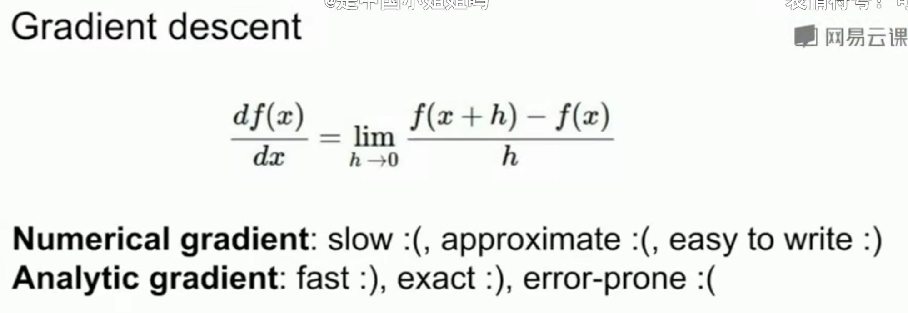

#### 数值梯度法：

借助于梯度的定义对其进行逼近计算

实际中用**中心差值公式**（**centered difference formula**） 效果会更好。

计算量大，当N非常大的时候，需要对每个w进行迭代，计算量非常大

#### 解析梯度法：

利用微分来分析，得到计算梯度的公式（不是近似），用公式计算梯度速度很快，但在实现的时候容易出错。

为了解决这个问题，在实际操作时常常将分析梯度法的结果和数值梯度法的结果作比较，以此来检查其实现的正确性，这个步骤叫做**梯度检查**。

### 梯度下降

利用每一步的梯度，计算下一步的方向，来获得是损失函数最小的一组w权重（线性分类器每一行每一个像素点的值）的值

梯度上升的方向是指函数值增大的方向，因此梯度下降的方向（梯度上升的反方向）就是函数值下降的方向

#### 普通梯度下降

#### 小批量梯度下降（Mini-batch gradient descent）

- 不是计算整个训练集的误差和梯度值，而是在每一次迭代中，随机选取一小部分训练成本，成为minibatch(小批量)

- 小批量数据的大小一般取2的n次方，来计算误差和梯度值

  **小批量数据的大小是一个超参数，但是一般并不需要通过交叉验证来调参**。它一般设置为同样大小，比如32、64、128等。之所以使用2的指数，是因为在实际中许多向量化操作实现的时候，如果输入数据量是2的指数，那么运算更快。

- 可以看作是对真是数值期望的一种蒙塔卡洛估计
- 选择一个的合适的大小进行Mini-Batch梯度下降。每次前进速度较快，且振荡较小，基本能接近全局最小值。

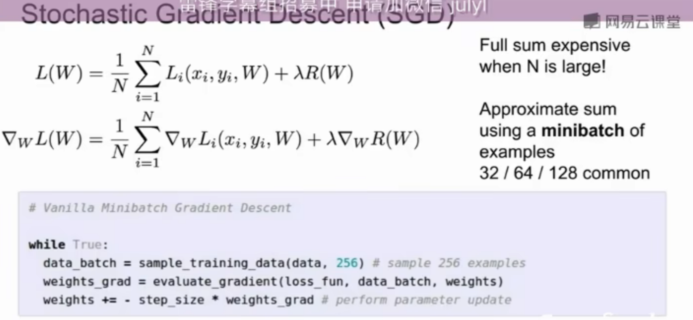

实际情况中，数据集肯定不会包含重复图像，那么小批量数据的梯度就是对整个数据集梯度的一个近似。因此，在实践中通过计算**小批量数据的梯度可以实现更快速地收敛，并以此来进行更频繁的参数更新**。

批量数据策略有个极端情况：每批数据的样本量为1，这种策略被称为**随机梯度下降**（**Stochastic Gradient Descent 简称SGD**），有时候也被称为在线梯度下降。

### 图像特征

直接输入原始像素，效果不好，可以将图像的特征计算出来，便于分类。

常用的特征计算方式：颜色直方图、词袋、计算边缘等，神经网络中是特征是训练过程中得到的。

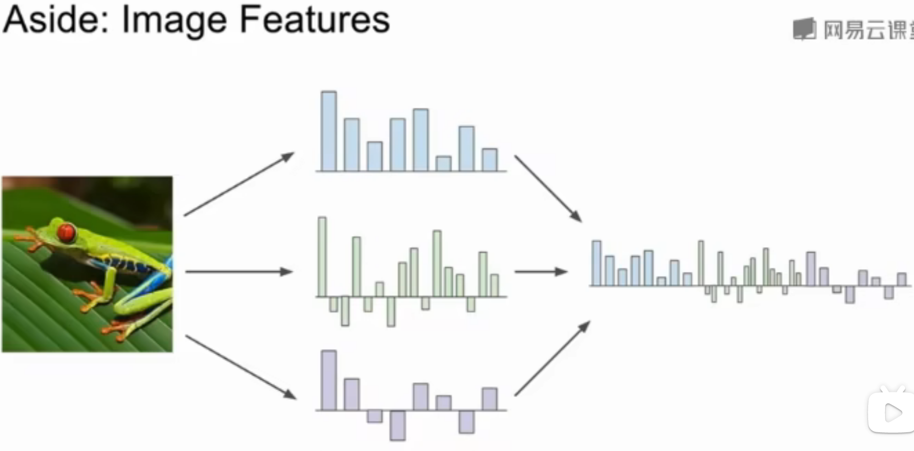

#### 特征转换

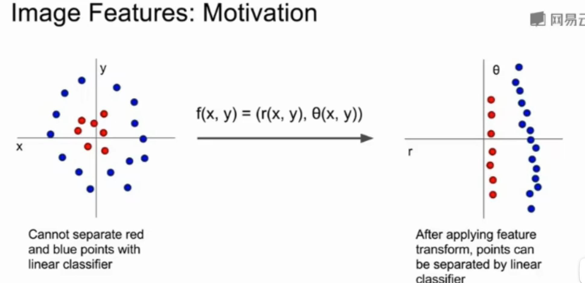 

转换后（这里使用极坐标转换）可以使用线性分类器画出决策边界

线性分类器各种细节，可在斯坦福大学开发的一个在线程序观看演示：[**点击这里**](http://vision.stanford.edu/teaching/cs231n-demos/linear-classify/)

# 反向传播 计算任意复杂函数的梯度

##  计算图computational graph

## 反向传播技术backpropagation

递归地调用链式法则来计算计算图中每个变量的梯度

右侧计算图上面绿色的数字表示向前计算的数值，下面红色的数字表示反向计算时得到的梯度值

在每一个节点上计算我们所需的本地梯度，然后跟踪这个梯度。在反向传播过程中，我们接收从上游传回来的这个梯度值，这个值再乘以本地梯度，就得到想要传回连接点的值。在下一个节点进行反向传播时，不考虑除了直接相连的节点之外的任何东西

例子：

上游传回来的梯度值乘以本地梯度值，其中本地梯度值中的x指这个节点接收的数值

-0.53 = 1 * (-1/(1.37)²)

- 1 上游传回来的梯度值
- (-1/(x)²)本地梯度值
- 1.37 这个节点接收的x的值

尽量把计算图写成简单的形式，即每个节点最多只有两个输入

由这个图可知，可以把计算图分解成比较大的点计算，也可以把它分解成所有这些更小的计算节点

### Patterns in backward flow

- **加法门add gate:**

梯度分布器gradient distributor

通过加法门，连接了两个分支，获取上游梯度并分发和传递完全相同的梯度给相连接的两个分支

- **最大门max gate**

可以看作路由转换器

最大的那个值的梯度是上游传来的所有梯度值，另一个值的梯度为0

- **乘法门mul gate**

可以看作梯度转换器，尺度缩放器

获取上游梯度，根据另一个分支的值对其缩放

### 向量计算

向量计算流程还是一样的，唯一区别在于梯度变成了雅可比矩阵

雅可比矩阵：包含了每个变量里每个元素导数的矩阵，矩阵的每一行都是偏导数，矩阵的每个元素是输出向量的每个元素对输入向量每个元素分别求偏导的结果；而输出的第i个元素只与输入的第i个元素有联系，所以输出的第i个元素对其他元素求导都为0，因此雅可比矩阵是个对角矩阵，只有对角线上有数值，不为0

### 模块化操作

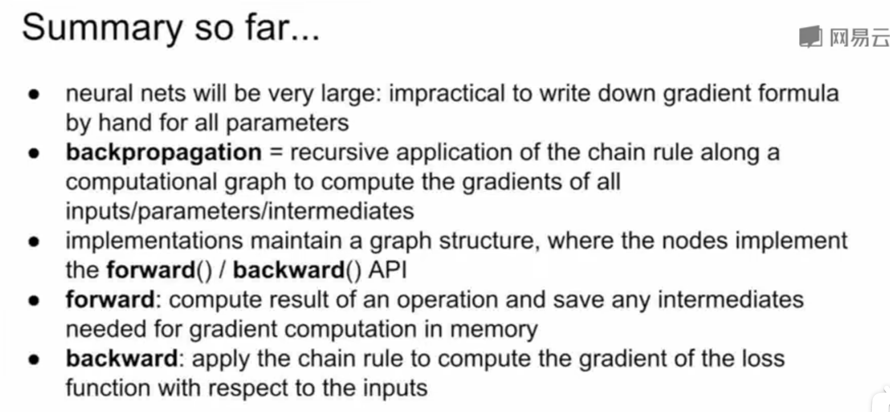

# 神经网络

神经网络就是由简单函数构成的一组函数在顶层由一种层次化的方式堆叠在一起，形成了一个更复杂的非线性函数

基本的多阶段分层计算

W1是像之前一样用来寻找的模板，W2是这些得分的加权，h是Max(0,W1*x)的值

举例：

左侧图：全连接层，两层神经网络，或单隐藏层神经网路

右侧图：全连接层，三层神经网络，或双隐藏层神经网络

可以把每层隐藏层神经网络看作一组向量，一组神经元的集合，利用矩阵乘法来计算神经元的值

# 卷积神经网络

**Convolutional Neural Networks**

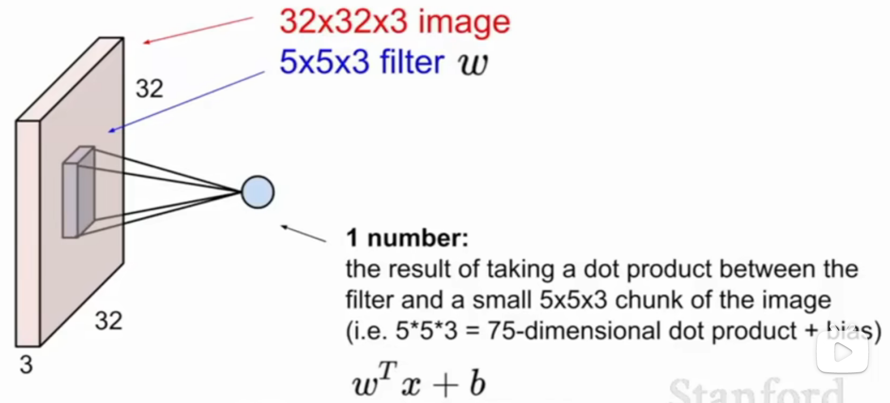

卷积核遍历整个图像进行点积计算，也就是将卷积核每个位置元素和与之对应图像区域的像素值相乘然后相加 

这里的WT不完全是w的转置，这只是一个表示方法，是为了让数学运算按照点积的方式进行

通过pytorch或者numpy等，将一个5*5*3的向量扩展为一个一维的，然后进行转置，再进行向量的点积即可

这里做的是向量点积，如果w不展开的话就是做的矩阵内积了

所以这里的卷积核W实际上是向量，而不是矩阵

不同卷积核提取不同的特征

向量点积与两个向量的夹角余弦值成正比，点积越大，夹角越小，向量越相似。也就是矩阵点积结果越大，特征越相似，激活函数就是添加非线性。

卷积核的通道数确实要和输入通道数一样，都是3，这里是卷积核的个数，经过一个卷积核，输出的是2维的，因为是用了多个卷积核，所以就是三维了

因为卷积核是三通道的，就是综合三通道算出来一个数字，所以压缩成单通道了

图像是7X7X3,那么卷积核必须是NXNX3的，这样一个核去做点乘的时候会得到一个数，有几个核就会得到几个数，然后所有的核再滑移

零填充的目的是保证图像尺寸再卷积后仍不变，更多地保留边缘值

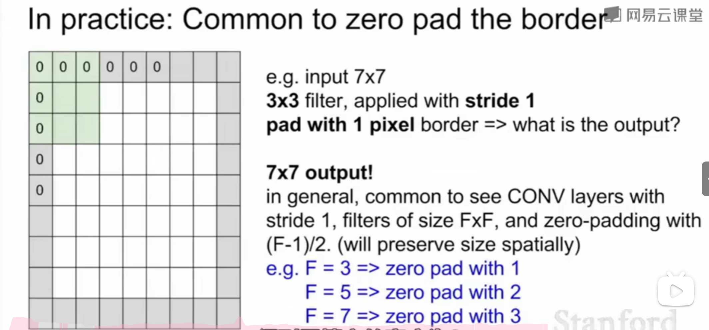

3×3：填充宽度为1

5×5：填充宽度为2

7×7：填充宽度为3

如果不进行边缘填充的话：

步长较大时，获得和降采样处理图片相同的效果

### 视觉之外的卷积神经网络

池化层：

不会做深度方向上的池化处理,而只是做平面上的池化处理，所以深度是不会改变的。

池化：目的之一是进行降采样处理，减少size

最常用的方法最大池化法：（其他方法如均值池化法不如最大池化法

选激活值最大的神经元，因为他们意义最大

卷积核的大小和所要池化处理的区域大小是相同的，做法是取区域最大值

设定步长，使它们不会重叠

一般不在池化层做填零处理，因为池化层只做降采样，不会导致卷积核扫过边缘时有一部分超出了输入的范围

池化相当于是最简单的卷积方法了， 也就是卷积也可以做到池化的效果，只是卷积的参数较多，计算量较大

总结：

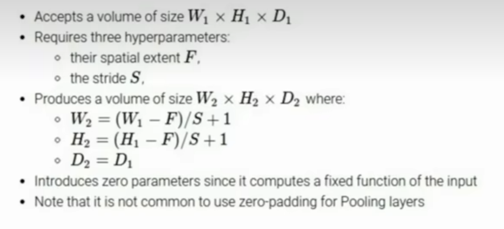

最后一层池化的输出，其实已经不能算作是一幅图像，更有点像是某个像素点值分布的阵列，着对应一个模式，从不同的模式中，对不同讴的检测特征进行区分识别等等

每一个池化层输出的值实际上是数据经过了整个网络处理后累积的结果

在最顶层，每一个值都表示了上一阶的某个概念

最底层寻找边缘或者一些简单的结构，经过卷积层一般是某些特定的激活表征，比如边缘在图像各个位置的体现，越往后得到的是更复杂、更高层的表示，下一个卷积层就比如表现出边角，输入不再是原始图像，而是之前的输出，在进一步计算得到更复杂的值；每一层每个值代表复合的复杂概念的受激程度
