# 无监督学习

无监督学习是在没有标签的训练数据的情况下，学习数据中隐含的结构。典型的无监督学习包括下述算法：聚类（k-Means）、PCA降维、特征学习、密度估计等。

## 聚类（k-Means）

找到数据的分组，组内数据在某种度量方式下是相似的。随机初始k个中心位置，将每个样本分配到最近的中心位置，然后根据分配的样本更新中心位置。重复这个过程直至收敛（中心位置不再变化）

## **数据降维**（**Dimensionality reduction**）

找出一些投影方向（轴），在这些轴上训练数据投影的方差最大。这些轴就是数据内潜在的结构。我们可以用这些轴来减少数据维度，数据在每个保留下来的维度上都有很大的方差。

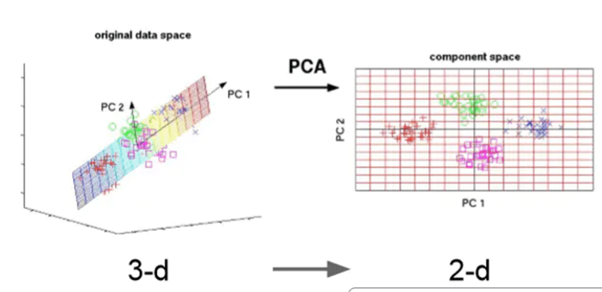

### 特征学习（Feature Learning）

自编码（Autoencoders）：

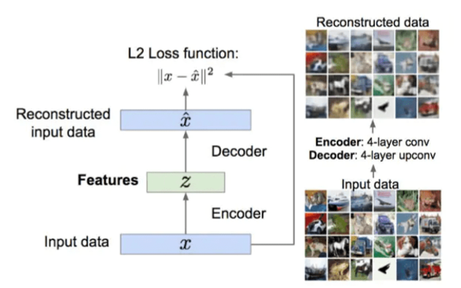

###  密度估计（ Density Estimation）

密度估计（ Density Estimation）也是一种无监督算法，我们会估计数据的内在分布情况，比如下图上方有一些一维和二维的点，我们用高斯函数来拟合这一密度分布，如下图所示：

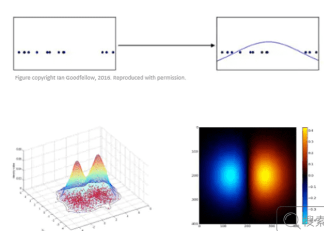

# 生成模型（Generative Models）

生成模型是一种无监督学习方法。它对应的任务是：根据一批由真实分布p-data(x) 产生的训练数据，通过训练学习，得到一个可以以近似于真实的分布p-model(x) 来产生新样本的模型。

生成模型分为「显式」和「隐式」的生成模型，往下分又可以分成很多子类。

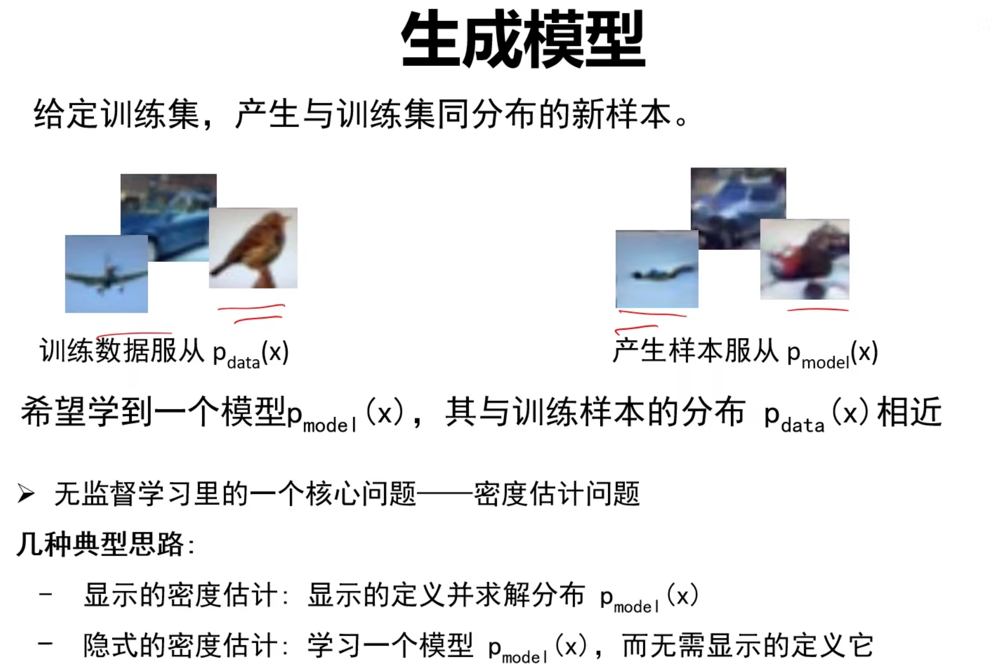

**PixelRNN / CNN，变分自动编码器**属于显示密度模型，**生成对抗网络**（GAN）属于隐式密度估计模型。

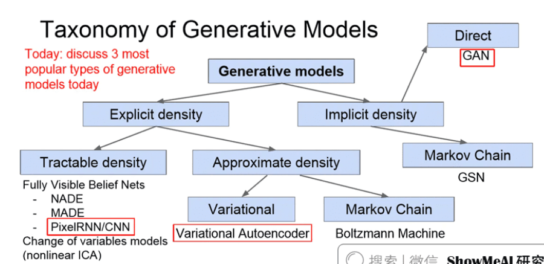

## PixelRNN 和 PixelCNN

PixelRNN 和 PixelCNN 使用概率链式法则来计算一张图片出现的概率。其中每一项为给定前  个像素点后第  个像素点的条件概率分布。这个分布通过神经网络 RNN 或 CNN 来建模，再通过最大化图片  的似然概率来学习出 RNN 或 CNN 的参数。

!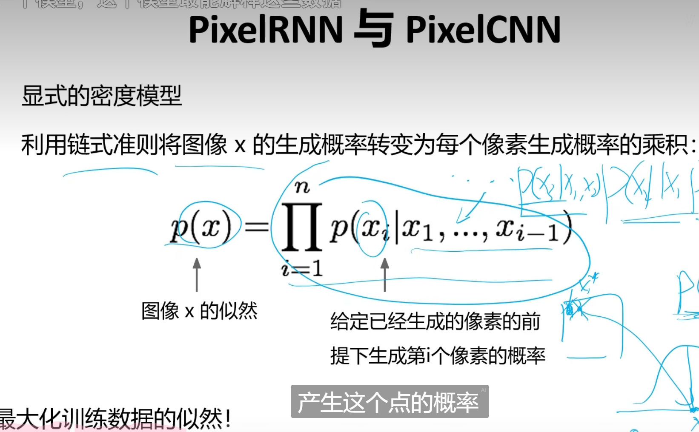

极大似然，就是找到一个模型，这个模型最能解释这些数据

PixelRNN 中，从左上角开始定义「之前的像素」。由于 RNN 每个时间步的输出概率都依赖于之前所有输入，因此能够用来表示上面的条件概率分布。

训练这个 RNN 模型时，一次前向传播需要从左上到右下串行走一遍，然后根据上面的公式求出似然，并最大化似然以对参数做一轮更新。因此训练非常耗时。

  

PixelCNN中，使用一个CNN来接收之前的所有像素，并预测下一个像素的出现概率：

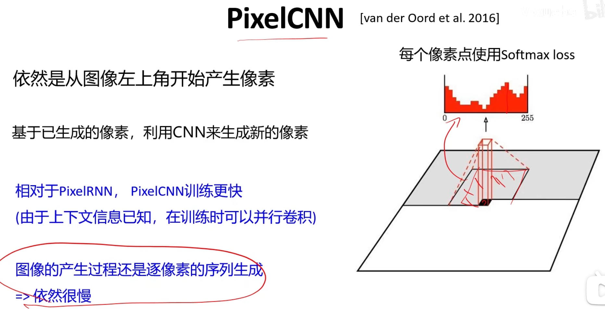

对比 PixelRNN 和 PixelCNN，后者在训练时可以并行计算公式中的每一项，然后进行参数更新，因此训练速度远快于 PixelRNN。

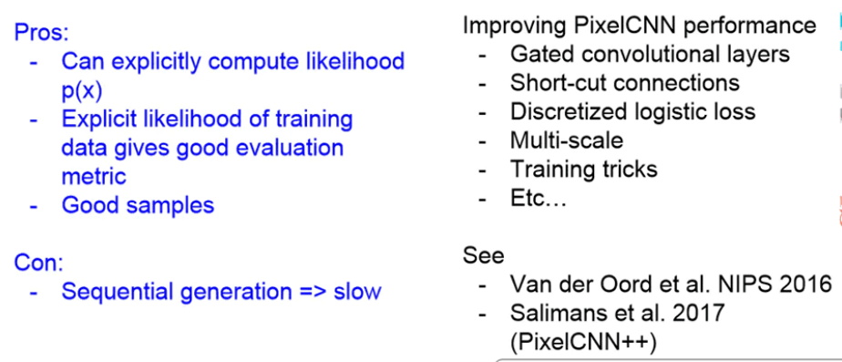

## 变分自编码器（VAE）

PixelCNN定义了一个易于处理的密度函数，可以直接优化训练数据的似然。

### 自编码器

自编码器是为了无监督地学习出样本的特征表示

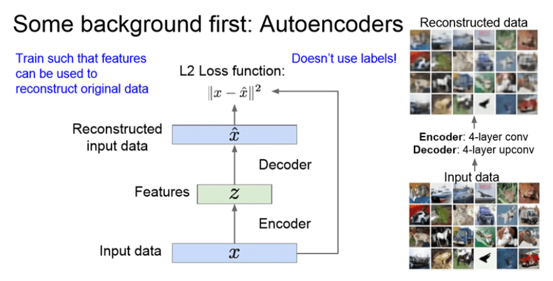

### 编码器

编码器可以有多种形式，常用的是神经网络。最先提出的是非线性层的线性组合，然后有了深层的全连接网络（MLP），后来又使用 CNN，通过神经网络对输入数据  计算和映射，得到特征 ， 的维度通常比  更小。这种降维压缩可以压缩保留  中最重要的特征。

### 解码器

解码器主要是为了重构数据，它输出一些跟  有相同维度的结果并尽量拟合  。解码器一般使用和编码器相同类型的网络（与编码器对称）。

训练好完整的网络后，会把解码器的部分去掉，使用训练好的编码器实现特征映射。

通过编码器得到输入数据的特征，编码器顶部有一个分类器，如果是分类问题可以用它来输出一个类标签，在这里使用了外部标签和标准的损失函数如 Softmax。

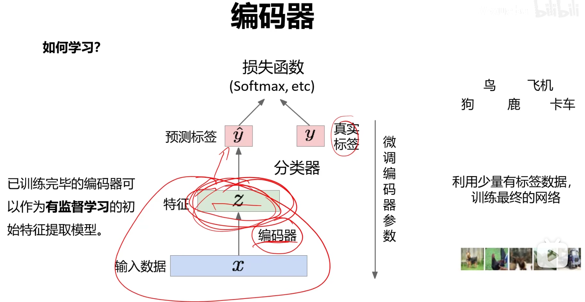

自编码器具有重构数据、学习数据特征、初始化一个监督模型的能力。这些学习到的特征具有能捕捉训练数据中蕴含的变化因素的能力。

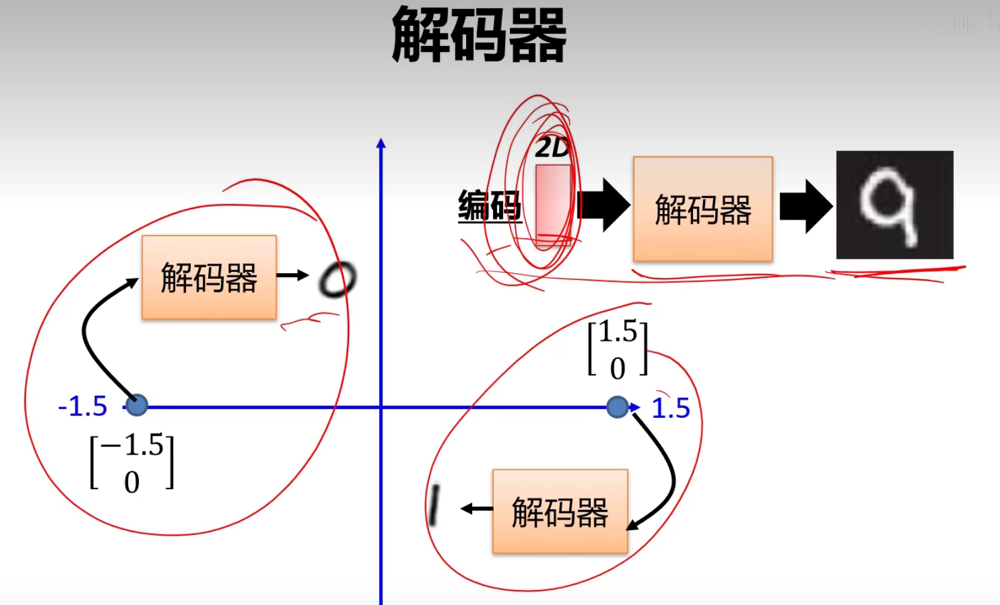

### VAE的思想

VAE模型的思路是，如果我们无法直接获得样本  的分布，那么我们可以假设存在一个  对应的隐式表征  ，  的分布是一个先验分布（比如高斯分布或其他简单的分布）。

举例来说，如果我们想要生成微笑的人脸，  代表的是眉毛的位置，嘴角上扬的弧度，它经过解码网络后，能够映射得到  的近似真实分布。那在样本生成阶段，我们可以通过标准正态分布采样得到  ，然后解码得到样本近似分布，再在此分布上采样来生成样本。

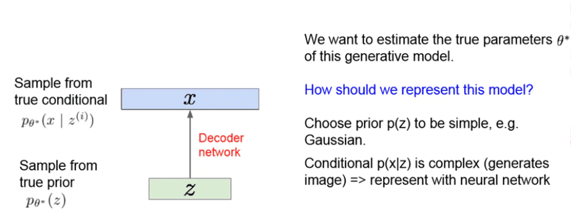

训练VAE：

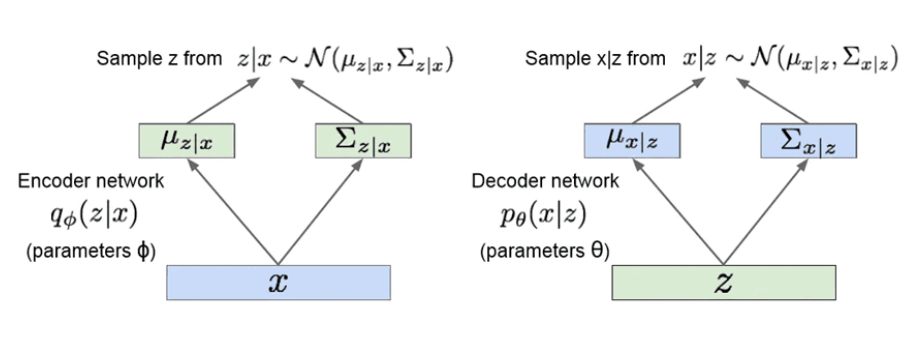

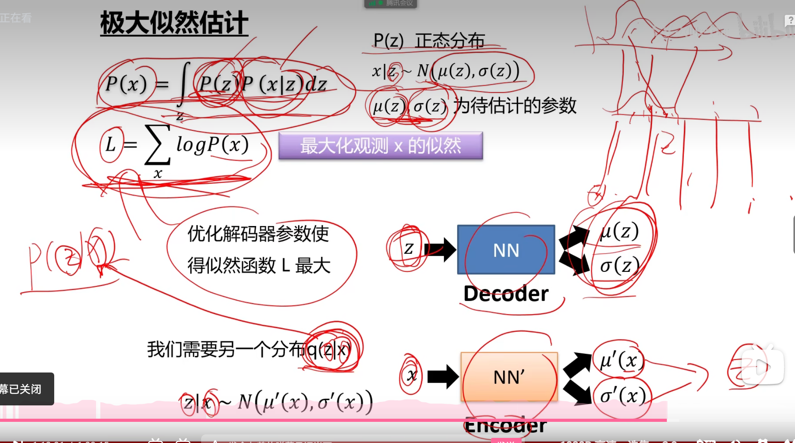

### VAE的优缺点

VAE 是在原来的自编码器上加了随机成分，使用VAE不是直接取得确定的输入  然后获得特征  最后再重构  ，而是采用随机分布和采样的思想，这样就能生成数据。 为了训练模型 VAEs，定义一个难解的密度分布，推导出一个下界然后优化下界，下界是变化的，「变分」指的是用近似来解决这些难解的表达式，这是模型被称为变分自动编码器的原因。

**VAEs优点**

VAEs 就生成式模型来说是一种有据可循的方法，它使得查询推断称为可能，如此一来便能够推断出像  这样的分布，这些东西对其他任务来说会是很有用的特征表征。

**VAEs缺点**

最大化似然下界不像 PixelRNN 和 PixelCNN 那样精准评估。而 VAE 相对GAN等方法，生成的图像结果更模糊。

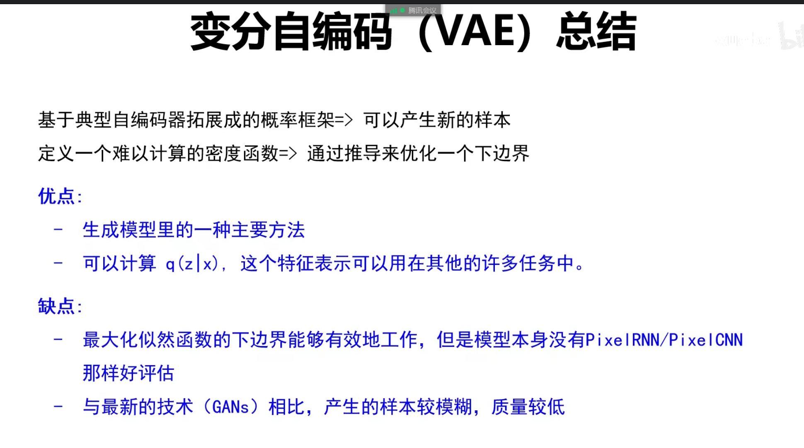

# 生成对抗网络(Generative Adversarial Nets, GAN)

采用一个博弈论的方法，模型将会习得从训练分布中生成数据，具体的实现是基于「**生成器**」和「**判别器**」这一对博弈玩家。

在 GAN 中定义了两个网络：「**生成器**」和「**判别器**」。

- 判别器负责辨别哪些样本是生成器生成的假样本，哪些是从真实训练集中抽出来的真样本。
- 生成器负责利用随机噪声  生成假样本，它的职责是生成尽可能真的样本以骗过判别器。

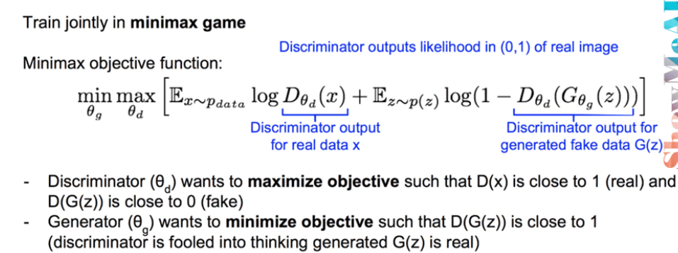

现在有两个玩家，通过一个  博弈公式联合训练这两个网络，该  目标函数就是如图所示的公式，目标是：

- **让目标函数在  上取得最小值，同时要在  上取得最大值。**

在每一个训练迭代期都先训练判别器网络，然后训练生成器网络，**GAN 的总体训练过程**：

- 训练判别器
  - 对于判别器网络的k个训练步，先从噪声先验分布  中采样得到一个小批量样本，接着从训练数据  中采样获得小批量的真实样本，下面要做的将噪声样本传给生成器网络，并在生成器的输出端获得生成的图像。
- 此时我们有了一个小批量伪造图像和小批量真实图像，我们有这些小批量数据在判别器生进行一次梯度计算，接下来利用梯度信息更新判别器参数，按照以上步骤迭代几次来训练判别器。

- 训练生成器
  - 在这一步采样获得一个小批量噪声样本，将它传入生成器，对生成器进行反向传播，来优化目标函数。

训练 GAN 的过程会交替进行上述两个步骤。

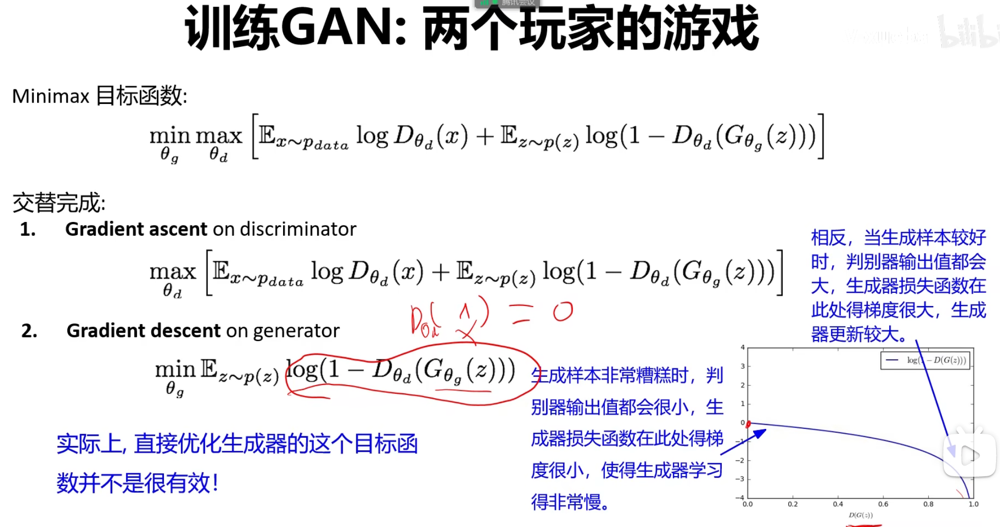

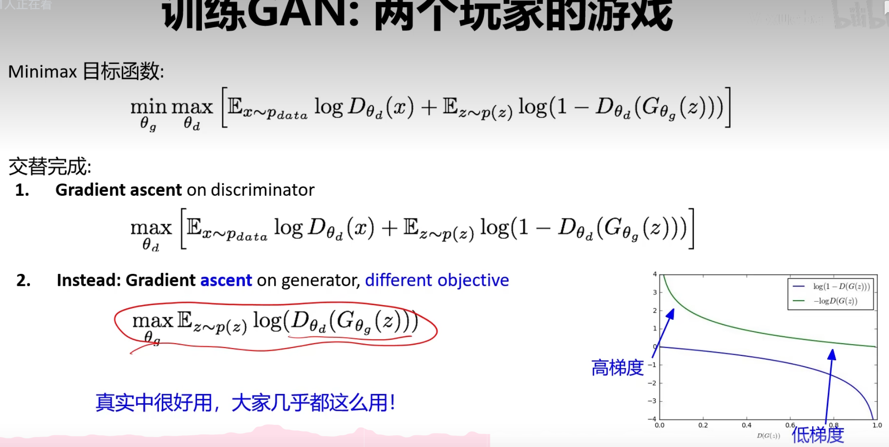

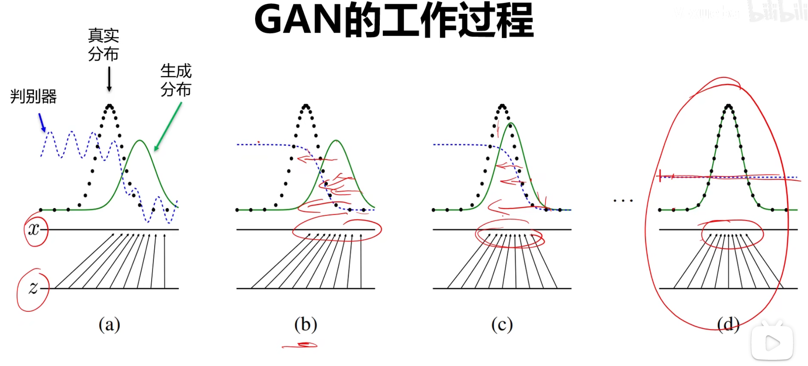