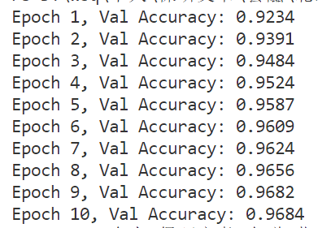

# 实验报告

## Task1: 简单的神经网络运算框架的实现

### 一、整体设计与项目结构

项目采用模块化结构，每种核心功能封装为独立文件：

- layers.py           # 各类神经网络层实现
- network.py          # 网络结构与训练流程
- utils.py            # 数据与辅助函数
- main.py             # 项目入口与训练主流程

### 二、各部分模块实现思路与细节

#### 1. layers.py -- 神经网络核心层实现

- **Layer基类**：为每一层提供统一接口，明确`forward`(前向)、`backward`(反向)、`update`(参数更新)方法。
- **全连接层 FullyConnected**：  
  - 参数：权重`self.W`、偏置`self.b`  
  - `forward`为 `y = x · W + b`，输入保存至`self.x`
  - `backward`：链式法则，保存梯度到`self.dW, self.db`
  - `update`：用学习率`lr`进行简单梯度下降
- **ReLU 激活**：
  - 激活函数：`y = max(0, x)`
  - 反向传播时记录 mask，仅对正值传递梯度
  
- **Batch Normalization**：
  - 前向传播：计算每批样本的均值与方差进行归一化
  - 反向传播：链式法则求解输入梯度，并更新 `gamma` 和 `beta` 参数
- **SoftmaxWithLoss 层**：
  - 同时实现 softmax 函数与交叉熵损失
  - 前向传播：计算分类概率与损失值
  - 反向传播：返回 loss 关于 logits 的梯度

#### 2. network.py -- 网络搭建与训练封装

- 模型结构：全连接+ bn + relu + 全连接
- forward 调用依次拼接每层，最后 loss 层，计算整条网络的输出与损失
- backward 依次对每层进行反向传播
- update 更新所有可训练参数
- predict 预测分类标签

#### 3. utils.py -- 工具及数据加载

- `load_mnist()` 从 `mnist.pkl.gz` 加载训练、验证、测试数据

#### 4. main.py -- 训练主入口

- 加载数据、初始化模型
- 迭代训练、随机shuffle、batch化
- 每轮训练后对验证集进行准确率评估

### 四、模型训练

1. **数据准备** 
   MINIST数据集：`mnist.pkl.gz`，训练、验证集（默认格式：784维向量，0-9标签）

2. **网络结构**    
   - 输入784维  
   - 128全连接 +BatchNorm+ReLU  
   - 输出层10维全连接  
   - SoftmaxWithLoss损失

3. **训练参数及流程**   
   - batch_size = 64
   - 学习率 0.01
   - epoch数=10
   - 每轮训练后直接在验证集上预测准确率

### 五、实验效果

### 六、主要遇到的挑战与解决思路

在本次实现过程中，最大的挑战来自于对神经网络各个层前向传播与反向传播机制的理解和手动实现。与使用高层封装好的深度学习框架不同，这次任务要求不依赖任何现有的神经网络库，必须自己实现梯度传播的过程。尽管原理在课程中接触过，但真正动手写代码时发现，理论到实践的距离远比预期中大。

像 BatchNorm 这样的层，单从公式上理解可能还不够，实际动手时需要把每一个中间变量都保存好，并用上合适的向量化操作，否则很容易在梯度计算时出错。

另外，刚开始每个层写法不统一，有的 forward 只收一个参数，有的则前向、反向返回值不一样，导致网络组装和反向传播时出错。后来我统一了每一层的接口规范：forward 必须收输入并返回输出，backward 接受上游梯度输出下游梯度，参数的更新也集中到 update 里，整个训练流程才合适。