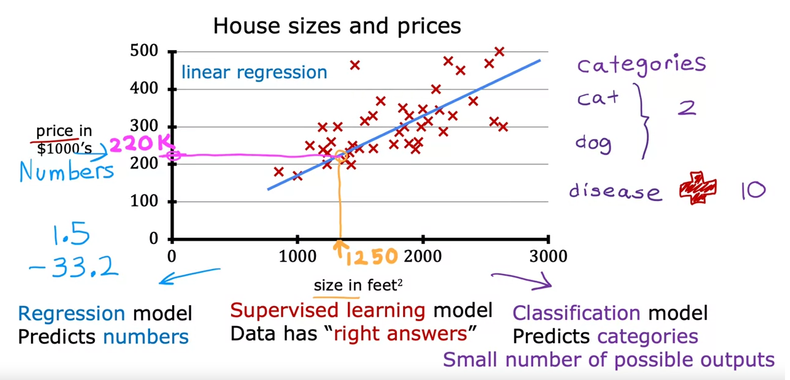
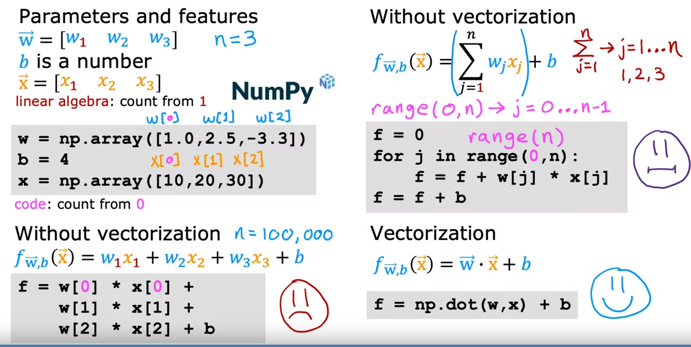

# Week1

### Supervised vs. Unsupervised Machine Learning

- #### 监督学习：

  Supervised machine learning or more commonly, supervised learning, refers to algorithms that learn x to y or input to 	output mappings. The key characteristic of supervised learning is that you give your learning algorithm examples to learn from. That includes the right answers, whereby right answer, I mean, **the correct label y for a given input x, and is by seeing correct pairs of input x and desired output label y** that the learning algorithm eventually **learns to take just the input alone without the output label and gives a reasonably accurate prediction or guess of the output**.

  监督学习是指是指**学习 x 到 y 或输入到输出映射**的算法。 

  监督学习的关键特征是由正确的算法示例（包括正确的答案和正确的输出），最终学会了在没有输出标签的情况下单独获取输入，并对输出做出相当准确的预测或猜测。

  The two major types of supervised learning are **regression** and **classification**. In a regression application like predicting prices of houses, the learning algorithm has to predict numbers from infinitely many possible output numbers. Whereas in classification the learning algorithm has to make a prediction of a category, all of a small set of possible outputs. 

  两种主要类型：**回归和分类**

  - 回归：从无限多的可能产出数字中预测数字

  - 分类：预测 一个类别

- #### 非监督学习

  In unsupervised learning, the data comes only with inputs x but not output labels y, and the algorithm has to find some structure or some pattern or something interesting in the data. 

  - 聚类算法： 

    a clustering algorithm, which is a type of unsupervised learning algorithm, takes data without labels and tries to automatically group them into clusters. 

  - 异常检测

    Anomaly detection, which is used to detect unusual events.

  - 降维

    Dimensionality reduction. This lets you take a big data-set and almost magically compress it to a much smaller data-set while losing as little information as possible. 

    

## Supervised Machine Learning: Regression and Classification

### 线性回归模型与代价函数 

- #### 线性回归模型

  Linear Regression Model, means fitting a straight line to your data.

- #### 代价函数（成本函数）

  Cost function, measures the difference between the model's predictions, and the actual true values for y.

  

  

  - ##### cost function intuition:

  

  

  - ##### Visualizing the cost function

  

  

  

### 梯度下降

Gradient descent

α 学习速率，值大则跨度大，值小则跨度小，过于大的时候有可能错过最小点，从而代价函数的值反向上升

梯度下降：同时更新w和b（通过偏导来更新），直到达到代价函数的局部最小值

求偏导得出以下式子：

在平方误差函数中，局部最小值就是全局最小值

- **bashed grading descenting**

  在每一次计算J成本函数时，都会计算全部的训练数据。

  即在梯度下降的每一步中，我们都在研究所有的训练示例， 而不仅仅是训练数据的一个子集

  

### 多元线性回归

Multiple linear regression

向量点乘

vectorization矢量化计算是指对应数据相乘然后总的相加（和矩阵乘法不同），使用的是python的Numpy库

矢量化计算：

多元回归的梯度下降：

正态方程法：

无需迭代，仅需了解，一些机器学习库可能会在后端使用。

