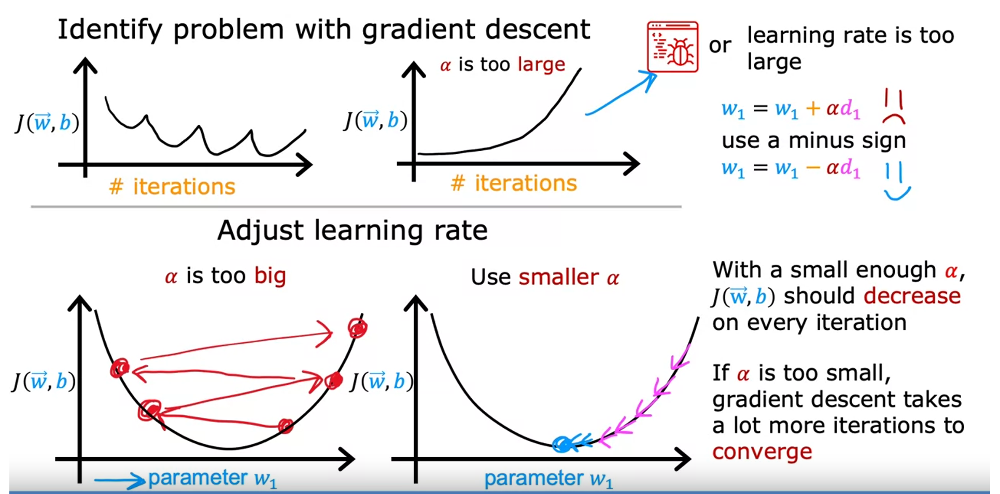

变量的范围越大，参数的值应越小：

这是因为对 w1 进行非常小的更改可能会对估计价格产生非常大的影响，而对w2进行微小的更改，产生的影响较小

=》成本函数轮廓形成椭圆形或椭圆形：

##### **特征缩放：**

按原数据，成本函数成椭圆形，梯度下降找全局最小值就可能会来回反弹很长时间，然后才能最终找到通往全局最小值的路。

##### **归一化：**

重新缩放 x1 和 x2 至 0-1 的范围

成本函数更趋圆形

**三种归一化方法：**

1.   x/max
2.  (x-ū)/(max-min)
3.  (x-ū)/标准差

##### **成本函数收敛：**

左边的图横坐标是迭代次数，J的值应在每次迭代后都下降

右边是自动收敛测试，通过计算来测试是否收敛

##### **学习率的选择：**

过大的学习率：可能会导致成本函数上升

过小的学习率：需要大量迭代才能梯度下降到最小值

调试程序：设置一个非常小的学习率，如果此时J上升则说明是代码某处出现问题

J上升原因：

- 学习率过大
- 代码出现问题，例如应为w-αd，但是写成w+αd，导致梯度下降朝着相反的方向了。

从小到大测试α，每次扩大三倍。

选择尽可能大的学习率， 或者只选择比我发现的最大合理值稍小的数值，即可保证J下降，又可尽量减少迭代次数

##### **特征工程：**

通过转换或组合原特征来设计对y有影响的新特征

例如：房屋面积的特征：土地的宽度、深度和土地面积的大小

##### **多项式回归：**

按照数据点的分布，选择可能的拟合曲线
