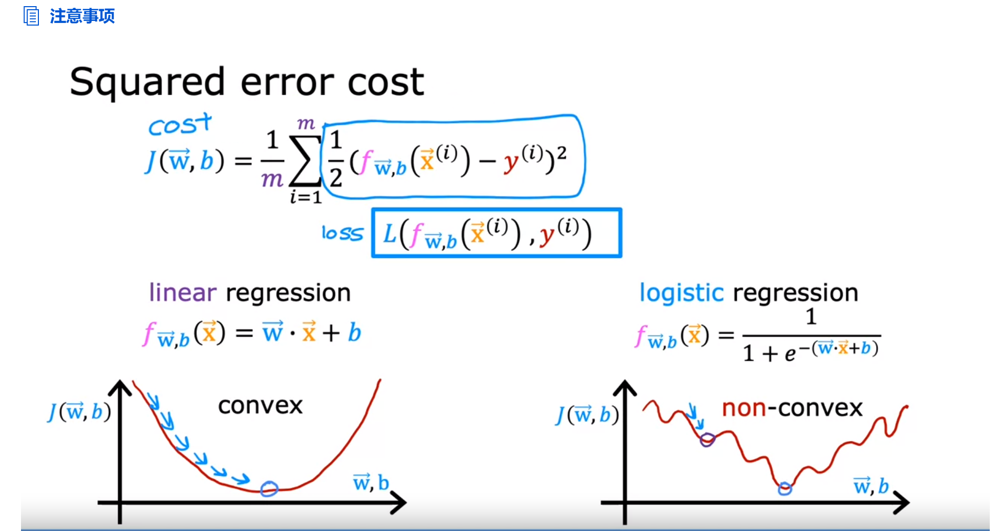
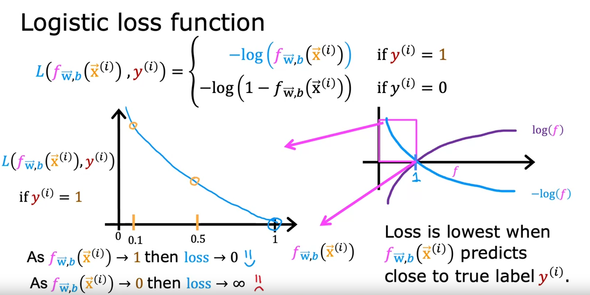

# Week3 Classification

## Motivations

This type of classification problem where there are only two possible outputs is called binary classification. Where the word binary refers to there being only two possible classes or two possible categories.

只有两个可能输出的分类问题 称为二元分类,其中 binary 一词是指只有两个可能的类或两个可能的类别。

0: false, benight, negative, absence ≠ bad

1: true, malignant, positive, presence ≠ good

当额外添加例子的时候，线性回归拟合的决策边界会移动。

logistic regression逻辑回归，虽然名字带有回归，但作用是分类。

## Logistic regression

S型函数：sigmoid function，有时叫做logistic function, 结果再0到1之间

f表示的是y是1的概率，1-f即是y是0的概率

## Decision boundary

设置一个阈值，使得当f>这个阈值时，y预测为1；相反，y预测为0。

通常，这个阈值设置为0.5，即z=0的时候。

决策边界：z=0时的线，边界两侧y=1或y=0

决策边界不一定是直线，多项式越高阶，决策边界越复杂。

## Cost function for logistic regression

使用方差成本函数，则f为逻辑回归函数时，不是凸函数，局部最小值不一定是全局最小值。

定义损失函数如图，f的取值范围在0到1之间。

当真实值y是1，且f接近1时，L的值接近0，说明损失较小；相反，f接近0时，L的值趋向正无穷，说明损失非常大。

当真实值y是0，且f接近0时，L的值接近0，说明损失较小；相反，f接近1时，L的值趋向正无穷，说明损失非常大。

选择这种损失函数，总体成本曲线是凸的，即有且仅有一个最小值，最小值是全局最小值。

回归与分类的成本函数区别如下图，上面是回归函数的成本函数，下面是分类函数的成本函数：

## Simplified Cost Function for Logistic Regression

## Gradient Descent Implementation

逻辑回归的wi和b的导数形式上看起来和线性回归的导数，但f函数实际上不一样，一个是sigmoid函数，一个是线性函数

## The problem of overfitting

underfit欠拟合，high bias高偏差，对训练案例也没办法很好地拟合

just right, generalization正则化，对训练案例比较好地拟合，并且对测试案例也可以很好地拟合

overfit过拟合，high variance高方差，对训练案例非常好地拟合，但对测试案例拟合很差

Our goal when creating a model is to be able to use the model to predict outcomes correctly for **new examples**. A model which does this is said to **generalize** well. 

## Addressing overfitting

解决过度拟合的方法：

1. Collect more data

2. Select features  ——Feature selection 选择重要的、影响大的特征

3. Reduce size of parameters ——"Regularization"正则化

   

## Cost function with regularization

令w3、w4乘以一个非常大的数加到 J 后面，这样当使 J 尽可能地小的时候，w3、w4的值就会变得非常小

more generally, the way that regularization tends to be implemented is if you have a lot of features, say a 100 features, you may not know which are the most important features and which ones to penalize. 

一般并不能提前知道哪个特征更重要，所以正则化就是把所有特征都做类似处理

正则化参数 λ ，与学习率α类似，需要选择一个适合的值。

当λ过小的时候，wj的值就会减小得少，对wj没有说明影响，仍然会过度拟合；当λ过大的时候，所有w的值都变得很小，此时 J 的值就接近常数b。

一般不会对b进行正则化

如图，成本函数的表达式的左边一项称为均方误差项（成本），右边一项称之为正则化项。

## Regularized linear regression

正则线性回归：

为什么每次更新λ都会缩小参数w：

导数计算过程：

## Regularized logistic regression

正则逻辑回归的导数形式和线性回归的一样，不同的只是f的表达式