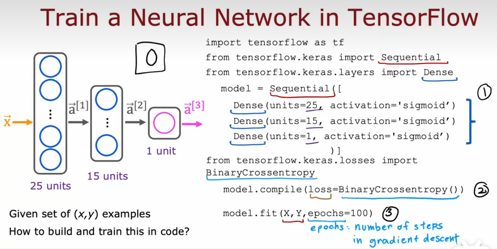
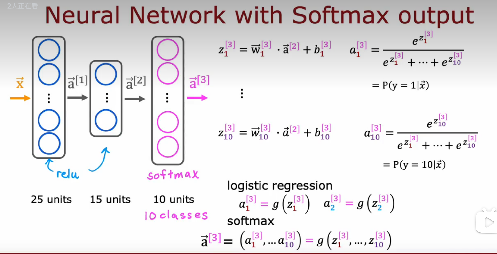

# 第二部分：高级学习算法

## 神经网络

神经网络基本的结构：输入层，隐藏层，输出层，这个例子中从隐藏层到输出层实际上是逻辑回归，判断房子成为最畅销的概率

多层隐藏层：多层感知器

例子：

不同的隐藏层可视化后可以发现它们在试图检测从细节到全局的图像特征，神经网络可以自己调整隐藏层来达到识别的目的，这也是神经网络的工作原理。

右上角的[1]表示这是第1层隐藏层，右下角的1，2表示这是这层隐藏层的第几个神经元的参数

工作原理：每个层都输入一个数字向量，并对其应用一系列逻辑回归单元， 然后计算另一个 数字向量，然后从一个层传递到另一个层，直到进入最终的输出层计算， 即神经网络的预测。 

​                                                                                                     各个参数的符号表示

forward propagation正向传播，从左到右进行计算，与反向传播相对；这种类型的神经网络架构，刚开始的隐藏层每层有比较多的隐藏单元，当靠近输出层时，隐藏单元的数量就会减少

TensorFlow和numpy都是常用的库，两者在使用上有不同之处，可以互相转换

## TensorFlow中构建模型：

第一个是一个1×2矩阵，每一行是二维向量，第二个是2×1矩阵，每一行是一维向量。第三个不是矩阵，是一维向量

tf.Tensor()是TensorFlow中矩阵的表示方式，array()是Numpy中矩阵的表示方式

TensorFlow中创建模型也可简化成如下：

矩阵乘法：
左边是传统的矩阵乘法计算方式，右边是直接使用Numpy进行矩阵运算

TensorFlow实现：

交叉熵损失函数 binary cross entropy     binary表示这是一个分类函数

均方误差函数，用于回归

损失函数：用于单个训练例子

成本函数：所有训练数据的损失的总和的平均

## 激活函数

三个最常用的激活函数，其中如果使用线性激活函数，也可以说是没有使用激活函数

ReLU激活函数：max(0,Z)

根据标签值Y来选择相应的激活函数

分类问题：Sigmoid激活函数

回归问题：y = +/- 线性激活函数

​                   y = 0 / + ReLU激活函数

隐藏层的激活函数：通常使用ReLU函数

原因：与sigmoid相比，计算量更小，梯度下降速度更快

不在神经网络的隐藏层中全使用线性函数作为激活函数的原因：

输出函数也是线性函数：

经过多层计算后输出完全等价于线性回归，相当于没有使用神经网络只经过了一次线性函数，不能处理比线性回归更复杂的事情

输出函数是sigmoid函数：

最后的输出也是与sigmoid函数完全等价，不能处理更复杂的事情

所以不要在隐藏层中使用线性激活函数，通常使用ReLU函数

## 多类

Softmax激活函数

n=2时，softmax函数与sigmoid函数效果相同

sofamax：使用稀疏范畴交叉熵函数 SparseCategoricalCrossentropy作为损失函数

把y分类作为范畴，稀疏指的是y只能接受多个类别中的一个

sigmoid：使用二进制交叉熵函数作为损失函数

softmax改进：

如图，x1直接计算比x2间接计算的误差更小

不使用a作为中间值，而是直接将其表达式放入式子中计算，TensorFlow会重新排列并提供一个更精准的计算方式，比把a当作中间值来计算更减少误差；在逻辑回归中，这两种都可以用，但是在softmax中，第一种误差较大

所以使用第二种时输出层就是只用线性函数，而整个损失的计算都包含在下面的损失函数中，这样最后的输出层输出的就不是最后的概率，所以最后进行预测的时候就要使用函数来将输出变成预测的结果：

tf.nn.sigmoid(logit)

或

tf.nn.softmax(logit)

## multi-label classification problem 多标签分类问题

同一幅图有多个标签，不等于多类问题的一个标签可能有许多值（如识别手写数字）

输入结果可以是一组向量

### Adam优化算法

优化学习率的选择

## 卷积神经网络

卷积层：

卷积层：每个神经元只观察输入的一个有限窗口

优点：更快的计算，更少的需要训练数据，减少过拟合

卷积网络（复合神经网络）：

隐藏层中都使用卷积层，输出层使用sigmoid输出决策

比密集层（dense layer）更有效