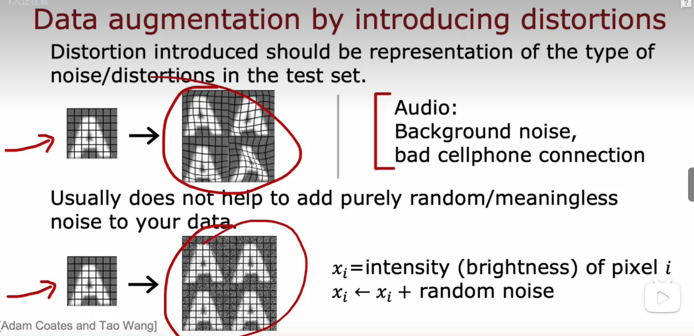
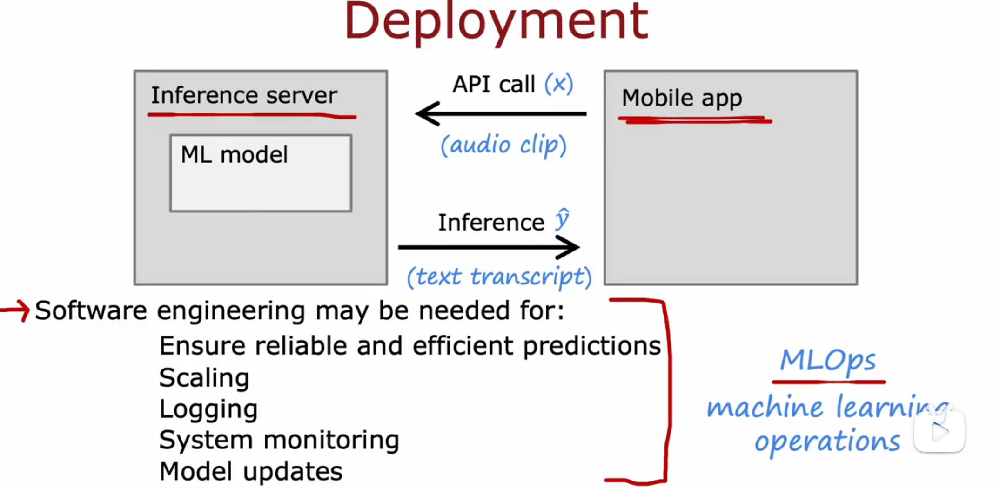
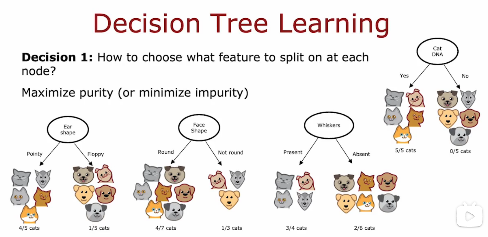
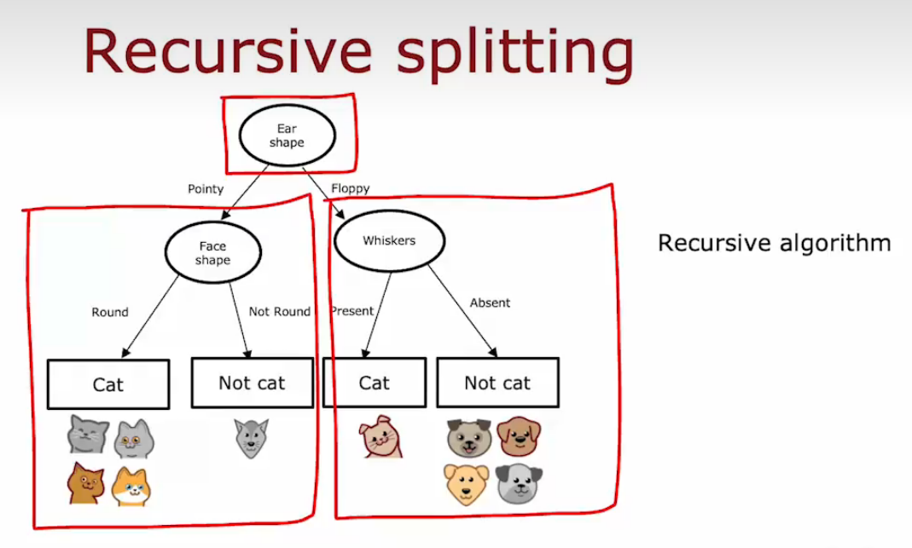

### 模型评估

将数据集一部分分为训练集，一部分为测试集

分类问题的误差：

在测试集上分类正确记为1，分类错误记为0，所有数据的error总和的平均值就是最后的误差

在分类问题上这样的误差计算比泛化误差更合适

数据集分为三类：训练集，交叉验证集，测试集

在交叉验证集上选择误差最小的那个方程模型，选择d（即d次方程），然后再在测试集上计算这个方程模型的泛化误差

### 诊断偏差和方差

### 正则化和偏差和方差

baseline performance 基线性能

训练误差和基线性能相差较大时，说明时高偏差；验证误差和基线性能相差较大时，说明是高方差

### 学习曲线

高偏差的时候，训练集越大，训练集的偏差反而会越大，验证集的偏差会变小，最后都趋于不变

所以只一味的增加训练数据的数量，不一定会使偏差变小，还要预先选择较为合适的模型

### 解决高偏差和高方差的方法：

次方的增加，会导致训练误差逐渐减小，但也会导致验证误差先变小再变大（过拟合），因此需要在模型的复杂度上进行trade off

神经网络减少偏差和方差的流程：

只要正确地正则化，更大的数据集一般没有坏处，不会导致高偏差

### 误差分析

误差分析：通过手动检查一组算法分类错误或标签错误的示例，来分析如何提高模型分类的精准度，并且可以分析出哪种原因更多地导致分类错误，从而进行下一步尝试

将误差分析应用在人类可以解决的问题中，效果比较好，有助于把注意力集中在更有希望提高模型分类精准度是事情上，但是应用在人类也不知道如何解决的问题中时，误差分析就有点困难，例如预测什么样的广告能使人点击网站时，人类无法预测，那么通过误差分析也无法知道怎么改善了。

### 添加数据

#### 数据增强

 

添加随机无意义的噪声对数据没有帮助

#### 合成数据

使用人工数据输入来创造一个新的训练例子

计算机视觉领域应用较多

### 迁移学习

在大数据集上进行第一次训练（supervised pretraining），然后再更小的数据集上进一步调整参数（fine tuning微调） ，可以得到在不同于大数据集任务的任务上表现良好的神经网络

下载别人训练并免费提供的训练过的模型

### 机器学习项目的完整周期

部署服务器：软件工程，需要有系统监督、模型更新......

### 倾斜数据集的误差指标

#### 正负样本不均衡

类不平衡问题

#### 精度、召回率：

#### F1 score

p 和 R 的调和平均值，更强调较小的值

## Week4

### 决策树

决策树的工作是基于所有可能的决策树尝试选择一个在训练中表现良好并且在理想情况下也能很好地概括新数据的决策树

建立决策树的步骤：

决策树的深度不能过深，防止过拟合

### 熵（entropy)：对一组数据的杂度的测量

选择拆分

### 信息增益的计算：

决策树学习：

使用递归算法来建立决策树，每个决策树是由更小的决策树组成的

### 分类特征的一种独热编码（one-hot encoding)

使用独热编码，决策树可以处理两个以上离散值的特性，用0和1编码分类特征，以数字作为输入，输入到神经网络中

#### 连续的有价值特征

尝试不同的阈值，进行信息增益计算，并在信息增益值高的连续值特征上进行分割

### 回归树

建立回归树，是为了选择一个能够最好地预测动物的体重，尝试减少值权重的方差即平均加权方差，而不是减少熵

### 树的集成算法tree ensemble

Tree ensemble是一种集成学习方法，它将多个决策树组合在一起以提高预测准确性和稳定性。

sample with replacement 放回取样

#### 随机森林算法

袋装决策树（bagged decision tree):

指把训练例子放在虚拟袋子里

#### XGboost增强决策树算法

### 决策树和神经网络的比较：

