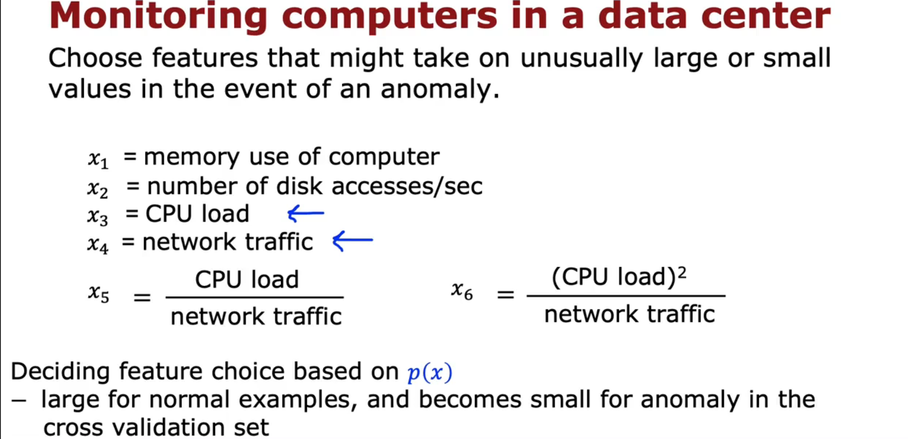

# 无监督学习

提供的数据没有标签

## 聚类

聚类算法， 在数据中寻找一种特定的结构，将数据集分组成聚类， 即彼此相似的点组。

## K-means

首先随机猜测它要找到的两个聚类的中心在哪里，然后**聚类质心分配点，移动聚类质心**

步骤一：把每个点分配到离它最近的聚类质心

步骤二：将每个聚类质心移动到分配给它的所有点的平均值或平均值

然后重复步骤一、二，直到指向质心的分配或 聚类质心的位置都不会发生进一步的变化，即聚类算法心收敛为止

### K-means算法

当一个集群没有分配给它的训练示例时，可以消减这个集群，即减去这个聚类或者随机重新初始化聚类质心

J**失真函数**（distortion）的目的：找到聚类质心点的分配，并找到最小化平方距离的聚类质心的位置

### 初始化Means

### 选择聚类的个数

## 异常检测

### 异常检测原理

不同的区域有不同的可能性值，值越小的越可能是异常

异常检测的应用：

### 高斯（正态）分布

Gauss（Normal/bell-shaped）distribution 高斯（正态/钟形）分布

### 异常检测算法

如果一个或多个特征相对于训练集中的内容来说非常大或非常小，它往往会将一个例子标记为异常

如果新示例的其中一个功能远远超出了这里，那么 P会非常小。如果这个乘积中只有一个项非常小，那么当你乘在一起时，这个总体乘积往往会很小，p (x) 会很小。 

异常检测对算法的作用 是一种系统的量化方法，可以量化这个新示例 x 是否具有异常大或异常小的特征。

开发和评估异常检测系统

将异常数据分为两部分，交叉验证集和测试集都包含正常数据和异常数据

系统先在训练集上训练，然后在交叉验证集（CV）上运行，运行后调整算法的参数，比如判断是否异常的临界值ɛ

最后再在测试集上运行

当异常数据过少的时候，可以没有测试集，所有的异常数据都在交叉验证集里

### 异常检测 VS. 监督学习

异常检测试图找到全新的正面例子，这些例子可能与 你以前见过的任何事情都不一样。 

其中，监督学习着眼于你的正面例子，并 试图决定未来的例子是否与 你已经看到的正面例子相似

### 特征选择

对于分布不像高斯分布的特征，可以先进行转换

## 推荐系统 

### 协同过滤

与线性回归不同之处在于，这这个损失函数为n中的每一个训练一个不同的线性回归模型

#### 协同过滤算法（collaborative filtering)

w,b,x都是参数

 协同过滤的目的：

由于多个用户同一部电影进行了协作评分，因此你可以了解这部电影可能是什么样子， 这可以让你猜出该电影有哪些合适的特征， 这反过来又可以让你 预测其他尚未对同一部电影进行评分的用户将来会如何决定对其进行评分。 

#### 二进制标签

#### 均值归一化

归一化前：

算法会预测所有电影都没有过评分记录的用户给电影的评分都是0

 归一化后：

对行使用均值归一化，算法会预测所有电影都没有过评分记录的用户给电影的评分都是0，还原回去后就是每部电影的评分的平均值，不再是0

在这个情境中，对列归一化没有意义

#### 协同过滤的Tensorflow实现

#### 查找相关项目

协同过滤的缺陷：

冷启动问题。：

例如，如果你的目录中有一个新项目，比如说有人刚刚发布了一部新电影， 但几乎没有人给这部电影打过分，该如何对新项目进行排名？ 同样，对于只给几个项目评分的新用户， 我们怎样才能确保向他们展示一些合理的东西？ 我们可以在之前的视频中看到，均值归一化可以如何帮助解决 这个问题，而且确实有很大帮助。 但是，也许还有更好的方法来向 用户展示那些评分很少的项目，以及他们可能感兴趣的东西。 这被称为冷启动问题， 因为当你有新项目时，评分的用户很少， 或者我们的新用户评分的项目很少，那么对该项目或该用户的协作筛选结果可能不太准确。

### 基于内容的过滤

#### 基于内容的过滤

在协作过滤中， 许多用户对不同的项目进行评分。 

在基于内容的过滤中，根据用户的特征和项目的特征，来进行用户和项目之间的良好匹配，方法是计算这些向量， v_u 代表用户，v_m 代表电影中的项目， 然后在它们之间取点积来尝试找到合适的匹配项

Xv,Xm 的大小可能不同，但向量Vu,Vm的大小必须相同，因为它们之间要做点积

#### 从大目录中推荐

#### 基于内容过滤的Tensorflow实现

