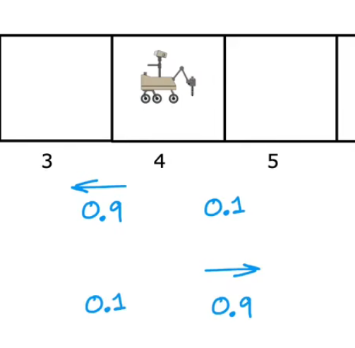

# 强化学习

## 强化学习的return

对不同的距离赋予不同的权重值，权重值可正可负，方向可不固定

奖励多少取决于采取的行动

## 强化学习中的策略与决策制定

Π给出在某个状态下的可能选择采取的行动

## 马尔可夫决策过程（MDP）

MDP指未来指取决于当前的状态，而不是在到达当前状态之前可能发生的任何事情。

## 状态动作值函数

 

上方为policy，最佳策略，下方为Q函数

Q(s,a)基于当前状态，给出可能尝试决策的行为的最大价值，基于最佳策略

Q(2，->) = 0 + (0.5)0 + (0.5)²0 + (0.5)³100 = 12.5

这里遵循最佳策略：

0：在第2个，Q的方向向右

0：在第三个，Q的方向向左

0：在第二个，方向向左

100：在第一个，达到结束状态

Ballmen方程

随机复杂环境

因为复杂环境，可能有几率不能沿着指定方向，可能错误地沿着错误方向行动

reward是尝试某个行为多次后的reward的平均值

## 连续状态空间应用

连续状态是一个包含各个因子的向量

## 登月器

制定不同的奖励机制

## 深度强化学习算法

### DQN deep-Qnetwork

使用（xi,yi）训练集，其中yi = R(s)+γmax(Q(s',a'))，最初Q的值/神经网络是随机初始化的

然后训练神经网络使Q(s,a)不断接近y，每次训练后都会更新Q的神经网络

最后Qnew就会逐渐收敛，使得Qnew(s,a)≈y

### 算法改进

由单个输出变为，所有可能选择方向的输出，这样此每次学习可以一下子获得全部可能方向的值，减少了运行时间

#### ɛ-greedy policy ɛ-贪婪策略

ɛ指的是采取随机方向的可能概率。

当随机初始化神经网络时，有可能随机到的结果使得一个可能很好的行为变得不好，那么神经网络就从一开始就不会选择这个行为。

ɛ-贪婪策略，以ɛ的概率不选择使得Q最大的方向，而是选择随机方向，就可以解决这个问题。

ɛ-贪婪策略对超参数的要求高，假如ɛ的选择不适合，可能要花费比监督学习算法更多的时间来收敛

#### mini-batches小批量

监督学习和强化学习中均可使用来优化算法

当数据集非常大时，每次更新都需要遍历所有的数据，耗时大

小批量即指每次更新时使用一个小规模的数据，而不是全部数据，因此速度更快

小批量梯度下降与其他优化算法（如Atom）一起使用比批量梯度下降更常见

在强化学习中，即使重放缓存区（reply buffer)中存有大量数据，每次训练模型也只是用部分数据。

#### soft updates软更新

强化学习中，每一次把神经网络训练成一个新的神经网络，重写了Q，这个神经网络可能效果并不好，之后的训练就可能具有更差的噪声神经网络

软更新可以避免Qnew仅通过不好的一步就变得更糟，震荡或转向或具有其他不良特性

 软更新：

即使W，B等参数的更新变得更缓慢

## 强化学习的限制

- 真实环境更复杂
- 比监督学习和无监督学习应用得更少
- 发展前景广阔